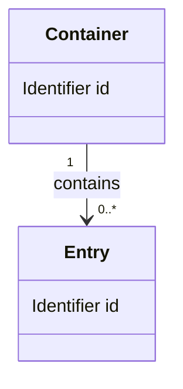

<!-- 記載枠の例。ID・保存先・状態・管理担当・分類は、呼び出し元の適用規則に合わせる。 -->

<!-- 独立した全体またはトピック別データ設計の記載枠。適用規則に従い文書のメタデータを追加する。
図・例示項目は記法例であり、具体的な型・多重度・保存方式を決めたものではない。
プレースホルダーは実値に置換。不明な型や制約は未決として担当・解消条件を引継ぎに記録する。 -->

# {{設計ID}}：{{データ設計名}}

- 設計状態：ドラフト
- 目的・範囲：{{管理するデータと対象外}}
- 参照要件：{{要件本文と受入条件へのリンク}}
- 依存設計：{{全体設計・機能設計へのリンク}}
- 分割元：{{該当時の元DESと移した内容}}

## 関連図

{{実際のエンティティ・属性・関連・両端の多重度・所有をclassDiagramに記載。DB採用は前提にしない}}

## 項目定義

| データ・項目 | 意味 | 型 | 必須/任意 | 初期値 | 範囲・単位・精度 | 根拠要件 |
| --- | --- | --- | --- | --- | --- | --- |
| {{名前}} | {{用途}} | {{論理型。契約に必要な物理型も記載}} | {{欠落とnullの区別が必要なら定義}} | {{値または設定方法・初期値なし}} | {{制約。数値を捏造しない}} | {{本文リンク}} |

## 識別・参照・不変条件

| 対象 | IDの生成・一意性・寿命 | 参照・多重度 | 不変条件 | 参照先欠落・入力不備時の扱い |
| --- | --- | --- | --- | --- |
| {{データ名}} | {{方式と範囲}} | {{関連先・任意性}} | {{常に守る条件}} | {{検証時点・通知・保護}} |

## 更新とライフサイクル

| 対象 | 作成・更新・削除の責務 | 関連データへの影響・更新単位 | 保持・破棄 | 復元範囲 |
| --- | --- | --- | --- | --- |
| {{データ名}} | {{操作と担当要素}} | {{整合性・競合防止}} | {{時点・条件}} | {{要件に必要なUndo/回復。対象外は明示}} |

## メモリと保存の対応

| 対象 | 区分 | 正本・所有者 | 変換・再生成 | 保存/復元時の検証 |
| --- | --- | --- | --- | --- |
| {{データ名}} | {{永続データ／一時状態／再生成データ}} | {{正本と責務}} | {{変換・欠落時の扱い}} | {{整合性・資源制御}} |

## 永続形式

{{永続化する場合のみ：採用したファイル構造またはスキーマ、形式識別・バージョン、項目と保存先の対応、読込検証、非対応形式、非破壊の更新・移行・失敗時の回復。方式の選択理由はADRへリンク。保証範囲が要件に影響する場合は上流へ返す}}
