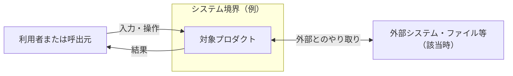
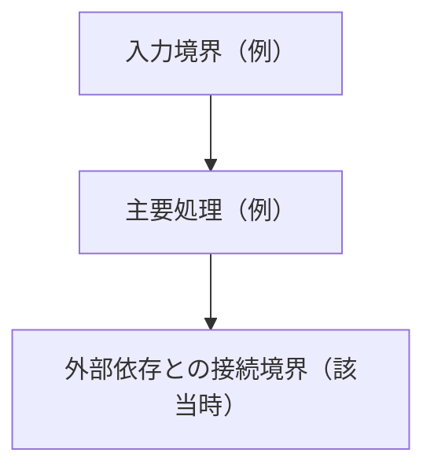
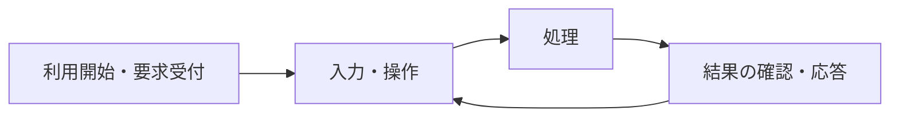

# DES-{{未使用の連番}}：全体設計

<!-- 保存先：docs/product-design/architecture.md。下図は形式例であり採用構成ではない。
実際の責務・関係に置換し、無関係な要素や節を削除する。必須3図は残す。 -->

- 設計状態：ドラフト
- 目的・範囲：{{対象と対象外}}
- 入力確認日：{{YYYY-MM-DD}}
- 参照REQ：{{実在する全REQ-ID・本文への相対リンク・内容要約・合意状況・受入条件}}
- 参照DEM：{{REQの根拠となるDEM-ID・相対リンク}}
- 依存DES：{{実在するID・本文リンク。なければ「なし」}}
- 関連ADR：{{実在するADR-ID・相対リンク。なければ「なし」}}
- 分割・統合・廃止：{{該当時のみ新旧ID・理由・後継へのリンク}}

<!-- DESは未使用のプロジェクト内連番。移動・編集で維持し廃止IDは再利用しない。
評価待ち・保留の解消後はドラフトとして再確認。意味に影響する変更は関連DESだけドラフトへ戻す。
状態はドラフト／評価待ち／実装引継ぎ可能／保留／廃止。レビュー判断は要件合意・ADR採用・試験合格と別。 -->

## コンテキストと実装構成

- ドメイン入力：{{要件側glossary.md・context-map.md・business-flow.mdへのリンクと確認時点。未作成は未作成とし、既存REQからの提案と確定事項を区別}}

| コンテキスト・用語定義 | 責務・所有するモデル | 対応する実装構成 | 文書の業務境界との対応 | 関連REQ・DES |
| --- | --- | --- | --- | --- |
| {{要件側の定義へリンク}} | {{業務上の責任}} | {{単一プロセス内の構成も可}} | {{相違も明示。移動は必須でない}} | {{本文リンク}} |

{{単一コンテキストも認める。異なるコンテキストの同名概念は一律共通化せず、必要な変換・連携の設計へリンク。論理的境界の変更は要件担当へ返す}}

## システム全体構成図

{{境界・外部との契約・前提・未決の構成を説明}}

## 内部構成図

| 構成要素 | 責務・所有する状態 | 依存・主要契約 | 詳細DES |
| --- | --- | --- | --- |
| {{図と同じ名称}} | {{責務}} | {{依存方向・入出力・エラー・順序}} | {{本文リンク}} |

## 画面・操作の全体図

{{主要画面・入力手段・通知・異常時の経路。画面なしなら外部との操作・処理の流れ}}

## データ・処理・状態の全体方針

{{共通データモデルの正本となるDESへのリンク。所有・保持・破棄、処理間の整合・競合・キャンセル、正常/異常時の保護・回復と詳細DES}}

## 技術構成・品質・配布

| 項目 | 方針・要件根拠 | 採用ADR・一次資料と確認日 | 未決・詳細DES |
| --- | --- | --- | --- |
| {{方式・依存技術・性能・資源管理・対応環境・ランタイム・配布条件・保守状況}} | {{根拠REQと実現方法}} | {{リンク}} | {{不足と詳細}} |

## 検証観点

{{受入条件に対応する主要リスク・観測方法・テスト方針DESへのリンク}}

## 未決事項・引継ぎ

{{handoff.mdの記載枠をここへ挿入。なければ「なし」。別台帳へ複製しない}}

## 完了確認

- 対象REQ・受入条件への対応：{{本文への参照または不足}}
- 主要構造・データ/インターフェース契約・正常異常処理：{{具体化した範囲と不足}}
- 図・本文・採用ADRの整合：{{確認内容}}
- テスト方針・観測方法・引継ぎ：{{関連DES・本文リンクと確認内容}}
- 実装を左右する未決・必要な試作根拠：{{解消と証拠、または残る影響}}
- DDDとの整合：{{現行の用語・論理的境界とモデル・技術契約・不変条件の対応。未作成資料に依存する判断は未決として上流へ}}

- レビュー判断：{{確認日・担当・状態の根拠。局所的な実装判断として残す事項}}

<!-- 必要な試作結果を確認してから実装引継ぎ可能にする。将来の受入試験合格自体は前提にしない。
条件付き合意の進行範囲を越える実装・最終受入の許可を推定しない。 -->
