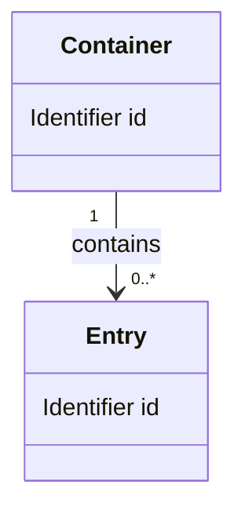

<!-- 挿入用：該当DESの「データ構造」節に以下を挿入する。独立文書にする場合はtopic.mdを外枠にする。
同一コンテキスト内の共通モデルは適用範囲を明示してcross-cutting/<topic>.mdに一元化。異なるコンテキストのモデルは必要な変換・連携で接続。固有構造は該当境界に置き相互参照する。
図・例示項目は記法例であり、具体的な型・多重度・保存方式を決めたものではない。
プレースホルダーは実値に置換。不明な型や制約は未決として担当・解消条件を引継ぎに記録する。 -->

### ドメインモデル・整合性の境界

| 適用コンテキスト・モデル | 不変条件・根拠REQ | 集約ルート・所有・参照（必要時） | 整合性を守る更新単位・理由 |
| --- | --- | --- | --- |
| {{用語定義へリンク}} | {{REQ本文を参照}} | {{採用した集約の責務。集約が不要なら理由}} | {{同時に成立すべき条件と更新境界}} |

{{クラス・集約・DBテーブルの一対一対応を前提としない。コンテキスト間の同名異義や共有モデルを扱う場合は、意味の対応・変換・責務・変更影響と根拠を示す}}

### 関連図

{{実際のモデル名・ID・関連・多重度・所有を説明。ER図でも可。DB採用は前提にしない}}

### 項目定義

| データ・項目 | 意味 | 型 | 必須/任意 | 初期値 | 範囲・単位・精度 | 根拠REQ |
| --- | --- | --- | --- | --- | --- | --- |
| {{名前}} | {{用途}} | {{論理型。契約に必要な物理型も記載}} | {{欠落とnullの区別が必要なら定義}} | {{値または設定方法・初期値なし}} | {{制約。数値を捏造しない}} | {{本文リンク}} |

### 識別・参照・不変条件

| 対象 | IDの生成・一意性・寿命 | 参照・多重度 | 不変条件 | 参照先欠落・入力不備時の扱い |
| --- | --- | --- | --- | --- |
| {{データ名}} | {{方式と範囲}} | {{関連先・任意性}} | {{常に守る条件}} | {{検証時点・通知・保護}} |

### 更新とライフサイクル

| 対象 | 作成・更新・削除の責務 | 関連データへの影響・更新単位 | 保持・破棄 | 復元範囲 |
| --- | --- | --- | --- | --- |
| {{データ名}} | {{操作と担当要素}} | {{整合性・競合防止}} | {{時点・条件}} | {{要件に必要なUndo/回復。対象外は明示}} |

### メモリと保存の対応

| 対象 | 区分 | 正本・所有者 | 変換・再生成 | 保存/復元時の検証 |
| --- | --- | --- | --- | --- |
| {{データ名}} | {{永続データ／一時状態／再生成データ}} | {{正本と責務}} | {{変換・欠落時の扱い}} | {{整合性・資源制御}} |

### ドメインモデルと永続化モデルの対応

| ドメインモデル | 保存表現（採用時のみ） | 変換・復元時の不変条件 | 根拠REQ・DES |
| --- | --- | --- | --- |
| {{業務上のモデル}} | {{ファイル構造・テーブル等。DBは必須でない}} | {{意味と整合性の保持}} | {{本文リンク}} |

### 永続形式

{{永続化する場合のみ：採用したファイル構造またはスキーマ、形式識別・バージョン、項目と保存先の対応、読込検証、非対応形式、非破壊の更新・移行・失敗時の回復。方式の選択理由はADRへリンク。保証範囲が要件に影響する場合は上流へ返す}}
