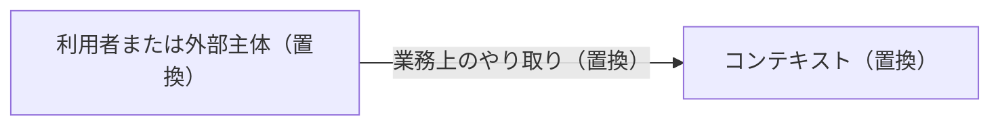

# コンテキストと論理的連携

<!-- 保存先：docs/product-requirements/context-map.md。単一コンテキストも認める。
文書の業務境界や配備単位と一致させず、API技術契約・DB構造は設計へ渡す。
DEM/REQを重複採番しない。図や用語整理だけでREQの合意を推定しない。 -->

## システムの対象範囲

{{システム内で担う業務と、利用者・外部システムが担う業務。根拠DEM/REQ・要求側候補へのリンク}}

## コンテキストの定義

| コンテキスト | 責務・対象外 | 所有する情報の意味 | 用語集・根拠REQ | 文書の業務境界との対応 | 状態・合意根拠 |
| --- | --- | --- | --- | --- | --- |
| {{名称}} | {{責任の範囲}} | {{業務上の正本・責任主体。DB所有とは区別}} | {{相対リンク}} | {{既存境界との対応。移動は必須でない}} | {{ドラフト／合意済み／保留。合意日・合意者・範囲・回答根拠}} |

## コンテキストマップ

{{責務・意味・所有の違いに基づく分割または統合の理由と根拠}}

{{実際の要素・関係へ置換する。未決の境界は図にも明示。関係があれば提供側・利用側と依存方向を示す}}

## 論理的連携

| 連携元 → 先・各責務 | 契機 | 受け渡す情報の意味 | 期待結果 | 必要な失敗時の振る舞い | 根拠REQ・受入条件 |
| --- | --- | --- | --- | --- | --- |
| {{内部または外部との関係}} | {{操作・出来事}} | {{各側の意味が違えば対応を示す}} | {{業務上観測できる結果}} | {{要件本文への参照。未決は明示}} | {{相対リンク}} |

<!-- 該当する連携がなければ表を削除し「該当なし」と理由を記載。
業務上の出来事から外部配信・非同期処理・メッセージ基盤の必須性を推定しない。 -->

## 未決事項・設計への引継ぎ

| 対象境界・関連REQ | 未決条件・影響 | 担当・解消条件・時期 | 進めてよい範囲・設計で具体化すること |
| --- | --- | --- | --- |
| {{本文リンク}} | {{不足・矛盾など}} | {{業務上の判断は要件担当、方式は設計担当}} | {{通信方式・スキーマ等は必要な場合のみ設計へ}} |

<!-- indexの関連文書から参照。境界の意味の変更は該当定義をドラフトへ戻し関連REQへの影響を確認。
REQの合意・受入条件・確認事項はREQ本文を正本とし、その詳細を重複管理しない。 -->
