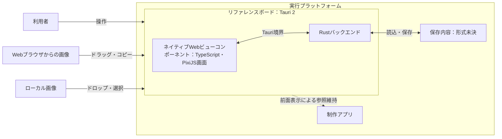
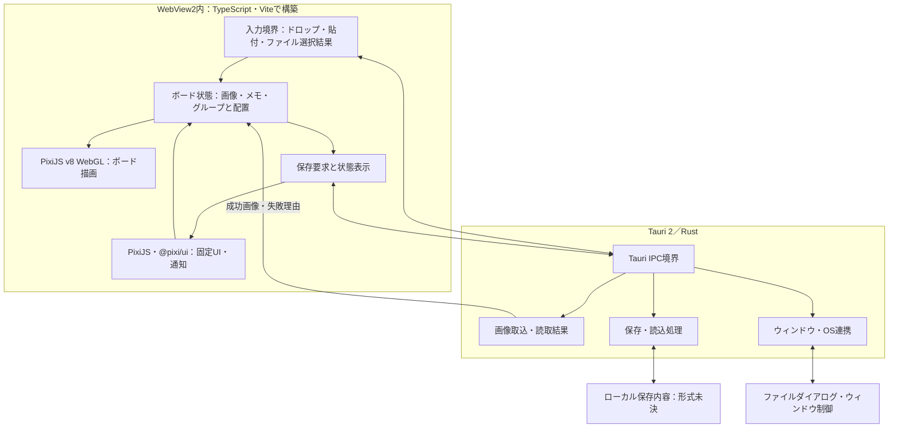
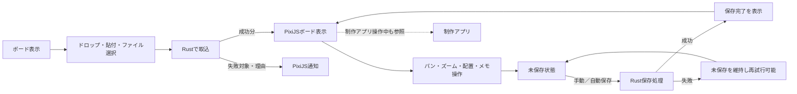

# DES-001：リファレンスボードの全体設計

- 設計状態：ドラフト
- 目的・範囲：Windows 11初期版の単一ボードを対象に、採用済み技術の全体構成、取込・表示・操作・保存の責務と境界を示す。保存形式、別PCへの移送形式、IPCの具体的な型、各機能の詳細画面は本書では確定しない。
- 入力確認日：2026-09-25。要求・要件の本文、合意状況、受入条件、設計担当への引継ぎとADR-001～003を確認した。
- 参照要求：[DEM-001](../product-demands/collection.md#dem-001比較したい参考画像を継続して蓄積する)、[DEM-002](../product-demands/comparison.md#dem-002多くの画像を見渡し全体と細部を比較する)、[DEM-003](../product-demands/organization.md#dem-003画像の関係や気づきを自分なりに整理する)、[DEM-004](../product-demands/cross-cutting.md#dem-004蓄積内容を保ち後日再開する)、[DEM-005](../product-demands/cross-cutting.md#dem-005別pcでも蓄積内容を使い続ける)。
- 依存設計：なし。
- 関連ADR：[ADR-001：デスクトップ実行基盤（採用）](architecture-decisions/2026-09-25-ADR-001-tauri-desktop-runtime.md)、[ADR-002：PixiJSを中心にした描画（採用）](architecture-decisions/2026-09-25-ADR-002-pixijs-ui-rendering.md)、[ADR-003：メモ編集時の入力方式（提案）](architecture-decisions/2026-09-25-ADR-003-text-editing.md)。

## 参照要件と設計範囲

| 要件・合意状況 | 本書で扱う範囲 |
| --- | --- |
| [REQ-001：画像の追加経路](../product-requirements/collection.md#req-001画像の追加経路)・合意済み、[REQ-002：静止画形式](../product-requirements/collection.md#req-002静止画形式と複数フレームの扱い)・合意済み、[REQ-003：複数取込と失敗通知](../product-requirements/collection.md#req-003複数取込と失敗通知)・合意済み | ローカル・ブラウザ入力とRustによる取込、成功分と失敗分の返却境界。形式別処理の詳細は未設計。 |
| [REQ-004：全体と細部の表示](../product-requirements/comparison.md#req-004全体と細部の表示)・条件付き合意、[REQ-005：制作中の参照維持](../product-requirements/comparison.md#req-005制作中の参照維持)・合意済み | PixiJSによるボード描画とTauriウィンドウの前面表示。倍率限界と実機での成立は未確認。 |
| [REQ-010：独立メモ](../product-requirements/organization.md#req-010独立メモの編集と配置)・条件付き合意 | メモをPixiJSで表示する方針。編集入力方式と文字数上限は未確定。 |
| [REQ-011：保存内容の復元](../product-requirements/cross-cutting.md#req-011保存内容の復元)・合意済み、[REQ-012：自動保存](../product-requirements/cross-cutting.md#req-01230秒ごとの自動保存)・合意済み、[REQ-014：手動保存](../product-requirements/cross-cutting.md#req-014手動保存)・合意済み、[REQ-015：保存状態](../product-requirements/cross-cutting.md#req-015保存状態の識別)・合意済み、[REQ-016：保存失敗](../product-requirements/cross-cutting.md#req-016保存失敗時の内容保護と再試行)・合意済み | 編集状態と保存処理を分離し、保存競合と失敗時の保護を扱う境界。保存媒体・形式と詳細契約は未設計。 |
| [REQ-017：未保存での終了](../product-requirements/cross-cutting.md#req-017未保存での終了)・合意済み、[REQ-019：別PCへの引継ぎ](../product-requirements/cross-cutting.md#req-019本人の別pcへの引継ぎ)・合意済み | 終了・保存内容の切替前に未保存状態と本人の選択を扱う境界。移送形式と具体的な画面遷移は未設計。 |
| [REQ-020：インストール不要利用](../product-requirements/cross-cutting.md#req-020windows-11でのインストール不要利用)・条件付き合意 | Tauri配布とWebView2依存。対応エディション・リリース範囲は未合意。 |
| [REQ-021：通常時の操作反応](../product-requirements/cross-cutting.md#req-021通常時の操作反応)、[REQ-022：通常時の細部表示](../product-requirements/cross-cutting.md#req-022通常時の細部表示)、[REQ-023：保存中の操作反応](../product-requirements/cross-cutting.md#req-023保存中の操作反応)、[REQ-024：保存中の細部表示](../product-requirements/cross-cutting.md#req-024保存中の細部表示)、[REQ-025：500枚の再開](../product-requirements/cross-cutting.md#req-025保存済み500枚の再開性能)、[REQ-026：500枚の取込](../product-requirements/cross-cutting.md#req-026ローカル500枚の初回取込性能)・いずれも条件付き合意 | 非同期処理、画像の段階的表示と描画資源管理の方針。評価条件と達成状況は未確定。 |

本書は上記要件の技術構成に関わる部分だけを扱う。機能全体の振る舞い、業務ルール、受入条件は各要件本文を正本とする。

## システム全体構成図

WindowsのWebView2を表示実行環境として使う。[ADR-001](architecture-decisions/2026-09-25-ADR-001-tauri-desktop-runtime.md)の採用は、全Windows 11環境での起動保証を意味しない。ブラウザ・ファイルからの入力経路と制作アプリとの重なりは実機で確認する。

## 内部構成図

| 構成要素 | 責務・所有する状態 | 依存・主要契約 |
| --- | --- | --- |
| 入力境界 | ローカルファイル、ブラウザ画像のドラッグ・貼付、ファイル選択結果を受ける | 入力ごとの差異を取込要求へ変換。WindowsのHTML5ドラッグ＆ドロップにはTauriの`dragDropEnabled: false`を使う。両経路の画像データ受渡しは未確認。 |
| ボード状態 | 表示・編集対象の画像、配置、メモ、グループ、保存済みとの差分を保持する | 描画と保存要求へ一貫した内容を渡す。具体的なデータ構造と更新単位は後続設計で定める。 |
| PixiJS v8 WebGL、`@pixi/ui` | ボードと画面固定UIを描画し、操作結果・通知・保存状態を示す | ボードのパン・ズームとメニュー位置を分離。メモ入力の`textarea`併用はADR-003の提案であり採用構成には含めない。 |
| Tauri IPC境界 | WebView2とRust間で取込・保存・ウィンドウ操作の要求と結果を仲介する | 要求に対応する結果・失敗を返す。具体的なコマンド名、ペイロード、画像転送形態は未決。 |
| Rustの取込処理 | 画像の読取・形式判定と取込結果の生成を担う | 正常分を残し、失敗対象と理由を画面へ返す。6形式・先頭コマ/ページの処理方法は後続設計で具体化。 |
| Rustの保存・読込処理 | 保存内容の書込・読込、失敗の通知を担う | 完了した保存が古い処理に上書きされないようにし、失敗時に直前の成功内容を保護する。保存形式・移送形式は未決。 |
| Tauriのウィンドウ・OS連携 | ファイルダイアログ、前面表示、終了時のウィンドウイベントを扱う | 保存状態やユーザー選択を尊重し、未保存変更がある終了・切替を無条件に進めない。 |

## 画面・操作の全体図

画像の取込では失敗が混在しても成功分を表示し、失敗対象と理由を通知する。保存失敗では編集中の内容と直前の成功内容を保護する。破損した保存内容の読込時は現在のボードを変更せず、対象と理由を通知する。これらの期待結果は[REQ-003](../product-requirements/collection.md#req-003複数取込と失敗通知)、[REQ-011](../product-requirements/cross-cutting.md#req-011保存内容の復元)、[REQ-016](../product-requirements/cross-cutting.md#req-016保存失敗時の内容保護と再試行)に従う。

## データ・処理・状態の全体方針

- 画面が操作中のボード状態を扱い、PixiJSはその状態から表示を更新する。Rustは取込対象・保存対象の読取と書込を担い、画面へ結果を返す。画像の実体をWebView2へどう転送・保持するかは、500枚の性能と保存内容の独立性を満たす方式として後続設計で決める。
- 保存要求は処理中の内容と後続の編集を区別する。自動保存と手動保存を同時に実行せず、手動保存が操作時点までの変更を含めて完了したことを通知できる順序を設計する。保存の古い結果で新しい内容を置き換えない。具体的な更新番号・キュー・ファイル更新方式は未決である。
- 自動保存の30秒固定周期、無変更時の省略、保存中の次周期の扱いは[REQ-012](../product-requirements/cross-cutting.md#req-01230秒ごとの自動保存)を正本とする。保存中・完了・失敗と未保存は[REQ-015](../product-requirements/cross-cutting.md#req-015保存状態の識別)に従って表示する。
- 別内容への切替・終了は、未保存変更の選択と保存成功を確認してから進める。画面・OS境界を含む具体的な遷移は[REQ-017](../product-requirements/cross-cutting.md#req-017未保存での終了)・[REQ-019](../product-requirements/cross-cutting.md#req-019本人の別pcへの引継ぎ)をもとに後続設計で定める。

## 技術構成・品質・配布

| 項目 | 現在の方針と要件根拠 | 根拠と未確認事項 |
| --- | --- | --- |
| デスクトップ実行環境 | Tauri 2＋Rust、Windows 11のWebView2。アプリ・追加実行環境のインストール不要を目指す（REQ-020） | [ADR-001](architecture-decisions/2026-09-25-ADR-001-tauri-desktop-runtime.md)。インストーラーなしビルドの配布物と、対象エディション・リリースでの起動は未確認。 |
| フロントエンドと描画 | TypeScript＋Vite、PixiJS v8のWebGLでボードと固定UIを表示し、適合する部品に`@pixi/ui`を使う（REQ-004、010） | [ADR-002](architecture-decisions/2026-09-25-ADR-002-pixijs-ui-rendering.md)。キーボード操作、フォーカス、支援技術、WebGL実行環境は未確認。 |
| メモ編集 | PixiJSによるメモ表示。入力方法は未採用 | [ADR-003](architecture-decisions/2026-09-25-ADR-003-text-editing.md)の`textarea`重ね合わせは提案。文字数上限と改行の扱いはREQ-010の未決として維持。 |
| 画像取込 | Rustで読取・取込結果を返し、画面で表示・通知する（REQ-001～003） | WindowsのHTML5ドラッグ＆ドロップ、ブラウザ画像のコピー・ドラッグ、6形式と先頭コマ/ページは実機・実装で確認が必要。 |
| 保存・再開 | 画面編集とRust保存処理を分離し、保存結果を状態表示へ反映する（REQ-011～016） | 保存・移送形式、具体的な競合防止方式、障害時の書込方式は後続設計で確定。 |
| 操作・表示性能 | 描画範囲とテクスチャ資源を管理し、保存・取込がUI操作を妨げない構造とする（REQ-021～026） | 性能達成の実測はない。共通評価条件の未決事項は[要件本文](../product-requirements/cross-cutting.md#性能の共通評価条件)を参照。 |

## 検証観点

- 取込：ローカル・ブラウザの各入力経路、対応形式、複数取込時の部分成功と通知が境界を越えて成立するか。
- 画面：ボードのパン・ズームと固定UIの位置が独立し、制作アプリ操作中の参照維持が成立するか。
- 保存：手動・自動保存の重なり、保存中の編集、失敗と再試行、破損データの読込時に、既存内容と未保存変更を保護できるか。
- 品質と配布：対象Windows 11環境で追加インストールなしに起動でき、500枚の操作・表示・取込・再開の性能目標を満たすか。具体的な試験環境・手順・合否判定は検証担当へ引き継ぐ。

## 未決事項・引継ぎ

| 対象 | 未決・確認事項 | 引継ぎ先・進行範囲 |
| --- | --- | --- |
| REQ-020 | 対応するWindows 11のエディション・リリース範囲、配布物とWebView2の起動条件 | 要件担当による本人合意と検証担当による環境確認。確定済みのインストール不要方針の設計は進める。 |
| REQ-004・006・010 | 倍率、画像操作範囲、メモ文字数の限界。メモ改行の扱いとADR-003の入力方式 | 範囲・受入条件に影響する点は要件担当へ返す。試作・評価結果は別担当から受け、確定範囲を反映する。 |
| REQ-001・005・021～026 | ブラウザ画像の受渡し、前面表示、画像500枚の資源使用と性能 | 実装・検証担当へ確認を引き継ぐ。実測前に達成済みとしない。 |
| REQ-011・014・016・019 | 保存・移送形式、更新順序、破損・異常終了時の保護方式 | 後続のデータ・保存設計で定め、実装・検証担当へ必要な試作・障害確認を引き継ぐ。 |

## 完了確認

- 対象要件・受入条件への対応：技術構成と境界を記載した範囲は一部対応。機能・データ・画面の詳細設計は未着手。
- 主要構造・データ/インターフェース契約・正常異常処理：責務と主要経路を示した。具体的な保存形式とIPC契約は未決。
- 図・本文・採用ADRの整合：Tauri・Rust・TypeScript/Vite・PixiJS v8 WebGL・`@pixi/ui`を採用構成とし、ADR-003は提案として分離した。
- テスト方針・観測方法・引継ぎ：検証観点と未決条件を記載した。試作、計測、具体的な試験計画と実行は未実施。
- レビュー判断：ドラフト。ADRの採用、要件合意、設計完了、試験合格はそれぞれ異なる。
