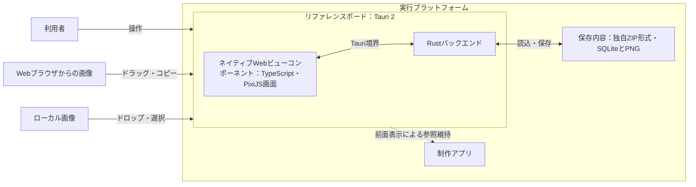
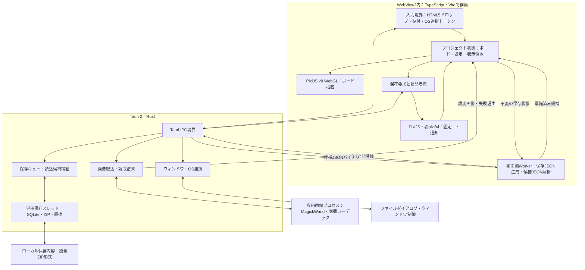
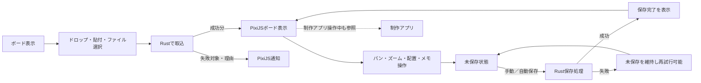

# DES-001：リファレンスボードの全体設計

- 設計状態：ドラフト
- 目的・範囲：Windows 11初期版の単一ボードを対象に、採用済み技術の全体構成、取込・表示・操作・保存の責務と境界を示す。保存・移送にはZIPを実体とする独自形式を採用する。画像・メモ・グループのデータ構造は[DES-004](../data-design/DES-004-board-data-model.md#des-004ボードのデータ設計)、編集更新単位は[DES-002](../functional-design/organization/DES-002-board-editing-state.md#des-002ボードの編集状態とグループ構造)を管理元とする。内部スキーマ、IPCの具体的な型、各機能の詳細画面は本書では確定しない。
- 技術スタック更新の確認日：2026-09-29。ユーザーによる計画実装の指示とADR-008・009の選定資料を確認した。新規開発・テスト基盤は設計上の選定であり、導入・実行は未実施。既存要求・要件の合意状態は変更しない。
- 入力確認日：2026-09-26。要求・要件の本文、合意状況、受入条件、設計担当への引継ぎ、ADR-001～007と本チャットの保存・復旧・編集状態に関するユーザーの回答を確認した。
- 参照要求：[DEM-001](../../product-demands/collection/DEM-001-collect-reference-images.md#dem-001比較したい参考画像を継続して蓄積する)、[DEM-002](../../product-demands/comparison/DEM-002-compare-image-overviews.md#dem-002多くの画像を見渡し全体と細部を比較する)、[DEM-003](../../product-demands/organization/DEM-003-organize-image-insights.md#dem-003画像の関係や気づきを自分なりに整理する)、[DEM-004](../../product-demands/cross-cutting/DEM-004-resume-saved-work.md#dem-004蓄積内容を保ち後日再開する)、[DEM-005](../../product-demands/cross-cutting/DEM-005-continue-on-another-pc.md#dem-005別pcでも蓄積内容を使い続ける)。
- 依存設計：[DES-002](../functional-design/organization/DES-002-board-editing-state.md#des-002ボードの編集状態とグループ構造)、[全体データ設計](../data-design/DES-003-data-overview.md#des-003全体データ設計)、[全体画面設計](../screen-design/DES-005-screen-overview.md#des-005全体画面設計)。編集処理と詳細データ・画面を分けて参照する。
- 関連ADR：[ADR-001：デスクトップ実行基盤](../architecture-decisions/2026-09-25-ADR-001-tauri-desktop-runtime.md)、[ADR-002：PixiJSを中心にした描画](../architecture-decisions/2026-09-25-ADR-002-pixijs-ui-rendering.md)、[ADR-003：メモ編集時の入力方式](../architecture-decisions/2026-09-25-ADR-003-text-editing.md)、[ADR-004：独自ZIPとPNG](../architecture-decisions/2026-09-26-ADR-004-zip-board-storage.md)、[ADR-005：保存と復旧](../architecture-decisions/2026-09-26-ADR-005-save-recovery-policy.md)、[ADR-006：編集履歴](../architecture-decisions/2026-09-26-ADR-006-session-edit-history.md)、[ADR-007：座標とグループ](../architecture-decisions/2026-09-26-ADR-007-board-coordinates-and-groups.md)、[ADR-008：整形・静的検査基盤](../architecture-decisions/2026-09-29-ADR-008-formatting-and-static-analysis.md)、[ADR-009：テスト自動化基盤](../architecture-decisions/2026-09-29-ADR-009-test-automation.md)。

更新内容：保存統合のユーザーの回答と計画実行指示を反映した。REQ-011～017・019は意味変更に伴い現在ドラフト。過去の参照時点と現在の合意状態を区別し、最新の状態・受入条件は要件本文を参照する。

更新内容：画像資源制限と編集方針の反映後、REQ-001～004・006～017・019はドラフト。REQ-005・018は合意済み、REQ-020～026は条件付き合意。以下に残る過去の参照状態は入力時点の記録で、現在状態の正本は要件本文とする。

## 参照要件と設計範囲

| 要件・合意状況 | 本書で扱う範囲 |
| --- | --- |
| [REQ-001：画像の追加経路](../../product-requirements/functional-requirements/collection/REQ-001-add-image-path.md#req-001画像の追加経路)・合意済み、[REQ-002：静止画形式](../../product-requirements/functional-requirements/collection/REQ-002-static-image-formats.md#req-002静止画形式と複数フレームの扱い)・合意済み、[REQ-003：複数取込と失敗通知](../../product-requirements/functional-requirements/collection/REQ-003-batch-import-errors.md#req-003複数取込と失敗通知)・合意済み | ローカル・ブラウザ入力とRustによる取込、成功分と失敗分の返却境界。形式別処理・初期配置は[DES-010](../functional-design/collection/DES-010-image-import-pipeline.md)へ具体化。成立は未検証。 |
| [REQ-004：全体と細部の表示](../../product-requirements/functional-requirements/comparison/REQ-004-board-overview-and-detail.md#req-004全体と細部の表示)・条件付き合意、[REQ-005：制作中の参照維持](../../product-requirements/functional-requirements/comparison/REQ-005-keep-references-visible.md#req-005制作中の参照維持)・合意済み | PixiJSによるボード描画とTauriウィンドウの前面表示。倍率範囲・再開・全体fitの契約はDES-004へ具体化済み。実機での成立は未確認。 |
| [REQ-006～010：画像・メモ・グループの整理](../../product-requirements/functional-requirements/organization/REQ-006-image-transform.md#req-006画像の移動回転拡縮)・REQ-006・010は条件付き合意、REQ-007～009は合意済み | ボード状態と描画の責務を分ける。共通データ構造、更新・取り消しの境界は[DES-002](../functional-design/organization/DES-002-board-editing-state.md#des-002ボードの編集状態とグループ構造)で扱う。 |
| [REQ-010：独立メモ](../../product-requirements/functional-requirements/organization/REQ-010-independent-notes.md#req-010独立メモの編集と配置)・条件付き合意 | メモをPixiJSで表示する方針。編集中のtextarea併用はユーザー選択済み。実機品質は未検証。本文10,000拡張書記素クラスタの上限と編集境界はDES-002へ反映。 |
| [REQ-011：保存内容の復元](../../product-requirements/functional-requirements/cross-cutting/REQ-011-restore-saved-content.md#req-011保存内容の復元)・ドラフト、[REQ-012：自動保存](../../product-requirements/functional-requirements/cross-cutting/REQ-012-periodic-autosave.md#req-01230秒ごとの自動保存)・ドラフト、[REQ-014：手動保存](../../product-requirements/functional-requirements/cross-cutting/REQ-014-manual-save.md#req-014手動保存)・ドラフト、[REQ-015：保存状態](../../product-requirements/functional-requirements/cross-cutting/REQ-015-save-status.md#req-015保存状態の識別)・ドラフト、[REQ-016：保存失敗](../../product-requirements/functional-requirements/cross-cutting/REQ-016-save-failure-recovery.md#req-016保存失敗時の内容保護と再試行)・ドラフト | 編集状態と保存処理を分離し、保存競合と失敗時の保護を扱う境界。独自ZIP形式を採用。詳細スキーマと保存契約はDES-008・009を参照。 |
| [REQ-017：未保存での終了](../../product-requirements/functional-requirements/cross-cutting/REQ-017-exit-with-unsaved-changes.md#req-017未保存での終了)・ドラフト、[REQ-019：別PCへの引継ぎ](../../product-requirements/functional-requirements/cross-cutting/REQ-019-cross-pc-transfer.md#req-019利用者の別pcへの引継ぎ)・ドラフト | 終了・保存内容の切替前に未保存状態と利用者の選択を扱う境界。移送は本ZIPファイル単体。画面遷移はDES-007、保存ゲートはDES-009を参照。 |
| [REQ-020：インストール不要利用](../../product-requirements/non-functional-requirements/cross-cutting/REQ-020-portable-windows-app.md#req-020windows-11でのインストール不要利用)・条件付き合意 | Tauri配布とWebView2依存。対象はHome・x64・サポート中通常リリース、固定WebView2を常に同梱するユーザー選択をDES-012へ反映。要件本文への反映・レビューは残る。 |
| [REQ-021：通常時の操作反応](../../product-requirements/non-functional-requirements/cross-cutting/REQ-021-normal-operation-latency.md#req-021通常時の操作反応)、[REQ-022：通常時の細部表示](../../product-requirements/non-functional-requirements/cross-cutting/REQ-022-normal-detail-display.md#req-022通常時の細部表示)、[REQ-023：保存中の操作反応](../../product-requirements/non-functional-requirements/cross-cutting/REQ-023-saving-operation-latency.md#req-023保存中の操作反応)、[REQ-024：保存中の細部表示](../../product-requirements/non-functional-requirements/cross-cutting/REQ-024-saving-detail-display.md#req-024保存中の細部表示)、[REQ-025：500枚の再開](../../product-requirements/non-functional-requirements/cross-cutting/REQ-025-saved-project-open-performance.md#req-025保存済み500枚の再開性能)、[REQ-026：500枚の取込](../../product-requirements/non-functional-requirements/cross-cutting/REQ-026-batch-import-performance.md#req-026ローカル500枚の初回取込性能)・いずれも条件付き合意 | 非同期処理、画像の段階的表示と描画資源管理の方針。評価条件と達成状況は未確定。 |

本書は上記要件の技術構成に関わる部分だけを扱う。機能全体の振る舞い、業務ルール、受入条件は各要件本文を正本とする。

## システム全体構成図

WindowsのWebView2を表示実行環境として使う。[ADR-001](../architecture-decisions/2026-09-25-ADR-001-tauri-desktop-runtime.md)の採用は、全Windows 11環境での起動保証を意味しない。同梱固定版と対象範囲は[DES-012](../non-functional-design/cross-cutting/DES-012-portable-runtime-distribution.md)へ具体化した。ブラウザ・ファイルからの入力経路と制作アプリとの重なりは実機で確認する。

## 内部構成図

| 構成要素 | 責務・所有する状態 | 依存・主要契約 |
| --- | --- | --- |
| 入力境界 | ローカルファイル、ブラウザ画像のドラッグ・貼付、ファイル選択結果を受ける | Windowsの`dragDropEnabled: false`でHTML5へ統一し、File／Blobをイベント中に保持。画像データは最大1MiB・全体1チャンクで転送し、OS選択はRustの入力トークンを使う。契約はDES-010・011、実機成立は未検証。 |
| ボード状態 | 表示・編集対象の画像、配置、メモ、グループ、保存済みとの差分を保持する | 描画と保存要求へ一貫した内容を渡す。共通の論理構造と更新単位は[DES-002](../functional-design/organization/DES-002-board-editing-state.md#des-002ボードの編集状態とグループ構造)を管理元とする。 |
| PixiJS v8 WebGL、`@pixi/ui` | ボードと画面固定UIを描画し、操作結果・通知・保存状態を示す | ボードのパン・ズームとメニュー位置を分離。メモ入力の`textarea`併用はユーザー選択済みとして設計構成へ反映。ADR-003は上流レビュー・実機成立待ちの提案を維持する。 |
| Tauri IPC境界 | WebView2とRust間で取込・保存・ウィンドウ操作の要求と結果を仲介する | protocolVersion=1。継続処理はacceptedとChannel、PNGはバイナリResponse、保存対象と候補はWorkerで扱うUTF-8 JSON。22コマンドの定義元一覧は[DES-011](../interface/DES-011-ipc-contracts.md)、通信形式・トークン寿命は[DES-014](../interface/DES-014-ipc-common-protocol.md)。照会・受領確認は[get_request_status](../interface/DES-038-ipc-get-request-status.md#get_request_status)・[acknowledge_requests](../interface/DES-039-ipc-acknowledge-requests.md#acknowledge_requests)の個別契約を参照する。キュー・採用・ゲートはDES-009、方式の根拠はADR-016。 |
| 画面側Worker | 保存対象のJSON生成、読込候補JSONの解析と準備を担う | 固定状態は後続編集で書き換えず、メイン画面で全体を同期JSON化しない。保存供給は[provide_save_snapshot](../interface/DES-027-ipc-provide-save-snapshot.md#provide_save_snapshot)、候補取得は[open_project](../interface/DES-031-ipc-open-project.md#open_project)。受渡しのコピー量と固定・描画への影響はDES-013で成立確認する。 |
| Rustの取込処理 | 画像の読取・形式判定と取込結果の生成を担う | 正常分を残し、失敗対象と理由を画面へ返す。6形式・先頭コマ/ページ・ICC・初期配置はDES-010へ具体化。 |
| Rustの保存・読込処理 | 保存内容の書込・読込、失敗の通知を担う | 完了した保存が古い処理に上書きされないようにし、失敗時に直前の成功内容を保護する。保存・移送は独自ZIP形式。設定独立保存・復旧用保持はDES-009へ具体化。ADR-005は提案を維持。 |
| Tauriのウィンドウ・OS連携 | ファイルダイアログ、前面表示、終了時のウィンドウイベントを扱う | 保存状態や利用者の選択を尊重し、未保存変更がある終了・切替を無条件に進めない。 |

## 画面・操作の全体図

画像の取込では失敗が混在しても成功分を表示し、失敗対象と理由を通知する。保存失敗では編集中の内容と直前の成功内容を保護する。破損した保存内容の読込時は現在のボードを変更せず、対象と理由を通知する。これらの期待結果は[REQ-003](../../product-requirements/functional-requirements/collection/REQ-003-batch-import-errors.md#req-003複数取込と失敗通知)、[REQ-011](../../product-requirements/functional-requirements/cross-cutting/REQ-011-restore-saved-content.md#req-011保存内容の復元)、[REQ-016](../../product-requirements/functional-requirements/cross-cutting/REQ-016-save-failure-recovery.md#req-016保存失敗時の内容保護と再試行)に従う。

画面の表示・通知の詳細は[全体画面設計](../screen-design/DES-005-screen-overview.md#des-005全体画面設計)と[ボード画面設計](../screen-design/DES-006-board-screen.md#des-006ボード画面設計)を参照する。

## データ・処理・状態の全体方針

- 画面が操作中のボード状態を扱い、PixiJSはその状態から表示を更新する。Rustは取込対象・保存対象の読取と書込を担い、画面へ結果を返す。[DES-002](../functional-design/organization/DES-002-board-editing-state.md#des-002ボードの編集状態とグループ構造)で画像・メモ・グループの座標と所属、編集履歴を分離して管理する。画像実体はディスクで保持し、表示にはID指定のPNGバイナリ応答を用いる。変換プロセス1つ・2GiB、CPU表示キャッシュ256MiB、GPU推定512MiB、画面読込2件を初期値とする。表示資源・取消は[DES-042](../non-functional-design/cross-cutting/DES-042-rendering-performance-and-resources.md#表示資源の初期予算)、変換資源は[DES-043](../non-functional-design/collection/DES-043-image-conversion-resource-controls.md)、作業領域は[DES-046](../functional-design/cross-cutting/DES-046-image-workspace-management.md)、上限は[DES-040](../non-functional-design/cross-cutting/DES-040-project-resource-validation.md#読込保存の資源上限)。
- 保存要求は処理中の内容と後続の編集を区別する。自動保存と手動保存を同時に実行せず、手動保存が操作時点までの変更を含めて完了したことを通知できる順序を設計する。保存の古い結果で新しい内容を置き換えない。更新番号による対象固定・保存の直列化・一時ZIPの置換をADR-005で提案する。主要契約・OS置換・中断復元手順は[DES-009](../functional-design/cross-cutting/DES-009-project-persistence-recovery.md)、障害検証は同書の残件とする。
- 自動保存の30秒固定周期、無変更時の省略、保存中の次周期の扱いは[REQ-012](../../product-requirements/functional-requirements/cross-cutting/REQ-012-periodic-autosave.md#req-01230秒ごとの自動保存)を正本とする。保存中・完了・失敗と未保存は[REQ-015](../../product-requirements/functional-requirements/cross-cutting/REQ-015-save-status.md#req-015保存状態の識別)に従って表示する。
- 別内容への切替・終了は、未保存変更の選択と保存成功を確認してから進める。画面・OS境界を含む具体的な遷移は[REQ-017](../../product-requirements/functional-requirements/cross-cutting/REQ-017-exit-with-unsaved-changes.md#req-017未保存での終了)・[REQ-019](../../product-requirements/functional-requirements/cross-cutting/REQ-019-cross-pc-transfer.md#req-019利用者の別pcへの引継ぎ)をもとに後続設計で定める。

データの正本・保存対象は[全体データ設計](../data-design/DES-003-data-overview.md#des-003全体データ設計)と[ボードのデータ設計](../data-design/DES-004-board-data-model.md#des-004ボードのデータ設計)を参照する。更新単位と編集履歴はDES-002を正本とする。

## 保存と復旧の設計方針

[DES-008](../data-design/DES-008-project-file-data.md)へ物理形式、[DES-009](../functional-design/cross-cutting/DES-009-project-persistence-recovery.md)へ処理契約を具体化した。SQLite採用は[ADR-010](../architecture-decisions/2026-09-29-ADR-010-sqlite-project-storage.md)を参照する。Rustは単一トランザクションで保存用DBを生成し、閉じたDBとPNGをZIPへ収める。DBコミットと本ZIPの保存成功を区別し、PNGとの整合性は別途検証する。ボード・表示位置と設定の更新番号を分け、設定独立保存、保存ゲート、準備／完了記録と独立退避をDES-009へ具体化した。追加動作は要件へ反映済みで、変更後レビューと障害検証は未完了。

保存・移送の採用根拠は[ADR-004](../architecture-decisions/2026-09-26-ADR-004-zip-board-storage.md)、保存処理と復旧設定の提案・ユーザーの決定は[ADR-005](../architecture-decisions/2026-09-26-ADR-005-save-recovery-policy.md)に記録する。以下はこれまでの回答と文書反映指示を反映した概要である。詳細契約の正本はDES-009。

- 利用者はボード作成時に保存場所と名前を指定し、以降の手動・自動保存で同じ独自ファイルを使う。ZIP内部に画像・配置・グループ・メモを保持し、別PCには本ファイルだけを持ち運べる。内部画像は取込時にPNGへ統一する。
- ボード・表示位置と設定の更新番号・成功番号を分離する。設定独立保存は直前成功のboard/viewと最新settingsを同じZIPへ保存し、未保存のボード編集を含めない。手動・定期・設定保存をRustの共通キューで直列化する。
- 新規は空のプロジェクトの初回保存成功後に編集開始する。取込中の終了・切替は完了を待ち、確認中は定期・設定保存の開始を止める。戻るでは保留周期を1回に集約して保存し、元の固定周期を維持する。
- 保存先と同じフォルダーに新ZIP・独立退避・準備記録を作り、検証・同期後にReplaceFileWで置換する。必要な復旧用更新と完了記録の同期後に成功通知する。API失敗後も現物を照合し、唯一の正常内容を削除しない。
- 復旧用保持はプロジェクト設定で初期有効。有効時は設定・表示位置だけの保存でも直前1世代を更新する。無効でも処理途中の退避は行い、既存復旧用は更新・自動削除しない。
- 中断処理は記録とハッシュで判定し、完了記録前は旧成功内容、完了記録後は新内容を復元対象とする。退避・復旧用は利用者の選択で開き、元ファイルを自動修復せず別名保存する。

## 技術スタック

実行時の構成と、開発・検証時に使用する基盤を以下に示す。採用状態・候補比較・選定根拠は冒頭の関連ADRを正本とする。開発・検証用ツールは利用者の追加インストール要件に含めない。

| 分類 | 技術 | 利用箇所 | 用途・役割 |
| --- | --- | --- | --- |
| フロントエンド | TypeScript | WebView2内の画面処理 | 入力、ボード編集状態、保存要求と状態表示を管理する。 |
| フロントエンド | PixiJS v8（WebGL）、`@pixi/ui` | ボードと画面固定UI | 画像・メモ・選択表示・通知等を描画し、適合するUI部品を利用する。 |
| バックエンド | Rust | ローカルアプリ内のネイティブ処理 | 画像取込、ファイル読書き、保存・復元を担う。クラウドサーバーは置かない。 |
| 実行基盤・連携 | Tauri 2、WebView2、Tauri IPC | Windows 11上のアプリ実行とフロントエンド／Rust境界 | Web画面の実行、要求と結果の受渡し、ウィンドウ・OS連携を担う。 |
| 画像処理 | 同梱ImageMagick 7 Q16・MagickWand・必要コーデック・Little CMS | 専用画像ワーカー | 形式・色・縮小・PNGの共通処理。選定案はADR-013、資源制限と契約はDES-010。 |
| 保存ライブラリ | rusqlite bundled・limits・hooks、zip | 専用保存スレッドと読込検証 | 保存専用SQLiteとZIP64、防御設定。選定案はADR-014、通信契約の定義元一覧はDES-011。 |
| 文字計数 | unicode-segmenter、unicode-segmentation | TypeScript・Rust | Unicode 17の拡張書記素クラスタを共通コーパスで照合。DES-002。 |
| フォーマッター | Prettier | 開発時のTypeScript・Web関連ファイル・Markdown等 | 対応するソース・文書の書式を統一する。 |
| フォーマッター | rustfmt（`cargo fmt`） | 開発時のRustコード | Rustコードの書式を統一する。 |
| リンター | ESLint＋typescript-eslint | 開発時のTypeScriptコード | コード品質と誤りにつながる記述を静的検査する。 |
| リンター | Clippy | 開発時のRustコード | Rust固有の誤りや改善対象を静的検査する。 |
| 型検査 | TypeScript（`tsc --noEmit`） | 開発時のTypeScriptコード | ファイルを生成せず型の整合性を検査する。 |
| テスト | Vitest | TypeScriptの単体・結合テスト | 編集状態や座標変換、フロントエンド内の連携を確認する。 |
| テスト | Rust標準テスト機構（`cargo test`） | Rustの単体・結合テスト | 取込・保存ロジックとファイル処理の組合せを確認する。 |
| テスト | WebdriverIO＋`@wdio/tauri-service`、外部`tauri-driver`＋Edge WebDriver | Windows上の実TauriアプリのE2E | 画面操作から実IPC・保存・再読込までの主要経路を確認する。 |
| ビルド | Vite | フロントエンドの開発・ビルド | 開発用サーバーと配布用Web資材の生成を担う。型検査は別工程で行う。 |
| ビルド | Cargo、Tauri CLI | Rustとアプリ全体のビルド | Rustをビルドし、Web資材を組み合わせてデスクトップアプリを構築する。 |
| 保存形式 | 独自ZIP、SQLite、内部PNG | プロジェクトの保存・移送 | Rustが確定状態から保存専用DBを生成する。設定・表示位置を含む構造化データとPNGを単一ZIPへ保持。SQLiteの選定根拠は[ADR-010](../architecture-decisions/2026-09-29-ADR-010-sqlite-project-storage.md)。 |

画像処理・資源管理・バイナリ画像転送・読込制限をDES-008・009へ具体化した。画像処理はDES-010・ADR-013、IPCはDES-011・[ADR-016](../architecture-decisions/2026-10-09-ADR-016-ipc-transport-lifecycle.md)、保存ライブラリはADR-014、メモ入力はDES-002・ADR-003へ具体化。具体的依存ビルドと方式成立・性能は未検証。

## 品質・配布方針

| 項目 | 方針と要件参照 | 未確認事項 |
| --- | --- | --- |
| 実行環境・配布 | アプリ・追加実行環境のインストール不要を目指す（REQ-020） | Home・x64・サポート中通常リリースと固定WebView2をDES-012へ反映。実配布物生成・実機起動、上流条件反映とレビュー待ち。 |
| 操作性・メモ入力 | ボードと固定UIを分離し、メモ表示と入力を扱う（REQ-004、010） | キーボード操作、フォーカス、支援技術、WebGL実行環境。入力方式はADR-003を参照し、本文上限10,000文字、折返し・改行・可変幅・自動高さを反映。計数単位はDES-002に具体化済み。入力方式はtextarea併用を選択済み。実機成立は未検証。 |
| 画像取込 | 入力を取込要求へ変換し、結果を表示・通知する（REQ-001～003） | ローカルとブラウザのドラッグ・コピー、6形式と先頭コマ／ページの成立。 |
| 保存・再開 | 編集と保存処理を分離し、保存結果を状態表示へ反映する（REQ-011～016） | 保存順序・置換・復旧の詳細契約と失敗時の保護。関連する判断はADR-004・005を参照する。 |
| 操作・表示性能 | [DES-042](../non-functional-design/cross-cutting/DES-042-rendering-performance-and-resources.md)を正本として描画・画像資源の方針を参照する（REQ-021～026） | 性能達成は未検証。評価条件と残件は参照先と要件本文に従う。 |

## 検証観点

- 取込：ローカル・ブラウザの各入力経路、対応形式、複数取込時の部分成功と通知が境界を越えて成立するか。
- 画面：ボードのパン・ズームと固定UIの位置が独立し、制作アプリ操作中の参照維持が成立するか。
- 編集：所属変更時の位置・重なり順、グループ移動時の相対配置、空グループの保存・復元を確認する。拡張された編集取り消しは要件反映後に確認する。
- 保存：手動・自動保存の重なり、保存中の編集、失敗と再試行、破損データの読込時に、既存内容と未保存変更を保護できるか。
- 品質と配布：対象Windows 11環境で追加インストールなしに起動でき、500枚の操作・表示・取込・再開の性能目標を満たすか。具体的な試験環境・手順・合否判定は検証担当へ引き継ぐ。

### 自動テスト基盤の利用境界

| 層 | 基盤・確認目的 | 境界と観測点 |
| --- | --- | --- |
| 単体 | Vitestで座標変換・編集状態・保存状態、Rust標準テストで取込・保存ロジックを確認する。 | 状態・計算結果・失敗結果を観測する。時計・ファイル操作等の依存の制御方法は具体的な検証計画へ引き継ぐ。 |
| 結合 | Vitestでフロントエンド内の連携、`cargo test`で画像処理・ZIP保存読込・失敗時の保護を確認する。 | IPCをモックした確認は実IPCの成立を保証しない。Rust側は実ファイル処理との組合せを対象に含める。 |
| E2E | WebdriverIOで実アプリの操作→実IPC→保存→再読込の主要経路を確認する。 | Canvas内の図形をDOM要素として選択できないため、座標操作、表示・保存結果、必要な画像観測を組み合わせる。具体的な観測方法は検証担当が定める。 |

外部ブラウザからのドラッグ、OSダイアログ、IME、前面表示、配布後の起動、500枚の性能は実機確認の対象とし、自動化できる範囲を検証担当が確認する。テスト基盤の選定は、これらの自動化成立や試験合格を意味しない。具体的ケース・環境・手順・テストコード・CIは今回の変更に含めない。

## 未決事項・引継ぎ

| 対象 | 未決・確認事項 | 引継ぎ先・進行範囲 |
| --- | --- | --- |
| ADR-008・009 | ツールの互換バージョン、適用範囲、設定、E2Eドライバー接続とCanvas観測の成立 | 実装・検証担当が導入時に確認する。外部ドライバー方式の具体的APIは導入版に合わせる。基盤の導入・試験実行は未実施。 |
| REQ-020 | 対応するWindows 11のエディション・リリース範囲、配布物とWebView2の起動条件 | 要件担当によるユーザーの合意と検証担当による環境確認。確定済みのインストール不要方針の設計は進める。 |
| REQ-004・006・010 | 画像1～1600%、ボード最大1600%と全体fit、メモ10,000文字・折返し・改行は方針反映済み。座標・文字計数はDES-004・002へ具体化済み。ADR-003の入力方式と品質は未確認 | 範囲・受入条件に影響する点は要件担当へ返す。試作・評価結果は別担当から受け、確定範囲を反映する。 |
| REQ-001・005・021～026 | ブラウザ画像の受渡し、前面表示、画像500枚の資源使用と性能 | 実装・検証担当へ確認を引き継ぐ。実測前に達成済みとしない。 |
| REQ-011・014・016・019 | [DES-008](../data-design/DES-008-project-file-data.md)・[DES-009](../functional-design/cross-cutting/DES-009-project-persistence-recovery.md)に内部構造と保存契約を具体化。OS置換・記録・退避手順もDES-009へ具体化。破損・異常終了時の成立検証は残る | 設計担当が具体化し、実装・検証担当が一時ZIP作成・置換・バックアップ更新中の失敗と性能を確認する。方式選択を試験合格としない。 |
| REQ-012・014・016・019に関わる操作追加 | ボード作成時の保存先指定、復旧用保持の有効・無効設定、破損時の復旧用を開く選択肢 | 要件担当へユーザーの回答を引き継ぐ。追加仕様と要件差分の正本は[DES-009の引継ぎ](../functional-design/cross-cutting/DES-009-project-persistence-recovery.md#未決事項引継ぎ)。設定独立保存・即時適用・非削除・復旧後別名保存を要件へ反映。変更後レビュー・検証が残りADR-005は提案を維持。 |
| REQ-006～011に関わる編集追加 | 基本編集の取り消し、要素ごとの重なり順、グループ枠と空時の枠保持 | [DES-002の引継ぎ](../functional-design/organization/DES-002-board-editing-state.md#未決事項引継ぎ)を正本として要件担当へ返す。編集方針は要件へ反映済み。組合せ境界はDES-002・004・006に具体化済み。要件反映レビュー・ADR-006・007の採用判断と成立確認を残す。 |

## セッション内の決定反映と残件の解消順序

今回のセッション計画の実行指示による設計反映。個別対話日時を補作せず、決定と技術上の具体化を分ける。

| 管理対象 | 正本と反映済み内容 | 残る担当・時期・解消条件 |
| --- | --- | --- |
| 編集・メモ・履歴 | DES-002：前面化＋移動の保存／取消／Undo、文章内Undo維持、IME、10,000文字計数、履歴上限 | 要件担当がREQ-006～010・011～014の具体差分を実装前に反映・レビュー。入力方式はADR-003、IME実機評価は検証担当 |
| 枠・寸法・表示・文字 | DES-004・008：24余白、64枠、メモ幅と文字、座標範囲、fitと再開倍率例外、永続列 | 要件担当がREQ-004・008・010・011・019を反映。操作性・描画精度・フォント差の成立は検証担当が実装後確認 |
| グリッド・スナップ | DES-006・008：位置8／12px、候補順位、除外、AABB、縦横比解法、Alt、回転刻み・保存 | 要件担当がREQ-006・008～010・011・019へ反映。スナップなし旧案は利用者の追加指定で変更。製品操作感と性能は未検証 |
| 保存・排他・フォント差 | DES-009：B0/B1原本分離、無通知最小座標補正、中断終結後最新保存、パス＋実体mutex | 要件担当がREQ-011～017・019の受入案を反映。保存障害／異常終了／パス別名・ACL実機評価は実装／検証担当。ADR-011は提案 |
| 設定・狭い画面 | DES-005・007：480×320、折畳み・到達可能、PC設定保存失敗・読込既定、プロジェクト設定 | 要件担当が本文差分を反映。高DPI・フォーカス・支援技術と最小画面成立は実装／検証担当が確認 |

上表は正本への案内であり、仕様の別台帳ではない。要件変更案と正常異常の受入条件案は該当DESの引継ぎ節を正本とする。要件の本文・合意を設計担当は変更しない。

### 残件と進行範囲

| 区分 | 担当・確定時期・解消条件・進行範囲 |
| --- | --- |
| 要件反映・レビュー | 要件担当が今回の数値／操作境界／保存排他差分を実装引継ぎ前に本文・受入条件へ反映する。個別回答と要件全体への合意は区別。設計はドラフトで反映可能 |
| 入力方式 | textarea併用の選択をADR-003へ反映した。複数行・IME・文章内履歴・標準フォント同等表示の評価を実装／検証へ引継ぐ。要件レビュー・実機評価の未完範囲を引継ぎ可能としない |
| ライブラリ選定 | ImageMagick・MagickWandはADR-013、rusqlite bundled・防御設定・zipはADR-014へ記録済み。具体的ビルドとAPI・資源・性能成立は実装／検証へ引継ぐ。既定予算・上限は維持 |
| 配布環境 | Home・x64・サポート中通常リリース・固定WebView2をDES-012・ADR-015へ反映。要件担当が本文・受入条件へ反映・レビューし、実機起動・フォーカスは検証担当 |
| 評価準備・実証 | 検証担当が既存要件の環境・データ・Canvas観測・障害注入・手順を具体化し受入前に実証。設計側は判定対象と観測点を渡す |

### 今回の設計レビュー

前面化→ドラッグ→途中保存→取消／確定→Undo／Redo、メモ保存成功／失敗→追加入力→文章内Undo／取消、枠と文字変更→フォント差B0/B1→設定だけ保存、zoom別の吸着→Alt→候補消失→限界、PC設定失敗→次回適用、置換後失敗→追加入力→再試行→後続保存、二重オープン→異常終了→再開を本文の更新単位・保存対象と照合する。図・構文・内部リンクを検査し、製品試験とは区別する。

## 完了確認

- 対象要件・受入条件への対応：技術構成と境界を記載した範囲は一部対応。今回の編集・表示・文字・スナップ・保存排他の契約はDES-002～009へ反映済み。上流本文・受入条件への具体的差分は該当DESの引継ぎ節に記載した。
- 主要構造・データ/インターフェース契約・正常異常処理：責務と主要経路を示した。保存コンテナーは独自ZIPに決定。内部スキーマと保存・読込の主要契約はDES-008・009へ具体化。資源上限は具体化。変更要件レビューと性能・障害検証等は同書の未決事項。
- 図・本文・ADRの整合：実行時の技術と責務を3図および技術スタックで対応付け、開発・検証基盤の利用箇所を追加した。判断の状態・理由は関連ADRを参照する。メモ入力の振る舞い、復旧・再試行・排他、編集履歴の今回決定した契約は具体化済み。メモ入力・ライブラリの方式選択を反映した。要件反映・レビューと具体的ビルド・実機での成立は本文と引継ぎに残す。
- テスト方針・観測方法・引継ぎ：検証観点と未決条件を記載した。試作、計測、具体的な試験計画と実行は未実施。
- レビュー判断：ドラフト。ADRの採用、要件合意、設計完了、試験合格はそれぞれ異なる。

文書反映確認：決定済み操作を要件・設計・ADR・物理項目へ同期し、画面図6件の編集データ・再出力と表示を確認した。OKFの52文書と内部リンクはエラー・警告0件。未決の解消順序は本書に残し、製品の性能・障害試験は未実施。

今回計画の反映確認：DES-001～009の本文・論理／物理データ・画面・ADRを整合化した。既存ADRの採用状態を維持し、排他・再試行の重要な技術判断をADR-011の提案として記録した。9画面図の構造・編集データ再読込・出力一致、全体／拡大表示と本文内の埋込読込を確認した。OKF厳格リンク検査は53文書、エラー0・警告0。セッション決定の反映と文書整合レビューの完了であり、全設計完了・要件合意・ADR一括採用・製品試験合格ではない。

## 共通要件の対応と引継ぎ

独立採番した[REQ-029](../../product-requirements/non-functional-requirements/cross-cutting/REQ-029-image-and-project-limits.md)、[REQ-033](../../product-requirements/non-functional-requirements/cross-cutting/REQ-033-performance-evaluation-conditions.md)は、既存の共通条件を管理する本文として参照する。既存設計との対応は一部対応とし、本文・受入条件との個別照合と既存の技術・実機検証の残件を引き継ぐ。文書の再配置によって設計完了・要件合意・ADR採用・試験合格へ状態を変更しない。

## 今回の詳細設計の反映と引継ぎ

今回のユーザー選択と計画実行指示を要約し、次の正本へ反映した。全体設計はドラフト、通信契約を決定したDES-011と分割先DES-014～039は評価待ちとして管理する。要件全体の合意・ADR一括採用・製品試験合格を認定しない。

- [DES-010](../functional-design/collection/DES-010-image-import-pipeline.md)：入力取得、URL自動取得、ImageMagick、ICC、初期長辺320、グリッド・衝突回避。
- [DES-011](../interface/DES-011-ipc-contracts.md)：IPCの責務・導出方針と定義元一覧。22コマンド・14通知はDES-018～039、通信・状態DTO・複合型・エラー・寿命はDES-014～017へ分割した。契約は決定済み、実IPCと性能は評価待ち。
- [DES-012](../non-functional-design/cross-cutting/DES-012-portable-runtime-distribution.md)：Home・x64・固定WebView2、同梱資材・パス解決・更新台帳。
- DES-002・005・006：textareaと描画・文字計数、ダーク固定、中ボタンパンとキー入力先。
- [DES-013](../test-strategy/DES-013-design-validation-handoff.md)：全対象要件との照合、受入条件変更案と小規模成立確認・製品評価への引継ぎ。

残件は上流本文への差分反映と変更後レビュー、具体的依存ビルドと配布台帳の固定、入力／表示／画像／保存／配布の小規模成立確認、既存条件による性能・障害実証。選択済み方式を未回答として扱わない。今回変更しない画面図の過去の表示検証結果と、今回の文書整合確認を区別する。

## 分割先と正本

- [DES-042：表示性能とキャッシュ資源管理](../non-functional-design/cross-cutting/DES-042-rendering-performance-and-resources.md)を関連する条件・詳細の正本とする。

分割・配置の整理であり、既存の意味・数値・根拠・状態・未決事項を変更しない。分割元と分割先を合わせて従前の適用範囲を維持する。
