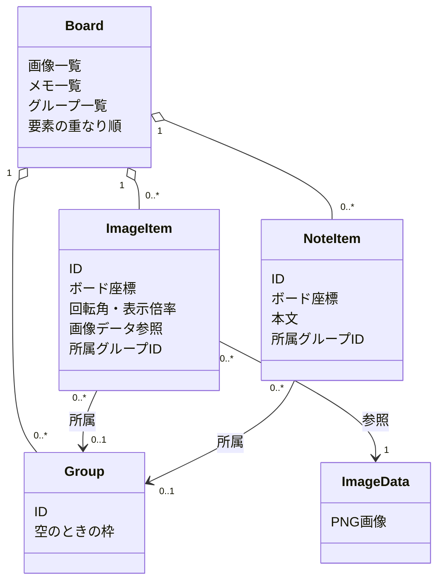

# DES-002：ボードの編集状態とグループ構造

- 設計状態：ドラフト
- 目的・範囲：単一ボードに置く画像・メモ・グループの共通データ構造と編集更新単位を管理する。ZIPの内部スキーマ、IPCの具体的な型、画面操作手段は後続設計で定める。
- 入力確認日：2026-09-26。[REQ-006～010](../product-requirements/organization.md#req-006画像の移動回転拡縮)、[REQ-011](../product-requirements/cross-cutting.md#req-011保存内容の復元)、[REQ-012](../product-requirements/cross-cutting.md#req-01230秒ごとの自動保存)、[REQ-014](../product-requirements/cross-cutting.md#req-014手動保存)、[REQ-016](../product-requirements/cross-cutting.md#req-016保存失敗時の内容保護と再試行)の本文・受入条件と、2026-09-26の本人回答を確認した。REQ-006・010は条件付き合意、REQ-007～009・011～012・014・016は合意済みである。
- 参照要求：[DEM-002](../product-demands/comparison.md#dem-002多くの画像を見渡し全体と細部を比較する)、[DEM-003](../product-demands/organization.md#dem-003画像の関係や気づきを自分なりに整理する)、[DEM-004](../product-demands/cross-cutting.md#dem-004蓄積内容を保ち後日再開する)。
- 依存設計：[DES-001](architecture.md#des-001リファレンスボードの全体設計)。
- 追加確認：2026-09-27、REQ-012の固定周期・保存中の次周期の扱いと、本人による「ドラッグ中は確定済み状態を保存する」の選択を確認した。
- 関連ADR：[ADR-002：描画](architecture-decisions/2026-09-25-ADR-002-pixijs-ui-rendering.md)（採用）、[ADR-003：メモ入力](architecture-decisions/2026-09-25-ADR-003-text-editing.md)（提案）、[ADR-004：保存形式](architecture-decisions/2026-09-26-ADR-004-zip-board-storage.md)（採用）、[ADR-005：保存と復旧](architecture-decisions/2026-09-26-ADR-005-save-recovery-policy.md)（提案）、[ADR-006：編集履歴](architecture-decisions/2026-09-26-ADR-006-session-edit-history.md)（提案）、[ADR-007：座標と所属](architecture-decisions/2026-09-26-ADR-007-board-coordinates-and-groups.md)（提案）。

## 責務・構造

この文書をボード共通データ構造の管理元とする。TypeScript側のボード状態が編集対象の正本を保持し、描画はその状態を読み取る。Rust側は取込画像の変換、ZIP保存・読込を担う。画像データの受渡し方法は後続設計で定める。PixiJSの描画オブジェクトを保存の正本にはしない。

グループは要素を所有・削除する容器ではなく、所属を示す独立した対象である。グループ側に別の所属一覧を正本として持たせず、画像・メモの所属IDから現在の要素を求める。

## データ構造

| データ・項目                 | 意味と論理型                                   | 必須・初期値                   | 制約・根拠                                                                                                                                                                                                                    |
| ---------------------------- | ---------------------------------------------- | ------------------------------ | ----------------------------------------------------------------------------------------------------------------------------------------------------------------------------------------------------------------------------- |
| ボードの画像・メモ・グループ | IDで識別する要素の集合                         | 必須・空集合                   | [REQ-008](../product-requirements/organization.md#req-008グループへの所属と解除)、[REQ-011](../product-requirements/cross-cutting.md#req-011保存内容の復元)                                                                   |
| 画像ID・画像データ参照       | 画像要素と変換済みPNG実体の対応                | 画像ごとに必須                 | 元ファイル・元サイトへの依存なし。[REQ-018](../product-requirements/cross-cutting.md#req-018原本に依存しない継続)、[ADR-004](architecture-decisions/2026-09-26-ADR-004-zip-board-storage.md)                                  |
| 画像の配置                   | ボード座標の位置、回転角、縦横比共通の表示倍率 | 画像ごとに必須                 | ボード表示倍率とは独立。具体的な数値範囲・精度は未決。[REQ-006](../product-requirements/organization.md#req-006画像の移動回転拡縮)                                                                                            |
| メモID・本文・位置           | 独立したメモの文章とボード座標                 | メモごとに必須                 | 文字数上限は要件の未決条件。[REQ-010](../product-requirements/organization.md#req-010独立メモの編集と配置)                                                                                                                    |
| 所属グループID               | 画像・メモが参照する任意のグループID           | 任意・未所属                   | 各要素は最大1グループ。参照先は同じボードに存在する。[REQ-008](../product-requirements/organization.md#req-008グループへの所属と解除)                                                                                         |
| グループID・空時の枠         | グループの識別と空になった後の位置・大きさ     | IDは必須。枠は空グループで保持 | 要素が0件でも残る。枠は最後の要素がなくなる直前の範囲。[REQ-008](../product-requirements/organization.md#req-008グループへの所属と解除)、[ADR-007](architecture-decisions/2026-09-26-ADR-007-board-coordinates-and-groups.md) |
| 要素の重なり順               | 画像・メモごとの表示順                         | 各要素に必須                   | グループ所属とは独立。前面・背面操作の範囲は未決。[ADR-007](architecture-decisions/2026-09-26-ADR-007-board-coordinates-and-groups.md)                                                                                        |

各要素IDはボード内で一意とし、編集・保存・復元・取り消しの間維持する。削除とその取り消しでは同じID・配置・所属・重なり順を復元する。存在しないグループまたは画像データへの参照、重複ID、不正な座標値を読込時に検出した場合は、破損したボードを現在の状態へ混ぜない。[REQ-011](../product-requirements/cross-cutting.md#req-011保存内容の復元)の通知と現在のボード保護に従う。ID生成方法、数値表現、ZIP内の保存項目名は未決である。

## 座標・所属・グループ枠

- 画像・メモは共通のボード座標を保持する。画面パン・ズームは表示変換で扱い、要素の位置や画像の表示サイズを変更しない。画像の表示倍率は縦横同率とする。
- 所属変更・除外・グループ解除では、対象要素の所属IDだけを更新し、ボード座標と重なり順を維持する。別グループへ移すときは旧所属の解除と新所属への設定を一括で確定する。
- グループ移動は、操作開始時の所属画像・メモ全体へ同じボード座標の移動量を適用する。近くや枠内にあるだけの未所属・別グループ要素は対象外。グループ一括回転・拡縮は含めない。
- 所属要素があるグループの枠は要素の表示範囲から計算する。最後の要素が外れる前の枠を空グループへ残し、保存・復元する。空グループを移動した場合は保持した枠の位置を更新する。枠内への配置だけで所属を変更しない。枠の余白・操作UIは未決である。

## 更新単位と編集履歴

以下は[ADR-006](architecture-decisions/2026-09-26-ADR-006-session-edit-history.md)の提案であり、画像削除直後以外の取り消し範囲は要件反映待ちである。

| 操作                               | 確定時の更新単位                                                    | 取り消し時に戻す範囲                         |
| ---------------------------------- | ------------------------------------------------------------------- | -------------------------------------------- |
| 画像・メモの移動、画像の回転・拡縮 | 一つのドラッグ開始から終了までを1操作とする案                       | 操作開始前の配置                             |
| グループの一括移動                 | 所属する全画像・メモの位置を1操作で変更                             | 同じ全要素の位置                             |
| グループへの所属変更・除外・解除   | 関連要素の所属変更を一括確定                                        | 旧所属。座標・重なり順は維持                 |
| 画像削除                           | ボードから除外し、取消用に同じ画像データと配置・所属を保持          | 画像・配置・所属・重なり順。空グループは維持 |
| メモ本文編集                       | 入力中は文章内の細かな履歴。編集終了時にボード状態へ1操作として確定 | 編集開始前の文章                             |

ボードの保存対象、編集中の一時表示・選択、編集履歴を別の状態として扱う。パン・ズーム、選択、保存処理はボード編集履歴へ積まない。履歴は保存成功後も開いている間維持し、閉じると破棄する。削除した画像データは、開いている間に取り消すために必要な範囲で保持する。画像データの実体と配置情報は分離し、ZIPには現在のボードに必要な画像だけを含める案とする。履歴上限・やり直しの詳細は後続設計で具体化する。ドラッグ中の自動保存は次節に従う。

編集を確定した時点で保存対象の更新番号を進め、保存対象のスナップショットをその番号で識別する案とする。取り消しも現在の状態を変更するため、新しい更新番号を持つ。保存中に新しい編集が生じた場合は、保存成功番号より後の変更を未保存として残す。[DES-001](architecture.md#保存と復旧の設計方針)と[ADR-005](architecture-decisions/2026-09-26-ADR-005-save-recovery-policy.md)の保存境界に従う。

### ドラッグ中の自動保存

2026-09-27の本人選択に基づき、自動保存は確定済みのボード状態を対象とする。画像・メモの移動、画像の回転・拡縮、グループ移動に適用する。ドラッグ途中の配置は表示用の一時状態として保持し、確定済みの配置と更新番号を書き換えない。

- 30秒の固定周期を維持する。保存時刻に確定済みの未保存変更があれば、その状態と更新番号を固定して保存する。ドラッグ中の対象は操作開始前の確定済み配置を含める。確定済みの未保存変更がなければ保存を省略する。
- ドラッグ終了時に変更があれば、最終配置を1操作として確定し、更新番号を進める。グループ移動は全対象を一括で確定する。中止または開始時と同じ配置で終了した場合は、配置・更新番号・履歴を変更せず、一時状態を破棄する。
- 保存対象を固定した後にドラッグが終了しても、進行中の保存対象は変更しない。確定した結果は未保存として表示し、次の固定周期または手動保存で保存する。ドラッグ終了だけを理由に追加の自動保存は開始しない。
- 保存処理中に次の固定時刻を迎えた場合は、REQ-012に従って保存を同時実行せず、保留した要求を1回に集約する。先行保存の成功後に確定済みの未保存変更があれば、その時点の最新状態を固定して続けて保存する。まだドラッグ中なら途中配置を除き、終了済みなら確定後の配置を含める。確定済みの未保存変更がなければ追加保存を省略する。
- 保存の成功表示は保存対象の更新番号に対応させ、ドラッグ確定後の変更まで保存済みにしない。失敗時は保存成功番号を進めず、REQ-015・016の失敗表示・内容保護・再試行方針に従う。

判断理由は[ADR-006](architecture-decisions/2026-09-26-ADR-006-session-edit-history.md#決定と理由)に記録する。この節は自動保存と配置ドラッグの境界を扱い、ドラッグ中の手動保存受付やメモ本文入力中の保存境界は後続設計で定める。

## 保存・復元と異常時の扱い

独自ZIPには、現在の画像・メモ・空グループを含むグループ、配置、所属、重なり順と、参照先のPNG画像実体を含める。編集履歴、選択状態、ドラッグ途中の表示は保存しない。読込は参照と内容の整合を確認してからボード状態を切り替え、破損時には現在のボードと保存ファイルを変更しない。形式識別・バージョン、詳細スキーマ、非対応版の扱いは後続設計で定める。

| 事象                               | 保護・回復の方針                                                             |
| ---------------------------------- | ---------------------------------------------------------------------------- |
| 保存中の編集・取り消し             | 保存対象番号と後続変更を分け、新しい状態を古い保存結果で置き換えない         |
| 読込中の不正な所属・画像参照・座標 | 新しい内容へ切り替えず、対象と理由を通知する                                 |
| グループ移動・所属変更の中断       | 関連要素を部分的に確定した状態を保存対象にしない                             |
| アプリ強制終了                     | 最後の保存成功内容まで復元する。セッション履歴と未保存変更の復元は保証しない |

## 検証観点

- 画像・メモの所属変更、グループ解除・移動、空グループ化・再利用・保存再開で、位置・相対配置・重なり順が保たれるか。
- 画像削除の取り消しで、元ファイルに触れず画像データ・配置・所属を復元できるか。拡張された基本編集の取り消し範囲は要件反映後に評価する。
- 保存中に編集・取り消しを行っても、保存成功と未保存を区別でき、古い保存結果が新しい状態を置き換えないか。
- ドラッグ中の定期時刻に、確定済みの未保存変更がある場合は開始前の配置を保存し、ない場合は省略するか。長いドラッグでも固定周期と途中配置の除外を維持するか。
- 保存対象の固定後にドラッグが終了した場合、結果が未保存として残るか。保存中に次周期を迎えた場合の追加保存が、その開始時点で確定済みの最新状態だけを含むか。
- ドラッグの中止・無変更終了で更新番号や履歴を増やさず、グループ移動の一部だけが保存されないか。
- 多数画像の履歴・削除取消に必要な資源量を確認する。具体的なケース、環境、手順、実測は実装・検証担当へ引き継ぐ。

## 未決事項・引継ぎ

| 対象・状態                                  | 残る判断と影響                                                                                                                                 | 引継ぎ先・解消条件・進行範囲                                                                                                                                                                    |
| ------------------------------------------- | ---------------------------------------------------------------------------------------------------------------------------------------------- | ----------------------------------------------------------------------------------------------------------------------------------------------------------------------------------------------- |
| 基本編集の取り消し拡張・ADR-006提案         | 対象操作・操作単位・履歴の保持期間が現行REQ-007を超える                                                                                        | 要件担当へ2026-09-26の本人回答を引き継ぎ、要件本文・受入条件と合意状態を更新する。反映までは合意済みの画像削除直後の取り消しを設計する                                                          |
| グループ枠と要素ごとの重なり順・ADR-007提案 | 自動枠、空時の保持、枠内への配置と所属の関係、必要な前後操作は新しい表示・操作仕様                                                             | 要件担当へ本人回答と設計案を引き継ぎ、範囲・受入条件を明確にする。既存REQ-008～009の所属・移動設計は進める                                                                                      |
| 保存・復旧操作・ADR-005提案                 | ボード作成時の保存先指定、復旧用保持設定、破損時の復旧選択                                                                                     | [DES-001の引継ぎ](architecture.md#未決事項引継ぎ)を正本とし、要件担当へ反映を依頼する                                                                                                           |
| データ・操作契約                            | ID生成、座標単位・精度、表示範囲、メモ上限、履歴上限・やり直しの詳細、ドラッグ中の手動保存受付、メモ本文入力中の保存境界、ZIP内部スキーマ、IPC | 設計担当が後続設計で具体化する。配置ドラッグ中の自動保存は[本書の方針](#ドラッグ中の自動保存)に従う。要件の受入範囲に影響する限界は要件担当へ返し、試作・計測が必要なものは実装・検証担当へ渡す |

## 完了確認

- 対象要件・受入条件への対応：共通構造と更新単位は一部対応。新しい取り消し・枠の振る舞いは要件反映待ち。
- 主要構造・データ/インターフェース契約・正常異常処理：論理構造、所有、参照整合、更新の境界を示した。物理型、ZIPスキーマ、IPCは未決。
- 図・本文・ADRの整合：採用済み描画・保存形式と、提案中の編集履歴・座標方式を区別した。
- テスト方針・観測方法・引継ぎ：検証観点と担当を示した。試作・試験実行は未実施。
- レビュー判断：2026-09-27、ドラフト。配置ドラッグ中の自動保存境界を具体化した。設計完了、要件合意、ADR採用、試験合格は別に判断する。
