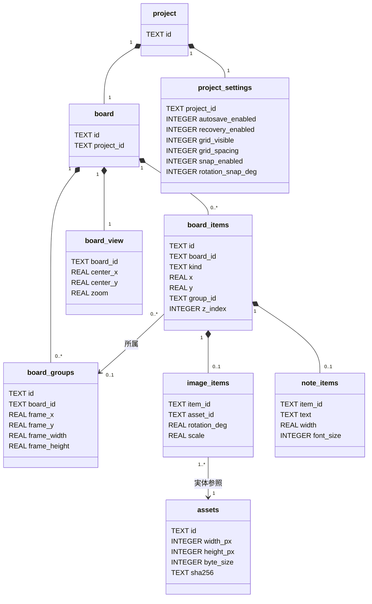

# DES-008：プロジェクトファイルのデータ設計

- 設計状態：ドラフト。保存処理の補助ファイルを追加。変更要件のレビュー・障害検証は未完了。
- 目的・範囲：単一ボードを持つプロジェクトの物理保存構造の正本。画面・保存処理・実装DDLは対象外。
- 入力確認日：2026-09-29。ユーザーのSQLite方針と文書整備計画の実行指示、および下記要件本文・受入条件を確認。
- 参照要件：[REQ-006～010](../../product-requirements/functional-requirements/organization/REQ-006-image-transform.md#req-006画像の移動回転拡縮)（006・010は条件付き合意、007～009は合意済み）、[REQ-011～019](../../product-requirements/functional-requirements/cross-cutting/REQ-011-restore-saved-content.md#req-011保存内容の復元)（011～017・019は意味変更でドラフト、018は合意済み）。方針回答と要件全体への合意を区別する。
- 依存設計：[DES-003](DES-003-data-overview.md)、[DES-004](DES-004-board-data-model.md)、[DES-009](../functional-design/cross-cutting/DES-009-project-persistence-recovery.md)。DES-004は論理モデル、本書は物理形式を管理する。
- 関連判断：[ADR-004](../architecture-decisions/2026-09-26-ADR-004-zip-board-storage.md)、[ADR-010](../architecture-decisions/2026-09-29-ADR-010-sqlite-project-storage.md)。
- 資源上限の判断：[ADR-012](../architecture-decisions/2026-10-06-ADR-012-image-resource-limits.md)。

更新内容：画像資源制限と編集方針の反映後、REQ-001～004・006～017・019はドラフト。REQ-005・018は合意済み、REQ-020～026は条件付き合意。以下に残る過去の参照状態は入力時点の記録で、現在状態の正本は要件本文とする。

## コンテナーと形式識別

```text
example.refboard                 # ZIP、初版コンテナーバージョン1
├── manifest.json
├── data/
│   └── project.sqlite
└── assets/
    └── images/
        └── <asset-id>.png
```

manifestはUTF-8のJSONオブジェクトで、必須の`format`（TEXT相当、固定値`reference-app-project`）と`containerVersion`（整数、初版`1`）だけを出力する。設定・プロジェクトIDはDBだけに保持する。DBスキーマ版は`PRAGMA user_version = 1`で管理する。アプリのリリース版とは別である。拡張子だけで形式を判定しない。

PNGパスは画像実体IDから導出し、DBに絶対パス・元ファイル位置・ZIPパスを重複保存しない。ZIPエントリー名は上記の小文字ASCIIと`/`に統一する。初版は必須ファイルと参照中PNGだけを出力し、不要画像・縮小キャッシュ・SQLiteのjournal/WAL/SHMは同梱しない。読込もこの集合と整合することを確認する。将来項目の追加は形式版で管理し、未知版を推測して読み書きしない。

## 読込保存の資源上限

[保存データの資源上限と安全な読込](../non-functional-design/cross-cutting/DES-040-project-resource-validation.md)を正本とする。関連する操作・結果の扱いは本書に残す。

## 関連図



初版はproject・board・project_settings・board_viewがそれぞれ必ず1行。image_itemsとnote_itemsは排他的で、各board_itemsに種類と一致する詳細行が必ず1行ある。保存DBのassetsは全行が画像要素から参照される。画像のないプロジェクトではassetsは0行。

## 項目定義

表中のPKは主キー、FKは外部キー、NNはNOT NULL。nullableと明記した列以外はNN。欠落を初期値で補うのは新規作成時のみで、既存ファイルの必須項目欠落は破損とする。SQLの暗黙変換に依存せず、列の宣言型と読み出した値の型・値域を検査する。

| テーブル・列 | 型・キー | 初期値・意味・制約 |
| --- | --- | --- |
| project.id | TEXT PK NN | 新規UUID。プロジェクトの識別。別名保存でも維持 |
| board.id | TEXT PK NN | 新規UUID。初版単一ボード |
| board.project_id | TEXT FK UNIQUE NN | project.idを参照 |
| assets.id | TEXT PK NN | 新規UUID。PNG実体の識別、配置要素IDとは別 |
| assets.width_px / height_px | INTEGER NN | 取込PNGから取得、正のピクセル数 |
| assets.byte_size | INTEGER NN | PNG全体の実測バイト数、正整数 |
| assets.sha256 | TEXT NN | PNG全バイトのSHA-256、小文字16進64文字。改ざん証明ではなく実体照合用 |
| board_groups.id / board_id | TEXT PK NN / TEXT FK NN | 新規UUID／board.id |
| board_groups.frame_x / frame_y | REAL NN | 全グループ枠の左上、ボード座標 |
| board_groups.frame_width / frame_height | REAL NN | 全グループ枠の幅・高さ、正のボード単位。最小64×64、内容外接矩形＋各辺24、詳細はDES-004 |
| board_items.id / board_id | TEXT PK NN / TEXT FK NN | 新規UUID／board.id |
| board_items.kind | TEXT NN | CHECKでimageまたはnote |
| board_items.x / y | REAL NN | 画像は中心、メモは表示枠左上のボード座標。配置結果を格納 |
| board_items.group_id | TEXT FK nullable | board_groups.id、初期NULL。所属最大1件 |
| board_items.z_index | INTEGER NN | ボード内でUNIQUE、0以上。小さいものから描画。空き番号可 |
| image_items.item_id | TEXT PK FK NN | board_items.id |
| image_items.asset_id | TEXT FK NN | assets.id |
| image_items.rotation_deg | REAL NN | 初期0度、画面上で時計回り。保存時に0以上360未満へ正規化 |
| image_items.scale | REAL NN | 初期1、PNGの1pxを1ボード単位とした縦横共通倍率。0.01以上16以下 |
| note_items.item_id | TEXT PK FK NN | board_items.id |
| note_items.text | TEXT NN | 初期空文字、確定したUnicode本文を保持。明示改行を保持し上限10,000文字。Unicode 17.0 UAX #29の拡張書記素クラスタ。改行はLFで1文字 |
| note_items.width | REAL NN | メモ表示外幅、初期320、120～4,096単位。高さは本文・幅・font_size・端末フォントから算出し保存しない |
| note_items.font_size | INTEGER NN | 初期16、CHECKで12・14・16・18・24・32。行高は1.5倍で列にしない |
| project_settings.project_id | TEXT PK FK NN | project.id |
| project_settings.autosave_enabled | INTEGER NN | 新規1。CHECKで0または1。30秒周期は仕様で固定しDB列にはしない |
| project_settings.recovery_enabled | INTEGER NN | 新規1。CHECKで0または1 |
| project_settings.grid_visible / snap_enabled | INTEGER NN | 初期1、CHECKで0または1。グリッド非表示でも吸着有効可 |
| project_settings.grid_spacing | INTEGER NN | 初期32、CHECKで8・16・32・64・128、ボード単位 |
| project_settings.rotation_snap_deg | INTEGER NN | 初期15、CHECKで5・15・45・90、度 |
| board_view.board_id | TEXT PK FK NN | board.id |
| board_view.center_x / center_y | REAL NN | 新規0、表示中心のボード座標 |
| board_view.zoom | REAL NN | 新規1、0.000001以上16以下。復元は保存値を無補正で採用。手動範囲・fitはDES-004。画像自身のscaleと区別 |

REALは有限の64bit浮動小数値として変換する。NaN・無限大・正倍率でない値を拒否する。画像倍率とメモ上限は上表の会話決定値に従う。配置外周±1,000,000、枠・本文寸法はDES-004に従う。読込時の端末フォント差による高さ変更だけはDES-009の補正例外を適用する。INTEGERは保存形式上の整数、JSへの受渡しは正確に表現できる範囲を検証し、丸めて受け入れない。要素数・寸法・展開容量の資源上限は[DES-040](../non-functional-design/cross-cutting/DES-040-project-resource-validation.md#読込保存の資源上限)に従う。

## 識別・参照・不変条件

- UUIDは生成時にUUID v4を使い、小文字・ハイフン付き36文字で統一する。保存、再開、削除取消では同じIDを維持する。画像実体は不変とし、内容を変える場合は別IDにする。内容による自動重複排除はしない。
- 接続ごと、トランザクション開始前に`foreign_keys=ON`を設定・確認する。各参照にFK、IDにPK、(board_id,z_index)にUNIQUE、種別・真偽・正値にCHECKを使う。FKの削除規則はRESTRICTとし、暗黙の連鎖削除で編集意図を補わない。
- 同一ボードの所属、種別と詳細行の排他、単一行条件、全グループ枠の条件、画像の使用集合はアプリ側で検査する。枠4値は空・非空を問わず非NULL。保存した枠を採用し、読込時に要素から自動縮小しない。画像外周と枠の検査を行い、メモ高再計算に伴う包含変更はDES-009で原本と分ける。
- 配置の変換は中心／左上の規約を描画・復元で共用する。読込原本を変更せず、端末フォント差調整が必要な場合は未保存の別状態を作る（DES-009）。重なり順に同値がある場合はID順で補正せず不正として扱う。
- FKはDB外のPNGを保護しない。DBのassets、image_items参照、ZIP画像集合、寸法・サイズ・ハッシュ・PNG読取結果が一致することを別途検査する。

## 保存対象と変換・互換性

保存PNGはsRGB・各色8ビット（透過がある場合はアルファも8ビット）とし、向き情報を引き継がない。取込時だけ上限寸法へ縮小する。変換手順は[DES-010](../functional-design/collection/DES-010-image-import-pipeline.md)を参照する。

ボード保存はTypeScriptの確定済みboard/view/settings、設定保存はRustの直前成功board/viewと最新settingsを合成し、本表の全行を新規DBへ一括変換する。更新中DBを編集の正本にしない。画像参照を先に固定して、構造化データと同じ保存スナップショットに結び付ける。読込は逆変換した候補のボード・設定・表示状態をまとめて採用する。[DES-009](../functional-design/cross-cutting/DES-009-project-persistence-recovery.md)が処理順序と失敗保護を管理する。

選択・履歴・未確定操作・描画キャッシュ・保存先パス・要求ID・boardRevision/settingsRevisionと両成功番号・タイマー起算時刻はセッション状態であり保存しない。読込成功時に更新番号を再初期化する。表示中心と倍率は画面寸法によらず復元し、ウィンドウサイズや前面表示等のOS固有状態は今回のプロジェクト設定に追加しない。

初版読込対応はコンテナー1かつDBスキーマ1だけ。0・未来版・組合せ不一致は非対応として入力を変更しない。将来の移行は専用一時コピーで行い、旧版ごとの変換と検証を追加し、別ファイルへ保存する。DB版だけを上げる操作を移行としない。

設計反映で、枠列を空時専用のempty_*から常時保持するframe_*へ変更し、note_items.widthを追加した。リリース済み形式の移行ではなく、形式1の実装前ドラフトの修正である。既存成果物の互換性を検証済みとはしない。履歴上限と画像作業先はアプリ設定のため本DBに含めない。

## 保存処理の補助ファイル

追加内容。以下は保存先と同じフォルダー・同じボリュームの処理用データであり、ZIP内部に同梱しない。本ファイル単体で正常な保存内容を移送できる契約を維持する。通常のDBスキーマ版・manifestの版は変更しない。

```text
example.refboard
example.refboard.recovery                 # 保持有効時の直前1世代
.example.refboard.txn-<transaction-id>/
    new.refboard                          # 新しい検証済み候補
    previous.refboard                     # 独立した旧正常内容の退避
    prepare.json                          # 置換前に同期する準備記録
    complete.json                         # 保存成功の完了記録
    replace-backup.refboard               # Windows置換API用、独立退避とは別
    recovery-next.refboard                # 復旧用更新の一時コピー
```

実装は必要なDB一時ファイル・復旧用置換バックアップもこの処理領域へ置く。画像保持用領域とは寿命を分ける。補助ファイルはアプリ生成の固定名だけを使用し、記録から任意のパスを展開・削除しない。

| 記録 | 必須情報・検証 |
| --- | --- |
| prepare.json | 記録形式版1、transactionId（UUID）、projectId、保存先の正規化識別、保存種類、両更新番号、旧ファイルの有無、新旧ZIPのSHA-256・バイト数、適用した保持設定。UTF-8 JSON、必須値と型を完全検証 |
| complete.json | 同じ識別情報と新旧ZIPのハッシュ・サイズ、保持設定、復旧用更新の要否と完了結果、準備記録のハッシュ。準備記録が後片付けでなくなっても本ファイルを照合できる情報を保持 |

記録は書込途中のファイルを完了記録として扱わない。全必須値の読取・対応照合と同期成功を必要とする。記録にある保存先は、利用者が選択した保存先と処理領域の帰属に一致することを確認する。パストラバーサル、リンク経由の別領域、同名の帰属不明データを受け入れない。新旧ハッシュで世代を結び、時刻だけで新旧を判断しない。部分記録や矛盾時は保存成功と推測せず現物を保全する。

previousは本ファイルと独立したコピーで、ハードリンクや置換APIの移動だけに保護を依存しない。保持設定は成功後の継続保持だけを制御し、無効でもpreviousを作る。有効時は設定・表示位置だけの保存でも毎回.recoveryを更新する。無効時は既存.recoveryを更新・削除しない。初回は旧ファイルなしと記録し、架空の復旧用を作らない。

成功後の整理は不要なZIP・退避等、prepare、completeの順とし、completeを最後に削除する。途中終了した処理や唯一の正常コピーは自動整理しない。読込時の判定と候補提示は[DES-041](../non-functional-design/cross-cutting/DES-041-save-integrity-and-recovery.md#中断した保存の判定)を正本とする。

## 検証観点・未決事項・引継ぎ

DB往復変換で値・ID・重なり順・全グループ枠・メモ幅・画像共有参照・設定・表示位置が保たれること、参照不正とPNG欠損を別々に検出することを確認する。構文・リンク以外の試験は未実施。変更要件のレビュー、資源上限の成立検証、配布用SQLiteライブラリと性能の確認は[DES-009の引継ぎ](../functional-design/cross-cutting/DES-009-project-persistence-recovery.md#未決事項引継ぎ)を正本とする。

## 今回追加項目の互換性

note_items.font_sizeとグリッド／スナップ4列を形式1の実装前ドラフトへ追加。新規作成だけ初期値を補い、読込時の列欠落・NULL・列型不一致・選択肢外は破損として全候補を拒否する。未リリース旧ドラフト形式の読込互換性を追加せず、コンテナー1／スキーマ1を維持する。実装済みの旧ファイルがある場合は担当が識別・移行方針を確認するまで更新しない。グリッド線、補助線、吸着候補・一時解除状態、フォント名・メモ高は保存しない。

入力確認：要件本文の現在状態は維持し、本セッションの決定と計画実行指示を設計へ反映した。振る舞い差分は要件担当の反映・レビュー待ち。製品試験は未実施。

## 共通要件の対応と引継ぎ

独立採番した[REQ-027](../../product-requirements/functional-requirements/organization/REQ-027-edit-history-and-stacking.md)、[REQ-028](../../product-requirements/functional-requirements/organization/REQ-028-placement-grid-and-snapping.md)、[REQ-029](../../product-requirements/non-functional-requirements/cross-cutting/REQ-029-image-and-project-limits.md)、[REQ-030](../../product-requirements/functional-requirements/cross-cutting/REQ-030-shared-settings.md)、[REQ-031](../../product-requirements/functional-requirements/cross-cutting/REQ-031-font-resumption-adjustments.md)、[REQ-032](../../product-requirements/functional-requirements/cross-cutting/REQ-032-file-lock-and-save-retry.md)は、既存の共通条件を管理する本文として参照する。既存設計との対応は一部対応とし、本文・受入条件との個別照合と既存の技術・実機検証の残件を引き継ぐ。文書の再配置によって設計完了・要件合意・ADR採用・試験合格へ状態を変更しない。

## 分割先と正本

- [DES-040：保存データの資源上限と安全な読込](../non-functional-design/cross-cutting/DES-040-project-resource-validation.md)を関連する条件・詳細の正本とする。

分割・配置の整理であり、既存の意味・数値・根拠・状態・未決事項を変更しない。分割元と分割先を合わせて従前の適用範囲を維持する。
