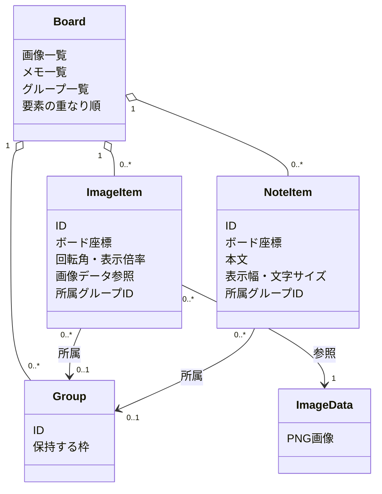

# DES-004：ボードのデータ設計

- 設計状態：ドラフト
- 目的・範囲：単一ボードの画像・メモ・グループの論理データ構造を管理する。物理形式・列型は[DES-008](project-file.md)を正本とする。入力の追加確認日：2026-09-29。
- 参照要件：[REQ-006～010](../../product-requirements/organization.md#req-006画像の移動回転拡縮)、[REQ-011](../../product-requirements/cross-cutting.md#req-011保存内容の復元)、[REQ-018](../../product-requirements/cross-cutting.md#req-018原本に依存しない継続)。状態と受入条件は各要件本文に従う。
- 分割元：[DES-002](../board-state.md#des-002ボードの編集状態とグループ構造)。データ構造の正本を本書へ移した。更新単位・編集履歴はDES-002を参照する。
- 依存設計：[DES-003](overview.md#des-003全体データ設計)。
- 関連ADR：[ADR-004](../architecture-decisions/2026-09-26-ADR-004-zip-board-storage.md)（採用）、[ADR-007](../architecture-decisions/2026-09-26-ADR-007-board-coordinates-and-groups.md)（提案）。

## 関連図

グループは要素を所有・削除する容器ではなく、所属を示す独立した対象である。グループ側に別の所属一覧を正本として持たせず、画像・メモの所属IDから現在の要素を求める。

## データ構造

| データ・項目                 | 意味と論理型                                   | 必須・初期値                   | 制約・根拠                                                                                                                                                                                                                    |
| ---------------------------- | ---------------------------------------------- | ------------------------------ | ----------------------------------------------------------------------------------------------------------------------------------------------------------------------------------------------------------------------------- |
| ボードの画像・メモ・グループ | IDで識別する要素の集合                         | 必須・空集合                   | [REQ-008](../../product-requirements/organization.md#req-008グループへの所属と解除)、[REQ-011](../../product-requirements/cross-cutting.md#req-011保存内容の復元)                                                                   |
| 画像ID・画像データ参照       | 画像要素と変換済みPNG実体の対応                | 画像ごとに必須                 | 元ファイル・元サイトへの依存なし。[REQ-018](../../product-requirements/cross-cutting.md#req-018原本に依存しない継続)、[ADR-004](../architecture-decisions/2026-09-26-ADR-004-zip-board-storage.md)                                  |
| 画像の配置                   | ボード座標の位置、回転角、縦横比共通の表示倍率 | 画像ごとに必須                 | ボード表示倍率とは独立。物理表現と座標基準はDES-008、画像倍率は1～1600%。[REQ-006](../../product-requirements/organization.md#req-006画像の移動回転拡縮)                                                                                            |
| メモID・本文・位置・幅・文字サイズ           | 独立したメモの文章、ボード座標と表示幅                 | メモごとに必須                 | 本文上限10,000拡張書記素クラスタ。幅320（120～4,096）、文字サイズ16（12・14・16・18・24・32）、行高は1.5倍。高さは全文から算出し保存しない。[REQ-010](../../product-requirements/organization.md#req-010独立メモの編集と配置)                                                                                                                    |
| 所属グループID               | 画像・メモが参照する任意のグループID           | 任意・未所属                   | 各要素は最大1グループ。参照先は同じボードに存在する。[REQ-008](../../product-requirements/organization.md#req-008グループへの所属と解除)                                                                                         |
| グループID・枠         | グループの識別と保持する位置・大きさ     | ID・枠とも常に必須 | 要素が0件でも残る。空・非空とも枠を保存し、空になっても維持する。[REQ-008](../../product-requirements/organization.md#req-008グループへの所属と解除)、[ADR-007](../architecture-decisions/2026-09-26-ADR-007-board-coordinates-and-groups.md) |
| 要素の重なり順               | 画像・メモごとの表示順                         | 各要素に必須                   | グループ所属とは独立。最前面・最背面操作と選択時前面化を保存する。[ADR-007](../architecture-decisions/2026-09-26-ADR-007-board-coordinates-and-groups.md)                                                                                        |

各要素IDは保存DB内で一意とし、編集・保存・復元・取り消しの間維持する。削除とその取り消しでは同じID・配置・所属・重なり順を復元する。存在しないグループまたは画像データへの参照、重複ID、不正な座標値を読込時に検出した場合は、破損したボードを現在の状態へ混ぜない。[REQ-011](../../product-requirements/cross-cutting.md#req-011保存内容の復元)の通知と現在のボード保護に従う。ID生成・数値表現・項目名は[DES-008](project-file.md#項目定義)で定義する。

## 座標・所属・グループ枠

- 画像・メモは共通のボード座標を保持する。画面パン・ズームは表示変換で扱い、要素の位置や画像の表示サイズを変更しない。画像の表示倍率は縦横同率とする。
- 所属変更・除外・グループ解除では、対象要素の所属IDだけを更新し、ボード座標と重なり順を維持する。別グループへ移すときは旧所属の解除と新所属への設定を一括で確定する。
- グループ移動は、操作開始時の所属画像・メモ全体へ同じボード座標の移動量を適用する。近くや枠内にあるだけの未所属・別グループ要素は対象外。グループ一括回転・拡縮は含めない。
- 全グループの枠を保持して保存・復元する。手動変更を認め、回転後画像・メモと余白を包含する寸法を下限にする。要素が外へ出ると必要な範囲まで拡大し、移動・除外・削除で自動縮小しない。「中身に合わせる」で明示的に縮小する。空グループを移動した場合は保持した枠の位置を更新する。枠内への配置だけで所属を変更しない。各辺24単位の余白、最小64×64。作成時は内容外接矩形＋余白を中心基準で最小寸法へ拡大し、空作成は64×64。空の「中身に合わせる」は無効。グループ移動では枠と所属要素へ同じ移動量を適用する。

## 保存対象と境界

独自ZIPには、現在の画像・メモ・空グループを含むグループ、配置、所属、重なり順と参照先のPNG画像実体を含める。編集履歴、選択状態、ドラッグ途中の表示は保存しない。読込時の不整合は[DES-002の保存・復元方針](../board-state.md#保存復元と異常時の扱い)に従う。形式識別・版・詳細スキーマは[DES-008](project-file.md)、読込検証は[DES-009](../project-persistence.md)を参照する。

## 数値・表示・フォント契約

2026-10-05の計画反映。有限64bit浮動小数で座標・倍率を保持し、描画は表示中心を差し引いてからGPUへ渡す。保存で恣意的な整数丸めをしない。

- 配置の各軸範囲は−1,000,000～＋1,000,000、画像の回転後外接矩形・メモ全文高さ・全グループ枠まで含める。境界値を含む。通常操作では制約を満たす最後のプレビューを保持し上限到達通知は1ドラッグ1回。取消で操作前へ戻す。グループ・複数選択は一体で検査する。
- グループ枠の変更は四辺を選択したハンドルで変更し、内容＋24単位と64×64を包含する範囲だけ許す。移動・寸法・回転・所属確定に伴う枠拡大も同じ操作へ含める。制約を破る所属追加は一括拒否し、部分的に所属させない。
- 画像角度は時計回り、保存値は `((angle % 360) + 360) % 360`（−0は0）。ドラッグ内部は連続した未正規化角度を保持して周回できる。画像倍率0.01～16、メモは回転・高さ指定なし。
- 手動ズームは空ボードで1～16、非空では `min(1, fitZoom)`～16。fitZoomは枠を含む全外接矩形を現在のボード表示領域の各辺24 CSSpx内へ収める倍率で、上限1。技術下限は0.000001（最大配置幅に対する最小画面で必要なfitより十分小さい）。保存zoomはこの技術下限～16を許可する。
- 全体表示は非空で外接矩形中心・fitZoom、空で原点・1。幅または高さ0の集合は当該軸を計算から除外。表示中心は有限値。読込した中心・倍率は画面寸法が違ってもそのまま採用し、自動fit・下限へのクランプをしない。再開後の手動下限は通常下限と保存zoomの小さい方とし、保存倍率まで縮小できる状態を維持する（空ボードも同じ）。利用者が全体表示を明示実行した時点で現在の画面の通常下限へ再設定する。このセッション下限は保存列にせず、ウィンドウ寸法変更だけで引き上げない。100%未満のメモ編集開始は100%へ拡大し、対象左上とカーソル位置を表示する最小パンを行う。
- フォントはWindowsのUI標準フォント（SystemParametersInfoWのNONCLIENTMETRICSメッセージフォント）を優先し、取得不能なら `Segoe UI`、`Yu Gothic UI`、`Meiryo`、`sans-serif` の順で代替。各文字の不足グリフはOSフォールバック。端末の具体的フォント名はプロジェクトへ保存しない。本文は通常ウェイト、指定サイズと1.5倍行高、内側余白8単位、ヘッダー24単位、最低1行で高さを計算する。幅は余白を含む外幅。

フォント差読込時の座標補正・保存原本との区別はDES-009を正本とする。フォント・計数規則の差を黙って本文変更で解消しない。

2026-10-05入力確認：要件本文の現在状態は維持し、本セッションの決定と計画実行指示を設計へ反映した。振る舞い差分は要件担当の反映・レビュー待ち。製品試験は未実施。
