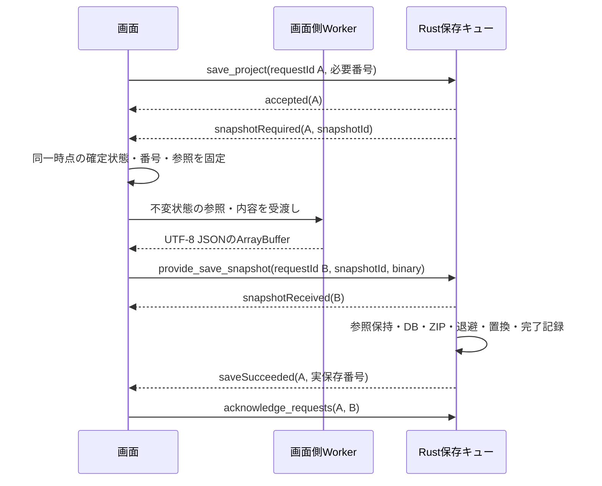

# DES-026：保存要求受付のIPC契約

- 設計状態：評価待ち。契約は決定済み。実Tauriの成立確認・性能・障害評価は未実施。
- 目的・範囲：保存要求受付。この入口とその応答・処理条件を管理し、編集正本や保存・排他の契約は根拠設計を参照する。
- 分割関係：[DES-011](DES-011-ipc-contracts.md)から項目別契約を分割した。全体方針と参照要件・確認時点は分割元を参照する。
- 関連判断：[ADR-016](../architecture-decisions/2026-10-09-ADR-016-ipc-transport-lifecycle.md)。文書の分割で方式の選択・設計状態を変更しない。
- 根拠・依存：[REQ-012](../../product-requirements/cross-cutting/REQ-012-periodic-autosave.md)・[REQ-014](../../product-requirements/cross-cutting/REQ-014-manual-save.md)、[DES-009](DES-009-project-persistence-recovery.md)、[REQ-015](../../product-requirements/cross-cutting/REQ-015-save-status.md)

## save_project

| 項目 | 定義 |
| --- | --- |
| 論理名・物理名 | 保存要求受付／`save_project` |
| 呼出元・呼出先／通信経路 | 画面 → Rust／JSON invoke → accepted → onEvent Channel |
| 責務 | 保存キューへ要求番号と達成待ちを登録する。 |
| 根拠 | [REQ-012](../../product-requirements/cross-cutting/REQ-012-periodic-autosave.md)・[REQ-014](../../product-requirements/cross-cutting/REQ-014-manual-save.md)、[DES-009](DES-009-project-persistence-recovery.md)、[REQ-015](../../product-requirements/cross-cutting/REQ-015-save-status.md) |
| 事前条件 | 現在保存先または選択したsaveAs保存先。blocked-transactionでは未達成番号を内部に保持し、要求はtransactionBlockedで失敗終結する。 |

### 入出力

[入出力表の読み方](DES-014-ipc-common-protocol.md#入出力表の読み方)を適用する。

| 入力：論理名 | 入力：物理名 | 入力：型 | 入力：説明 | 出力：論理名 | 出力：物理名 | 出力：型 | 出力：説明 |
| --- | --- | --- | --- | --- | --- | --- | --- |
| 通信形式版 | `protocolVersion` | number（整数） | 必須。1。 | 通信形式版 | `protocolVersion` | number（整数） | 必須。1。 |
| 要求識別子 | `requestId` | [UUID](DES-014-ipc-common-protocol.md#共通スカラー型) | 必須。画面発行。この呼出し自身の識別。 | 応答・通知種別 | `type` | string | 必須。accepted。 |
| 要求元セッション | `sessionId` | [UUID](DES-014-ipc-common-protocol.md#共通スカラー型) | 必須。現セッション。解放・受領確認は所有を証明できる旧セッションも可。 | 対応要求 | `requestId` | [UUID](DES-014-ipc-common-protocol.md#共通スカラー型) | 必須。元の受付要求。 |
| 現プロジェクト | `projectId` | [UUID](DES-014-ipc-common-protocol.md#共通スカラー型) | 必須。現プロジェクト。 | 要求元セッション | `sessionId` | [UUID](DES-014-ipc-common-protocol.md#共通スカラー型) | 必須。[CommonEnvelope](DES-014-ipc-common-protocol.md#commonenvelope)の照合規則。 |
| 保存先 | `destinationToken` | [Token](DES-014-ipc-common-protocol.md#共通スカラー型) | 必須。現在先または選択済みsaveAs用途。 | 対象プロジェクト | `projectId` | [UUID](DES-014-ipc-common-protocol.md#共通スカラー型) | 対象判明時に必須。空セッション・対象不明では省略。 |
| 保存種類 | `kind` | string（enum） | 必須。boardまたはsettings。 | — | — | — | — |
| 保存契機 | `trigger` | string（enum） | 必須。boardはmanual・periodic、settingsはsettings-change。 | — | — | — | — |
| 必要ボード番号 | `requiredBoardRevision` | [Revision](DES-014-ipc-common-protocol.md#共通スカラー型) | boardだけ必須。settingsでは禁止。 | — | — | — | — |
| 必要設定番号 | `requiredSettingsRevision` | [Revision](DES-014-ipc-common-protocol.md#共通スカラー型) | 必須。 | — | — | — | — |
| 後続通知経路 | `onEvent` | Tauri Channel（[NotificationEnvelope](DES-014-ipc-common-protocol.md#包絡型の参照先)） | 必須。要求ごとに画面が生成し、invoke前にハンドラーを登録する。 | — | — | — | — |

### 処理と失敗時の扱い

[snapshotRequired](DES-026-ipc-save-project.md#snapshotrequired)は実行開始時に代表Channelへ一度だけ送る。保存の最終結果は達成した各要求へ[saveSucceeded](DES-026-ipc-save-project.md#savesucceeded)を返す。settingsのsaveAsは不可。保存先未確立なら先に[select_inputs](DES-019-ipc-select-inputs.md#select_inputs)(saveAs)し、board保存で確立する。

## 応答・通知・エラー

| 段階 | 経路・定義元 |
| --- | --- |
| 受付応答 | 本文の入出力表のPromise正常結果。acceptedの後は元要求のChannel通知で進行・終結する。 |
| 後続通知・最終結果 | [snapshotRequired](DES-026-ipc-save-project.md#snapshotrequired)、[saveSucceeded](DES-026-ipc-save-project.md#savesucceeded)。各通知の経路・発生時点・終端を定義元で確認する。 |
| 拒否・実行失敗・取消 | [FailedEnvelope](DES-017-ipc-error-contracts.md#failedenvelope)。受付前はPromise拒否、継続処理の受付後は元要求の[failed](DES-017-ipc-error-contracts.md#failed)通知。対象別の部分失敗・照合結果は各契約の結果として区別する。 |

## 後続通知

[NotificationEnvelope](DES-014-ipc-common-protocol.md#包絡型の参照先)は[通知型の定義元](DES-014-ipc-common-protocol.md#通知型の定義元)で案内する通知型の判別共用体。通知はRust → 画面の出力として8列へ記載する。表示中の進捗と実際の保存成功を分ける。

### snapshotRequired

| 経路 | 発生時点 | 要求の終端 |
| --- | --- | --- |
| [save_project](DES-026-ipc-save-project.md#save_project).onEventまたは[retry_save](DES-028-ipc-retry-save.md#retry_save).onEvent | 保存キュー先頭の実行開始時 | 非終端 |

| 入力：論理名 | 入力：物理名 | 入力：型 | 入力：説明 | 出力：論理名 | 出力：物理名 | 出力：型 | 出力：説明 |
| --- | --- | --- | --- | --- | --- | --- | --- |
| — | — | — | — | 通信形式版 | `protocolVersion` | number（整数） | 必須。1。 |
| — | — | — | — | 通知種別 | `type` | string | 必須。[snapshotRequired](DES-026-ipc-save-project.md#snapshotrequired)。 |
| — | — | — | — | 対応要求 | `requestId` | [UUID](DES-014-ipc-common-protocol.md#共通スカラー型) | 必須。Channelを渡した元要求。 |
| — | — | — | — | 要求元セッション | `sessionId` | [UUID](DES-014-ipc-common-protocol.md#共通スカラー型) | 必須。採用先セッションと混ぜない。 |
| — | — | — | — | 対象プロジェクト | `projectId` | [UUID](DES-014-ipc-common-protocol.md#共通スカラー型) | 対象判明時に必須。空セッションでは省略。 |
| — | — | — | — | 通知順序 | `eventSequence` | [Revision](DES-014-ipc-common-protocol.md#共通スカラー型) | 必須。要求内で増加。照会再掲では同じ値。 |
| — | — | — | — | 保存対象識別子 | `snapshotId` | [UUID](DES-014-ipc-common-protocol.md#共通スカラー型) | 必須。Rust発行。この実行に一意。 |
| — | — | — | — | 保存種類 | `kind` | string（enum） | 必須。boardまたはsettings。 |
| — | — | — | — | 必要ボード番号 | `requiredBoardRevision` | [Revision](DES-014-ipc-common-protocol.md#共通スカラー型) | boardだけ必須。settingsでは省略。 |
| — | — | — | — | 必要設定番号 | `requiredSettingsRevision` | [Revision](DES-014-ipc-common-protocol.md#共通スカラー型) | 必須。 |
| — | — | — | — | 再試行段階 | `phase` | string | [retry_save](DES-028-ipc-retry-save.md#retry_save)の後続保存だけ必須。followup。通常保存では省略。 |

集約実行の代表Channelへ一度だけ発行する。照会では供給待ちの有効なものを再掲し、同じsnapshotIdを二重供給しない。

### saveSucceeded

| 経路 | 発生時点 | 要求の終端 |
| --- | --- | --- |
| [save_project](DES-026-ipc-save-project.md#save_project).onEventまたは[retry_save](DES-028-ipc-retry-save.md#retry_save).onEvent | 置換・必要な復旧更新・完了記録の同期後 | [save_project](DES-026-ipc-save-project.md#save_project)では終端、[retry_save](DES-028-ipc-retry-save.md#retry_save)では非終端 |

| 入力：論理名 | 入力：物理名 | 入力：型 | 入力：説明 | 出力：論理名 | 出力：物理名 | 出力：型 | 出力：説明 |
| --- | --- | --- | --- | --- | --- | --- | --- |
| — | — | — | — | 通信形式版 | `protocolVersion` | number（整数） | 必須。1。 |
| — | — | — | — | 通知種別 | `type` | string | 必須。[saveSucceeded](DES-026-ipc-save-project.md#savesucceeded)。 |
| — | — | — | — | 対応要求 | `requestId` | [UUID](DES-014-ipc-common-protocol.md#共通スカラー型) | 必須。Channelを渡した元要求。 |
| — | — | — | — | 要求元セッション | `sessionId` | [UUID](DES-014-ipc-common-protocol.md#共通スカラー型) | 必須。採用先セッションと混ぜない。 |
| — | — | — | — | 対象プロジェクト | `projectId` | [UUID](DES-014-ipc-common-protocol.md#共通スカラー型) | 対象判明時に必須。空セッションでは省略。 |
| — | — | — | — | 通知順序 | `eventSequence` | [Revision](DES-014-ipc-common-protocol.md#共通スカラー型) | 必須。要求内で増加。照会再掲では同じ値。 |
| — | — | — | — | 保存種類 | `kind` | string（enum） | 必須。boardまたはsettings。 |
| — | — | — | — | 実保存ボード番号 | `savedBoardRevision` | [Revision](DES-014-ipc-common-protocol.md#共通スカラー型) | 必須。[SavedResult](DES-016-ipc-composite-types.md#savedresult)。 |
| — | — | — | — | 実保存設定番号 | `savedSettingsRevision` | [Revision](DES-014-ipc-common-protocol.md#共通スカラー型) | 必須。[SavedResult](DES-016-ipc-composite-types.md#savedresult)。 |
| — | — | — | — | 保存先 | `destinationToken` | [Token](DES-014-ipc-common-protocol.md#共通スカラー型) | 必須。[SavedResult](DES-016-ipc-composite-types.md#savedresult)。 |
| — | — | — | — | 表示保存先 | `destinationDisplayPath` | string | 必須。[SavedResult](DES-016-ipc-composite-types.md#savedresult)。 |
| — | — | — | — | トランザクション | `transactionId` | [UUID](DES-014-ipc-common-protocol.md#共通スカラー型) | 必須。成功した処理。 |
| — | — | — | — | ZIPハッシュ | `archiveSha256` | [Sha256](DES-014-ipc-common-protocol.md#共通スカラー型) | 必須。[SavedResult](DES-016-ipc-composite-types.md#savedresult)。 |
| — | — | — | — | 後片付け保留 | `cleanupPending` | boolean | 必須。[SavedResult](DES-016-ipc-composite-types.md#savedresult)。 |
| — | — | — | — | 再試行段階 | `phase` | string | [retry_save](DES-028-ipc-retry-save.md#retry_save)だけ必須。followup。通常保存では省略。 |

達成した保存要求それぞれへ同じ実保存結果を返す。settings結果で現在のboard成功番号を進めない。

## 処理順序と失敗保護

### 保存対象固定と集約

キュー先頭でRustがsnapshotIdを発行し、代表要求へ必要番号を通知する。供給のrequestIdは別。集約した要求へ[snapshotRequired](DES-026-ipc-save-project.md#snapshotrequired)を重複発行せず、実保存番号が必要番号を満たした各待機要求へ個別に[saveSucceeded](DES-026-ipc-save-project.md#savesucceeded)を返す。固定後に受付した、より新しい必要番号は次の対象で満たす。

画面はDES-002の確定単位・メモ保存境界に従い、board/settings/viewと両番号、参照集合を同一時点で固定する。固定したオブジェクトは書き換えず、後続編集は別オブジェクトへ適用する。ドラッグ途中・IME変換中を混ぜない。Workerへの受渡しも大きな同期コピーで操作を止めない構成を成立確認する。JSON化はWorkerで行い、転送したArrayBufferは移譲後に再使用しない。実Tauriで必要なコピー量・メモリ予算・保存中反応を計測し、ゼロコピーを保証済みとしない。

board保存は[BoardState](DES-015-ipc-state-dtos.md#boardstate)・[SettingsState](DES-015-ipc-state-dtos.md#settingsstate)・[ViewState](DES-015-ipc-state-dtos.md#viewstate)・[AssetIds](DES-014-ipc-common-protocol.md#共通スカラー型)・両番号を必須とする。settings保存では最新[SettingsState](DES-015-ipc-state-dtos.md#settingsstate)と設定番号だけを渡し、未保存board/view/assets/boardRevisionを禁止する。Rustは先行成功後のB0/view0/画像参照へ合成する。番号不足、使用画像集合不一致、欠損画像は対象不正として書込前に失敗終結する。

供給前にWorkerが失敗した場合は、小さな[SnapshotFailure](DES-016-ipc-composite-types.md#snapshotsubmissionsnapshotfailure)本文を同じ有効snapshotIdへ送って元の保存を失敗終結する。古い供給はstaleSnapshot。供給済みへの重複はsnapshotAlreadySuppliedとして、既に開始した保存を続行する。要求自身の不正なID・ヘッダーは該当する有効な別保存を終了させない。

保存成功はSQL commitではなくDES-009の置換・復旧・完了記録同期後。成功後の整理失敗はcleanupPending。別名保存成功後に保存先とロックを移管する。置換前失敗なら旧保存先・編集状態を保護する。

## 検証観点と関連契約

保存キューの集約、settings保存の範囲、保存先未確立、ブロック待機の失敗終結、保存中編集と実保存番号。具体的な成立確認・性能・障害評価は[DES-013](../test-strategy/DES-013-design-validation-handoff.md#ipc契約の共通評価観点)へ引き継ぐ。

- [DES-011](DES-011-ipc-contracts.md)：全体方針とコマンド一覧。
- [共通通信・資源寿命](DES-014-ipc-common-protocol.md)、[エラー契約](DES-017-ipc-error-contracts.md)：識別・照会・保持・終結と失敗分類。
- 関連コマンド：[select_inputs](DES-019-ipc-select-inputs.md#select_inputs)、[provide_save_snapshot](DES-027-ipc-provide-save-snapshot.md#provide_save_snapshot)、[retry_save](DES-028-ipc-retry-save.md#retry_save)、[get_request_status](DES-038-ipc-get-request-status.md#get_request_status)、[acknowledge_requests](DES-039-ipc-acknowledge-requests.md#acknowledge_requests)。
