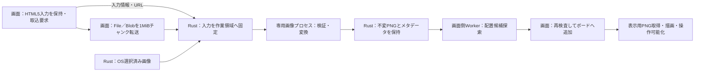

# DES-010：画像取込と初期配置の詳細設計

- 設計状態：ドラフト。方式選択を反映済み。要件差分の反映・レビューと実機成立確認は未完了。
- 目的・範囲：画像入力から表示完了まで。保存・資源所有は[DES-009](../cross-cutting/DES-009-project-persistence-recovery.md)、通信の全体入口は[DES-011](../../interface/DES-011-ipc-contracts.md)、画像取込の通信契約は[import_images](../../interface/DES-020-ipc-import-images.md#import_images)を正本とする。
- 入力確認日：2026-10-08。ユーザーの対話回答と詳細設計反映の実行指示を要約して記録する。URL自動取得、グリッド、長辺320、既存要素回避、ImageMagick同梱、壊れたICCの個別失敗はユーザー選択。API・補助ライブラリ・配置間隔は設計案。
- 参照要件：[REQ-001](../../../product-requirements/functional-requirements/collection/REQ-001-add-image-path.md)、[REQ-002](../../../product-requirements/functional-requirements/collection/REQ-002-static-image-formats.md)、[REQ-003](../../../product-requirements/functional-requirements/collection/REQ-003-batch-import-errors.md)、[REQ-004](../../../product-requirements/functional-requirements/comparison/REQ-004-board-overview-and-detail.md)、[REQ-026](../../../product-requirements/non-functional-requirements/cross-cutting/REQ-026-batch-import-performance.md)、[REQ-029](../../../product-requirements/non-functional-requirements/cross-cutting/REQ-029-image-and-project-limits.md)。001～004・029はドラフト、026は条件付き合意。受入条件の正本は各要件本文。
- 関連判断：[ADR-013](../../architecture-decisions/2026-10-08-ADR-013-imagemagick-worker.md)、[ADR-016](../../architecture-decisions/2026-10-09-ADR-016-ipc-transport-lifecycle.md)。HTML5入力はユーザー選択済み。選定と試験合格は別に管理する。

## 責務と処理経路

受付、変換完了、ボード追加、表示完了を区別する。成功画像ごとに追加・表示し、失敗で既存画像や同じ取込の成功分を巻き戻さない。取込全体は全対象の成功表示または失敗確定で完了する。自動保存完了は含めない。バッチ内の順番は受付時に固定し、画像名と結果を対応させる。

[itemSucceeded](../../interface/DES-020-ipc-import-images.md#itemsucceeded)／[itemFailed](../../interface/DES-020-ipc-import-images.md#itemfailed)は変換結果、[importProcessed](../../interface/DES-020-ipc-import-images.md#importprocessed)は全変換の終結。画面は変換成功対象の配置・表示をdisplayed／placementFailed／displayFailedへ確定し、[sync_asset_refs](../../interface/DES-024-ipc-sync-asset-refs.md#sync_asset_refs)の受領後に[complete_import](../../interface/DES-025-ipc-complete-import.md#complete_import)を呼ぶ。[importFinished](../../interface/DES-020-ipc-import-images.md#importfinished)までバッチ参照を保持する。終了・切替はこの表示終結まで待ち、変換終結だけで進まない。

## 入力取得

1. Windowsの`dragDropEnabled: false`でローカル・ブラウザのドラッグをHTML5へ統一する。ドロップ・貼付イベント中にFile／Blobと文字列を取得して保持し、後続の非同期処理からDataTransferを再読込しない。OSファイル選択は[select_inputs](../../interface/DES-019-ipc-select-inputs.md#select_inputs)(images)を使い、Rustが直接処理する入力トークンを返す。
2. ブラウザが直接渡す画像ファイル／画素データを優先する。ドラッグで直接画像を得られず画像URLだけを得た場合は自動取得する。画像コピー後の貼付は画像データを対象とし、任意のURL文字列貼付やURL入力欄は追加しない。入力が取得不能ならその対象を失敗として通知する。
3. URLはドラッグ対象から抽出したHTTP/HTTPSだけを受け付ける。Rustの`reqwest`で取得し、ブラウザのCookie・認証状態は引き継がない。対象ページの条件はREQ-001に従う。接続10秒、取得全体120秒、リダイレクト最大5回を設計初期値とし、各転送先もHTTP/HTTPSに限定する。Content-Lengthだけに依存せず実受信1GiBで打切る。接続・取得時間は変換プロセスの120秒とは別に計測する。
4. 全入力を管理された作業領域へ固定し、拡張子やHTTPのContent-Typeだけで形式を決めない。画像名は通知用の文字列とし、ファイルパスやワーカー命令として使用しない。取得後は共通の形式・寸法・資源検査へ進める。

[import_images](../../interface/DES-020-ipc-import-images.md#import_images)へはinputId・0始まりinputIndex・displayName・sourceを持つ一覧を先に送る。source.kindはtoken／stream／dragUrl。streamの受付でinputTokenを発行し、[upload_import_chunk](../../interface/DES-021-ipc-upload-import-chunk.md#upload_import_chunk)のArrayBuffer本文と識別・オフセットのヘッダーで固定する。最大1MiB、アプリ全体で同時1チャンク。同じ位置・長さ・内容の再送を受領済みとして返し、不一致を拒否する。転送完了または取得失敗は[finish_import_input](../../interface/DES-022-ipc-finish-import-input.md#finish_import_input)で対象ごとに終結する。入力型は[DES-016](../../interface/DES-016-ipc-composite-types.md#inputspecinputsource)、再送は[upload_import_chunk](../../interface/DES-021-ipc-upload-import-chunk.md#upload_import_chunk)、入力終結は[finish_import_input](../../interface/DES-022-ipc-finish-import-input.md#finish_import_input)を正本とする。

入力上限・作業領域確保・保存先との分離はDES-008・009を維持する。入力固定の失敗でボード状態を変更しない。

## 変換ワーカー

Rustの専用子プロセスからImageMagick 7のMagickWand C APIを呼ぶ。Q16ビルド、JPEG・PNG・WebP・GIF・TIFF・BMPとLittle CMSを同梱対象とし、必要なコーデック・DLL・ポリシーを配布物で固定する。任意の外部コマンドやネットワークdelegateは使わない。子へ渡す入出力はRustが管理する作業領域内だけに限定する。

変換の同時数・メモリ・時間・子プロセス制御は[DES-043](../../non-functional-design/collection/DES-043-image-conversion-resource-controls.md)を正本とする。クラッシュ・制限超過・タイムアウトは当該画像の失敗とし、次の対象には新しい制限付きワーカーを使う。同じ対象の無限再試行はしない。

| 段階 | 契約 |
| --- | --- |
| 形式・寸法検査 | REQ-029の画素数・一辺・入力容量を検査。ヘッダーとデコード結果の両方を照合し、過大入力を拒否 |
| 静止画像化 | GIF・WebPは先頭コマ、TIFFは先頭ページ。残りを追加せず複数コマ／ページの通知を返す。向き情報による自動回転は行わない |
| 色変換 | 有効な埋込ICCがあればそれを入力色としてsRGBへ変換。ICCなしは形式から得た色空間を使用し、色情報のないRGBはsRGBとする。壊れたICCや変換不能は個別失敗とし、プロファイルを捨てて成功扱いにしない |
| 縮小 | 既存の長辺3840・短辺2160内へ縦横比を保って縮小。拡大せず、寸法丸めと最小1pxは本書の「変換寸法・派生画像の共通ルール」に従う。線形RGBでLanczos3を使い、透過周辺の色にじみを評価する |
| 出力 | sRGBの8bit RGB(A) PNG、透過を保持。sRGBと整合する色情報を残し、元のICCや向き情報を出力へ持ち越さない。PNG上限と寸法を再検査。本PNGから拡大なしの256／1024px表示用PNGを作り、必要な縮小版の検証まで[DES-043](../../non-functional-design/collection/DES-043-image-conversion-resource-controls.md)の変換時間制限の対象とする |
| 登録 | 成功PNGを不変実体として登録し、assetId・寸法・バイト数・SHA-256を返す。内容を変更するときは別assetIdを使う |

保存画像の解像度とボード上の初期サイズは別である。PNG生成中の一時ファイルは公開せず、生成失敗時に未完成実体を登録しない。

## 初期サイズと衝突回避配置

ボード倍率100%で長辺最大320pxにする。PNG寸法をw・hとすると、初期画像倍率は`min(1, 320 / max(w,h))`。320より小さい画像を拡大しない。取込で保存PNGを320pxへ縮小し直すことはしない。

設計初期値としてグリッドのセル320×320、セル間隔24ボード単位を使う。列数は受付件数Nと受付時のボード表示領域の縦横比aから`min(N, max(1, ceil(sqrt(N*a))))`、行数は`ceil(N/列数)`とする。ドロップ位置、ファイル選択・貼付の表示中心をグリッド中心の基準にし、画面座標を受付時のボード座標へ変換して固定する。

行優先の各セルを割り当て、画像をセル中心へ配置する。既存画像の回転後AABB、メモ表示枠、空を含むグループ枠と24単位の間隔を確保する。衝突時はセル間隔単位の周囲候補を、元セルからの距離二乗、Y座標、X座標の昇順で探索する。成功済みの配置と後続予約を占有扱いにし、失敗した対象のために成功済み画像を詰め直さない。枠内に入っただけでグループへ所属させない。

探索は画面側Web Workerで空間索引を使って分割実行する。追加直前に現在のボード状態で位置と全体上限を再検査し、編集中の要素と衝突したら候補探索をやり直す。座標上限内に置けなければ当該画像は配置失敗とし、既存要素を移動したり重ねて成功扱いにしない。変換済みPNGはDES-009の参照所有に従い、ボード・保存・履歴に参照がなければ解放できる。

## エラーと検証への引継ぎ

取得・形式・寸法・色変換・変換資源・PNG登録・配置・表示を別の失敗段階として返す。取込時に追加されなかった対象と、ボードへ追加済みだが表示に失敗した対象を区別する。後者は画像実体を消さず、表示再要求の対象とする。証拠のない破損・権限・色プロファイル原因を推測しない。

要件担当へ：REQ-001のURL自動取得条件、REQ-003の壊れたICC・配置失敗・部分成功、REQ-004の320px・既存要素回避を本文・受入条件と照合する。正常案は各取込経路で初期サイズと間隔を満たし操作可能になること。異常案は直接入力／URL取得／ICC／配置の失敗対象を識別し成功分と既存内容を保持すること。未合意の変更後要件全体を合意済みへ自動変更しない。

実装・検証担当へ：[DES-013](../../test-strategy/DES-013-design-validation-handoff.md)に従い、6形式・先頭コマ／ページ・ICC・透過・巨大入力・HTML5入力・OS選択・チャンク再送／不一致・取得途中失敗・配置競合・表示失敗を小規模成立確認で評価する。MagickWandのWindowsビルド、FFI、実Tauri転送、色変換・ピーク資源と配置探索性能は未検証。成立しない場合は証拠と影響を記録して本書・ADR-013・016を見直す。

根拠：[reqwest ClientBuilder](https://docs.rs/reqwest/latest/reqwest/struct.ClientBuilder.html)は接続・取得タイムアウトと転送制御の確認元。数値は本設計の初期値でありライブラリの既定値ではない。

## 変換寸法・派生画像の共通ルール

- 向き情報は無視し、PNGへ引き継がない。元の色情報からsRGBへ変換し、RGBと必要な透過を各8ビットへ統一する。色情報のないRGBはsRGBとして扱う。不正・非対応の色情報で変換できない場合は対象画像を失敗とし、黙って別の色解釈へ置き換えない。

- 長辺3840px・短辺2160pxを超える画像だけ縦横比を維持して縮小する。倍率は `min(1, 3840/長辺, 2160/短辺)`、出力各辺は乗算後切捨て・最低1pxとする。上限以下の画像は拡大も縮小もしない。原本を変更せず、縮小後PNGを保存用画像とする。GIF・WebP先頭コマ、TIFF先頭ページの範囲は維持する。

- 本画像から長辺256px・1024pxの表示用画像を作る。元より大きい派生画像は作らず、同じ寸法なら既存画像を共有する。変換結果を検証してから画像をボードへ追加し、途中成果を保存対象にしない。

## 変換失敗時の処理

タイムアウトでは対象プロセスを終了し、当該画像の途中成果を採用せず、次の画像は新しいプロセスで処理する。クラッシュ・メモリ不足も対象と理由を通知し、同じ画像を無限に自動再試行しない。

クラッシュ・制限超過・タイムアウトは当該画像の失敗とし、次の対象には新しい制限付きワーカーを使う。同じ対象の無限再試行はしない。制限の設定と打切り条件は[DES-043](../../non-functional-design/collection/DES-043-image-conversion-resource-controls.md)を正本とする。

## 分割先と正本

- [DES-043：画像変換の資源制御](../../non-functional-design/collection/DES-043-image-conversion-resource-controls.md)を関連する条件・詳細の正本とする。

分割・配置の整理であり、既存の意味・数値・根拠・状態・未決事項を変更しない。分割元と分割先を合わせて従前の適用範囲を維持する。
