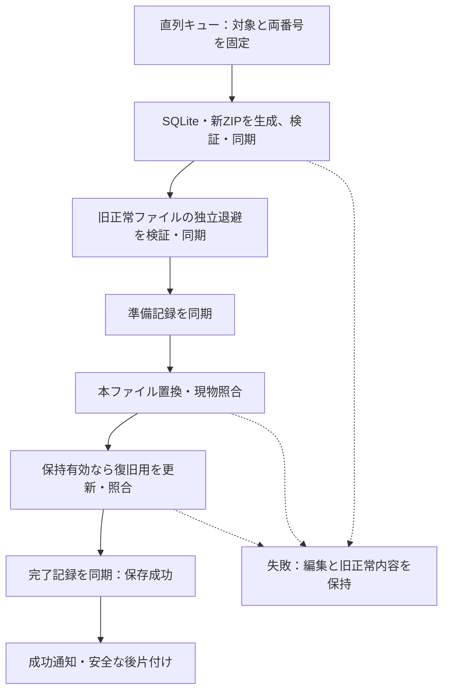

# DES-041：保存整合性と復元保証

- 設計状態：ドラフト
- 分割元：[DES-009](../../functional-design/cross-cutting/DES-009-project-persistence-recovery.md)。本文の意味・数値・保証範囲を保持した整理であり、新たな合意・設計完了・試験合格を表さない。
- 目的・範囲：保存整合性と復元保証の詳細を管理する。操作、データ項目、画面配置、通信項目の正本は依存設計を参照する。
- 参照要件：[REQ-037](../../../product-requirements/non-functional-requirements/cross-cutting/REQ-037-saved-content-durability.md)、[REQ-014](../../../product-requirements/functional-requirements/cross-cutting/REQ-014-manual-save.md)、[REQ-016](../../../product-requirements/functional-requirements/cross-cutting/REQ-016-save-failure-recovery.md)、[REQ-032](../../../product-requirements/functional-requirements/cross-cutting/REQ-032-file-lock-and-save-retry.md)。現在の合意状況と受入条件は各要件本文を正本とする。
- 依存設計：[DES-009](../../functional-design/cross-cutting/DES-009-project-persistence-recovery.md)

### 書込と成功境界

1. 保存先と同じフォルダーに処理ごとの一意な一時領域を作る。参照PNGを保持し、新しい専用DBで`foreign_keys=ON`、`journal_mode=DELETE`を用いて全行を単一トランザクションで生成する。制約・参照検証後にcommit・closeする。
2. manifest・閉じたDB・参照PNGだけから新ZIPを生成する。PNGはストリームで扱い、ZIPを閉じ、構造・DB・画像対応を検証して書出しを同期する。DB commitはプロジェクト保存成功ではない。
3. 既存本ファイルの識別・ハッシュを直前成功時の基準と照合し、外部変更があれば上書きせず失敗とする。旧正常ファイルを独立した退避へコピーし、照合・同期する。初回は旧ファイルなしを記録する。
4. 新旧のハッシュ・保存先識別・保持設定等の準備記録を同期してから本ファイルを変更する。補助ファイルの構造は[DES-008](../../data-design/DES-008-project-file-data.md#保存処理の補助ファイル)を参照する。
5. 既存ファイルは`ReplaceFileW`（flagsは0、別の一時バックアップ名を指定）で置換する。独立退避をAPIの移動元や上書き先に使わない。初回は同一ボリューム内の`MoveFileExW`で置き、`MOVEFILE_REPLACE_EXISTING`・`MOVEFILE_COPY_ALLOWED`を使わず、既存なら失敗する。API結果にかかわらず新旧・本ファイルの所在とハッシュを照合し、不明な現物を削除しない。
6. 置換先を照合・同期する。保持有効かつ旧正常内容がある場合は、退避のコピーから復旧用を一時生成・検証・同期して`.recovery`へ置く。既存復旧用の更新にも退避付き置換を使う。設定・表示位置だけの保存も対象。保持無効なら既存復旧用を更新・削除しない。
7. 本ファイルと必要な復旧用処理を確認後、完了記録を完全に書き出して同期する。この地点を保存成功とし、直前成功スナップショットと両成功番号を更新して通知する。同期失敗・不完全な記録を成功扱いしない。成功後の一時領域整理だけの失敗は保存失敗へ戻さず、後片付け保留として扱う。

`ReplaceFileW`には失敗後もファイルの所在が変わる場合があり、`REPLACEFILE_WRITE_THROUGH`は未サポート。同期は`FlushFileBuffers`で別途行う。確認した資料：[ReplaceFileW](https://learn.microsoft.com/en-us/windows/win32/api/winbase/nf-winbase-replacefilew)、[FlushFileBuffers](https://learn.microsoft.com/en-us/windows/win32/api/fileapi/nf-fileapi-flushfilebuffers)、[MoveFileExW](https://learn.microsoft.com/en-us/windows/win32/api/winbase/nf-winbase-movefileexw)。API選定は障害検証合格を意味しない。

同一保存先のアプリ内・別プロセスからの二重書込を排他する。外部アプリの同時書換えを協調ロックだけで防げるとはみなさず、置換直前と直後の照合で検出した競合は成功にしない。別名保存先の既存ファイルも無断で上書きしない。

### 中断した保存の判定

本ファイルを開く際は、その保存先に属する処理記録も確認する。本ファイルが存在しない場合にも同じ保存先の退避候補を探せるよう、開く画面から中断処理の候補を選べる。日時の新しさだけで採用せず、準備記録・完了記録とファイルの完全な検証を用いる。

| 状態 | 判定・保護 |
| --- | --- |
| 置換前、本ファイルが旧ハッシュと一致 | 旧正常内容を利用。作成途中の新ZIPを採用しない |
| 置換後、完全な完了記録なし | 本ファイルが新ハッシュでも成功扱いしない。検証済みの独立退避を直前成功内容として提示 |
| 完全な完了記録と本ファイルが一致 | 新しい成功内容を利用。通知前の終了でも同じ |
| 記録・現物の不一致または破損 | 当該保存先の上書き・自動整理を停止し、検証済みの候補だけ提示 |
| 初回保存の途中 | 保証対象の旧保存はない。正常な候補があれば「未完了の初回保存」と示して選択可能にする |

準備記録だけ・途中までの完了記録・単に正常な新ZIPは成功証明にならない。退避や復旧用を開く操作はコピーを保持したまま行い、別名保存成功前に唯一の正常内容を削除しない。元ファイルを自動修復しない。複数の未整理処理がある場合は新旧ハッシュの連鎖を検証し、後続の準備記録が保護する直前成功内容まで確認する。連鎖が曖昧なら自動選択しない。

後片付けは成功した処理だけを対象とし、完了記録を最後に削除する。準備記録の除去後は完了記録だけでも成功ファイルを照合できる情報を残す。未完了処理の退避や帰属不明のファイルを時間経過だけで削除しない。後片付け中の強制終了でも新本ファイルと成功証拠が残る順序にする。

## 分割元の根拠・状態・未決事項

### DES-009から引き継ぐ情報

- 設計状態：ドラフト。保存統合・復元と資源制御を具体化したが、障害・性能検証と変更要件のレビューが残るため実装引継ぎ可能とはしない。
- 入力確認日：2026-09-30。ユーザーの設定独立保存、確認中の保存停止と戻った後の集約実行、入力済みメモ保存・IME変換中除外、同一ファイル再読込、取込完了待ち、表示位置保存、全保存での復旧用更新の回答と、本設計具体化計画の実行指示を確認。要件全体への合意・製品試験合格とは区別する。
- 関連ADR：[ADR-011](../../architecture-decisions/2026-10-05-ADR-011-project-lock-and-retry.md)（排他・明示再試行、提案）、[ADR-004](../../architecture-decisions/2026-09-26-ADR-004-zip-board-storage.md)・[ADR-010](../../architecture-decisions/2026-09-29-ADR-010-sqlite-project-storage.md)は採用、[ADR-005](../../architecture-decisions/2026-09-26-ADR-005-save-recovery-policy.md)は変更要件レビュー・障害検証が残る提案。

詳細な文脈・確認事項・引継ぎは[DES-009](../../functional-design/cross-cutting/DES-009-project-persistence-recovery.md)を参照する。

## 検証への引継ぎ

[DES-013](../../test-strategy/DES-013-design-validation-handoff.md)のテスト方針を適用する。方式の選択と文書整合確認を、製品の性能達成・障害保護・実機試験の成立と区別する。
