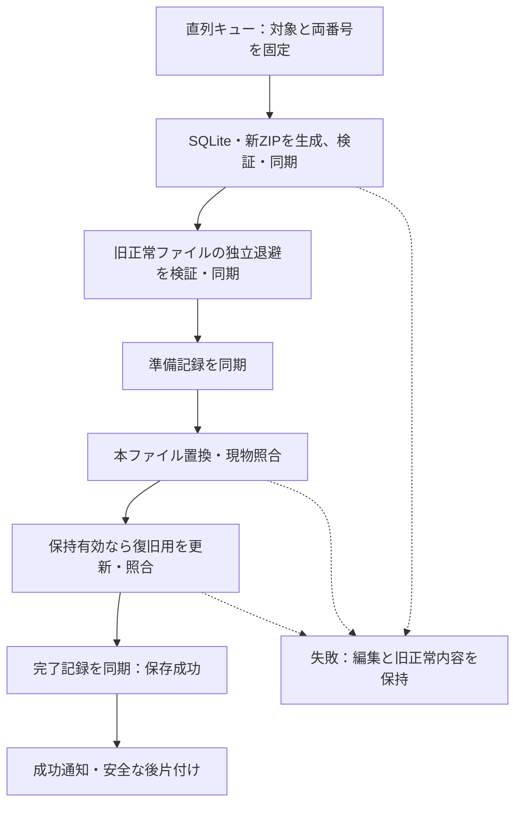
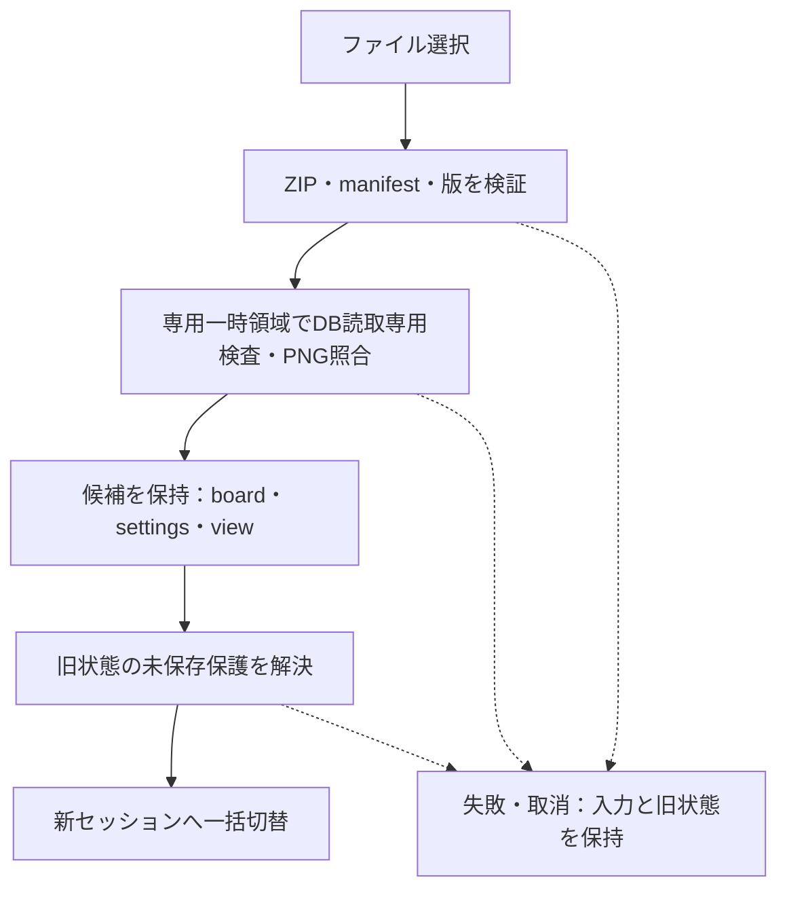

# DES-009：プロジェクトの保存・読込・復旧設計

- 設計状態：ドラフト。保存統合・復元と資源制御を具体化したが、障害・性能検証と変更要件のレビューが残るため実装引継ぎ可能とはしない。
- 目的・範囲：プロジェクト永続化の処理契約と失敗時の保護。物理構造は[DES-008](data-design/project-file.md)、編集単位は[DES-002](board-state.md)、画面は[DES-007](screen-design/persistence.md)を正本とする。
- 入力確認日：2026-09-30。ユーザーの設定独立保存、確認中の保存停止と戻った後の集約実行、入力済みメモ保存・IME変換中除外、同一ファイル再読込、取込完了待ち、表示位置保存、全保存での復旧用更新の回答と、本設計具体化計画の実行指示を確認。要件全体への合意・製品試験合格とは区別する。
- 参照要件：[REQ-011～019](../product-requirements/cross-cutting.md#req-011保存内容の復元)（011～017・019は今回の意味変更に伴いドラフト、018は合意済み）、[REQ-023～025](../product-requirements/cross-cutting.md#req-023保存中の操作反応)（条件付き合意：保存中操作と500枚再開）。変更後の受入条件と既存性能基準は要件本文を正本とする。
- 関連ADR：[ADR-011](architecture-decisions/2026-10-05-ADR-011-project-lock-and-retry.md)（排他・明示再試行、提案）、[ADR-004](architecture-decisions/2026-09-26-ADR-004-zip-board-storage.md)・[ADR-010](architecture-decisions/2026-09-29-ADR-010-sqlite-project-storage.md)は採用、[ADR-005](architecture-decisions/2026-09-26-ADR-005-save-recovery-policy.md)は変更要件レビュー・障害検証が残る提案。

## 責務と状態

TypeScriptはボード・設定・表示中心と倍率、二系統の更新番号、未保存表示と手動要求の達成待ちを所有する。Rustは直列保存キュー、直前成功スナップショット、画像参照、DB変換・検証、ZIP生成・読込、ファイル置換と保存先を所有する。SQLiteは保存・復元専用であり、UIスレッドで長いDB・画像・ZIP処理を行わない。

- `boardRevision`はボードまたは表示中心／倍率の確定変更、`settingsRevision`は設定変更で進む。各々の`savedBoardRevision`・`savedSettingsRevision`と比較し、未保存を別々に判断する。取消も新番号、同値の確定・重なり順を変えない選択変更・描画・未確定ドラッグは番号を進めない。選択時前面化は永続編集として扱い、その確定境界はDES-002で具体化する。パン・ズームは保存対象だがUndo履歴には含めない。
- 番号はセッション内の単調増加整数。同一ファイルを開き直しても新しいsessionIdを発行し、保存先・セッションの異なる成功基準を混用しない。
- Rustは直前成功スナップショットとしてボード・表示位置・設定と両成功番号を保持する。設定保存はここへ最新設定だけを組み合わせる。画面で削除済みでも、直前成功内容が参照する画像実体を保持する。直前成功内容・履歴・実行中保存・読込候補の全参照がなくなるまで解放しない。
- 新規作成は保存先と名前を指定し、空ボード・初期設定・初期表示位置の初回保存成功後に編集可能にする。取消では作成しない。失敗は再試行・別保存先・取消を選べる。既存ボードは新規ファイル保存成功と未保存保護の解決まで保持する。
- 復旧から開く場合だけは保存先未確立で編集可能とし、別名保存まで設定独立保存・定期保存を開始しない。設定変更も未保存として示す。

## 主要契約

以下は責務間の論理契約であり、具体的なIPCコマンド名やシリアライズライブラリは実装時に割り当てる。更新番号はIPCで正確な整数として往復可能な表現にする。

| 契約 | 入力・事前条件 | 結果・失敗 |
| --- | --- | --- |
| 保存要求 | requestId、sessionId、projectId、destinationToken、kind（board／settings）、trigger（manual／periodic／settings-change）、必要boardRevision・settingsRevision。実行開始時の確定済みboard/settings/viewと参照assetId集合。保存先トークンはRustが管理する選択済み保存先に限る | 受付は成功通知と別。成功は同じ識別子・実際に保存した両番号・保存先・transactionIdを返す。設定保存でboard成功番号を進めない。失敗はstage、reason、保護できた旧保存の位置・再試行可否を返す |
| 画像保持 | スナップショットのassetId集合。不変のPNG実体をRust側で取得できること | 保存完了・失敗まで参照を保持。履歴や画面から削除されても実体を解放しない。不在は保存失敗 |
| 読込候補生成 | loadRequestId、現sessionId、OSで選択した入力ファイル | 検証済みcandidateToken、projectId、board/settings/view、保持済み画像参照。または対象と理由。現在の状態を変更しない |
| 候補採用 | 最新のloadRequestIdとcandidateToken、入力の識別・ハッシュが検証時と一致、旧セッションの未保存保護が解決済み | 全状態と保存先を一括切替し新sessionIdを発行、両更新番号と両成功番号を0へ。端末フォント調整が必要な場合は読込原本を成功状態B0に保持し、調整後B1だけboardRevisionを1へ。失敗・取消なら旧状態を保持 |

エラーstageはsnapshot、database、assets、archive、prepare、replace、recovery、commit、cleanup、loadのいずれか。reasonは不正形式、非対応版、整合不正、画像欠損・破損、容量不足、アクセス不可、取消、I/O失敗を区別し、実際に判定できた範囲だけ通知する。例外文字列から容量不足等を推測しない。遅延結果はsessionId・requestId・保存先を照合し、別プロジェクトを保存済みにしたり、取り消した切替を実行したりしない。

## 保存処理

### 保存対象と直列キュー

| 種類 | 実行開始時に固定する内容 | 成功の反映 |
| --- | --- | --- |
| 設定保存 | 直前成功のboard/viewとその画像集合＋最新settings | settings成功番号だけを進める |
| 手動・定期保存 | 最新の確定済みboard/view/settingsと画像集合 | 実際に含む両成功番号を進める |

例えば保存済みB0/S0から画像を動かしてB1とし、自動保存を無効にしてS1とした場合、設定保存はB0/S1を保存する。画面のB1は未保存のまま。後の手動保存でB1/S1になる。

同じ保存先への書込は設定を含め1件だけ実行する。待機要求は種類・必要番号で管理し、実行開始時に最新の確定対象を取得・固定する。設定保存の基礎は先行処理成功後のスナップショットとし、古いボードを予約して巻き戻さない。固定後の変更は次の保存へ送る。待機要求は受付順を基本に、定期要求と設定要求を各最大1件へ集約する。手動要求の達成待ちは個々に維持し、成功した両番号が必要番号を満たす場合だけ完了通知する。ボード保存が待機中の最新設定も含めば、その設定要求を満たして重複書込を省く。

失敗は待機要求の成功ではない。実行した要求は失敗結果で終了し、未保存は保持する。次の独立した受付要求・手動再試行・次の固定周期で再評価し、失敗要求の無限即時再試行はしない。置換以降の失敗は当該保存先の書込を止める。利用者の再試行では下記の照合・中断処理終結契約を先に実行し、解消できなければ別名保存へ案内する。編集メモリは保持する。

### 書込と成功境界

1. 保存先と同じフォルダーに処理ごとの一意な一時領域を作る。参照PNGを保持し、新しい専用DBで`foreign_keys=ON`、`journal_mode=DELETE`を用いて全行を単一トランザクションで生成する。制約・参照検証後にcommit・closeする。
2. manifest・閉じたDB・参照PNGだけから新ZIPを生成する。PNGはストリームで扱い、ZIPを閉じ、構造・DB・画像対応を検証して書出しを同期する。DB commitはプロジェクト保存成功ではない。
3. 既存本ファイルの識別・ハッシュを直前成功時の基準と照合し、外部変更があれば上書きせず失敗とする。旧正常ファイルを独立した退避へコピーし、照合・同期する。初回は旧ファイルなしを記録する。
4. 新旧のハッシュ・保存先識別・保持設定等の準備記録を同期してから本ファイルを変更する。補助ファイルの構造は[DES-008](data-design/project-file.md#保存処理の補助ファイル)を参照する。
5. 既存ファイルは`ReplaceFileW`（flagsは0、別の一時バックアップ名を指定）で置換する。独立退避をAPIの移動元や上書き先に使わない。初回は同一ボリューム内の`MoveFileExW`で置き、`MOVEFILE_REPLACE_EXISTING`・`MOVEFILE_COPY_ALLOWED`を使わず、既存なら失敗する。API結果にかかわらず新旧・本ファイルの所在とハッシュを照合し、不明な現物を削除しない。
6. 置換先を照合・同期する。保持有効かつ旧正常内容がある場合は、退避のコピーから復旧用を一時生成・検証・同期して`.recovery`へ置く。既存復旧用の更新にも退避付き置換を使う。設定・表示位置だけの保存も対象。保持無効なら既存復旧用を更新・削除しない。
7. 本ファイルと必要な復旧用処理を確認後、完了記録を完全に書き出して同期する。この地点を保存成功とし、直前成功スナップショットと両成功番号を更新して通知する。同期失敗・不完全な記録を成功扱いしない。成功後の一時領域整理だけの失敗は保存失敗へ戻さず、後片付け保留として扱う。

`ReplaceFileW`には失敗後もファイルの所在が変わる場合があり、`REPLACEFILE_WRITE_THROUGH`は未サポート。同期は`FlushFileBuffers`で別途行う。確認した資料：[ReplaceFileW](https://learn.microsoft.com/en-us/windows/win32/api/winbase/nf-winbase-replacefilew)、[FlushFileBuffers](https://learn.microsoft.com/en-us/windows/win32/api/fileapi/nf-fileapi-flushfilebuffers)、[MoveFileExW](https://learn.microsoft.com/en-us/windows/win32/api/winbase/nf-winbase-movefileexw)。API選定は障害検証合格を意味しない。

同一保存先のアプリ内・別プロセスからの二重書込を排他する。外部アプリの同時書換えを協調ロックだけで防げるとはみなさず、置換直前と直後の照合で検出した競合は成功にしない。別名保存先の既存ファイルも無断で上書きしない。

## 設定と表示状態の保存

設定はプロジェクトごとに持ち、新規の自動保存・復旧用保持は共に有効。値変更で即時適用してsettingsRevisionを進め、自動保存の有効・無効とは独立した設定保存要求を送る。「閉じる」は変更を取り消さない。失敗でも適用値は戻さず、設定保存失敗と再試行を表示する。手動保存でも最新設定を保存できる。

自動保存の無効化は新しい定期要求と保留した定期要求を止めるが、設定保存・実行中保存・受付済み手動要求を止めない。有効化で30秒周期を開始し、同値では起算点を変えない。読込成功後はそのプロジェクトの設定を使い、利用可能時点から周期を開始する。保持設定は固定したスナップショットの値で適用し、処理途中で切り替えない。

パン・ズームの確定はboardRevisionを進め、別PCでも同じ表示中心・倍率を復元する。設定保存だけには未保存の表示変更を含めない。

メモは手動・定期保存時に入力済み文章を確定して保存対象に含め、編集を継続できる。IME変換中の部分は除外し、変換開始直前までの確定入力を保持する。未確定分が残れば両番号が一致しても「入力中・未保存」を示す。編集取消の基点は保存対象として確定した文章へ進む（書込失敗でも確定自体は戻さず、本文を未保存として保持）。文章内Undoを途中保存でも維持する契約はDES-002に従う。

## 終了・切替の保存ゲート

1. 取込中なら完了を待つ。待機取消では現在のボードへ戻り、取込そのものは中止しない。
2. 新たな定期保存・設定保存の開始を止める。実行中保存と受付済み手動保存の処理が終わるまで待ち、失敗も結果として扱う。保留定期要求は最大1件、設定要求は最新値だけ保持する。
3. 未確定ドラッグ・IME等は編集完了／取消／戻るで解消する。IME変換をアプリ側で強制確定しない。残るボード・表示位置・設定の未保存を確認し、保存／破棄／戻るを選べる。既に保存成功した設定は破棄対象に含めない。
4. 保存選択は最新の全対象を保存し、成功かつ追加の未保存・未確定入力がない場合だけ進む。確認中は新たな編集を抑止する。破棄選択は未保存変更と保留要求だけを捨てる。処理済みの保存を巻き戻さない。
5. 戻るではゲートを解除し、設定要求を再開する。停止中に固定周期を迎えたなら、自動保存が有効で未保存がある場合に最新内容を1回保存する。設定要求を同じ保存で満たせば重複実行しない。次の時刻は元の固定周期を維持する。停止中に周期を迎えていなければ戻るだけで追加の定期保存を開始しない。

保存待ち中の戻る・切替取消は遷移要求だけを取り消し、実行中保存を中断しない。後着の成功で終了・切替しない。

## 画像処理・資源管理

判断の根拠と上流見直しの経緯は[ADR-012](architecture-decisions/2026-10-06-ADR-012-image-resource-limits.md)に記録する。

ユーザーの計画実行指示を反映する。以下は16GB評価環境に対する初期設計値であり、性能達成・障害保護の実証ではない。初版ではキャッシュ容量・並列数を利用者向け設定に公開しない。

| 管理対象 | 初期設計値 |
| --- | --- |
| 取込・変換 | 専用プロセス1つ、同時1枚 |
| 変換プロセスのコミットメモリ | 2GiB以下 |
| CPU側の表示画像キャッシュ | 256MiB |
| GPU側の画像テクスチャ | 推定使用量512MiB |
| 画面側の画像読込・デコード | 同時2件 |
| 表示用解像度 | 長辺256px・1024pxの縮小版と取込後の本画像 |

### 変換と失敗境界

- 元画像のファイルサイズ・寸法・画素数を[DES-008の上限](data-design/project-file.md#読込保存の資源上限)で検査する。画素数の乗算はオーバーフローを検出し、上限確認前に全面デコードしない。形式別の読取制限も併用する。
- 画面・保存処理から独立した画像変換プロセスをWindows Job Objectへ割り当て、コミットメモリを2GiBに制限する。制限を設定できない場合は無制限で続行しない。親終了時は子も終了させる。これはアプリ全体やWebView2・描画ドライバーの厳密なメモリ上限ではない。
- 1画像の処理開始から、本PNGと必要な縮小版の生成・検証まで120秒を上限とする。待機キューの時間は含めない。タイムアウトでは対象プロセスを終了し、当該画像の途中成果を採用せず、次の画像は新しいプロセスで処理する。クラッシュ・メモリ不足も対象と理由を通知し、同じ画像を無限に自動再試行しない。
- 向き情報は無視し、PNGへ引き継がない。元の色情報からsRGBへ変換し、RGBと必要な透過を各8ビットへ統一する。色情報のないRGBはsRGBとして扱う。不正・非対応の色情報で変換できない場合は対象画像を失敗とし、黙って別の色解釈へ置き換えない。
- 長辺3840px・短辺2160pxを超える画像だけ縦横比を維持して縮小する。倍率は `min(1, 3840/長辺, 2160/短辺)`、出力各辺は乗算後切捨て・最低1pxとする。上限以下の画像は拡大も縮小もしない。原本を変更せず、縮小後PNGを保存用画像とする。GIF・WebP先頭コマ、TIFF先頭ページの範囲は維持する。
- 本画像から長辺256px・1024pxの表示用画像を作る。元より大きい派生画像は作らず、同じ寸法なら既存画像を共有する。変換結果を検証してから画像をボードへ追加し、途中成果を保存対象にしない。

### 表示キャッシュと画像転送

- ボード情報には画像ID・寸法・参照情報を持たせ、画像本体を埋め込まない。PNG実体はRust側の作業ファイルで管理する。
- 画面からの論理要求は `sessionId / assetId / resolution(256,1024,full) / requestId`。Rustは現セッションに属する画像と解像度を検証し、PNGバイナリを返す。任意のファイルパスは受け付けない。失敗は要求IDと理由を返す。具体的なコマンド名は実装で割り当てる。
- 同一セッション・画像・解像度の要求を集約し、各要求元の参照を数える。不要になった要求元を外し、参照がなくなった要求を取消す。取消不能な処理の結果や、セッション切替後の遅延応答はキャッシュ・画面へ採用せず解放する。
- 画面内、とくに細部確認中の画像を優先し、実表示に必要な解像度を選ぶ。画面側の読込・デコードは合計2件まで。CPUの圧縮データ・デコード中バッファ・保持画像、GPUのアップロード中と保持テクスチャをそれぞれ予算へ計上し、処理開始前に予約する。
- 予算不足時は画面外・未使用の表示資源から解放する。CPUとGPUに重複する実体は各々計上し、共有する同一実体は同一予算内で二重計上しない。GPU推定量は寸法・形式・ミップ等を含め、実測値やドライバーの総使用量と同一視しない。
- 解放しても必要量を確保できなければ追加処理を止め、編集内容を維持して通知する。低解像度が見えているだけで細部表示完了にしない。表示キャッシュの解放で、保存・Undo・復元に必要な画像ファイルを削除しない。

### 作業ファイルと容量不足

- 既定はプロジェクトファイルの隣の専用サブフォルダー。アプリ設定で代替先を指定できる。どちらもプロジェクトID・セッションIDで分離し、同じIDの複製を開いても衝突させない。変更は次にプロジェクトを開くときから適用し、使用中ファイルを途中移動しない。
- 作業先の設定はPC側のアプリ設定で、.refboardのプロジェクト設定には含めない。復旧候補を開く場合の既定基準は候補の属する元プロジェクトのフォルダーとし、候補ファイル自身は変更しない。
- 編集内容、Undo／Redo、直前保存成功内容、実行中保存、読込候補の参照が一つでもあれば画像実体を保持する。表示用縮小キャッシュは再生成可能な資源として別管理する。
- 正常終了時は不要な作業ファイルを削除する。掃除に失敗しても保存成功を巻き戻さず、残存物として扱う。異常終了後の残存物は、実行中セッションの所有物でないことと復元記録との関係を確認してから整理する。唯一の正常コピーや帰属不明のファイルを一括削除しない。
- 保存用の新ZIP・旧正常退避・処理記録・復旧用更新は従来どおり保存先と同じフォルダーに置く。画像作業先の変更で保存トランザクションの場所を移さない。
- 作業領域と保存先の各ボリュームで、保持中資源に加えて新規出力・新ZIP・旧正常コピー・復旧用更新のピーク追加容量を見積もる。同一ボリュームなら合算し、共有画像は実体単位で数える。32GiBはプロジェクト内容の上限であり、必要な空き容量の総量ではない。
- 作業領域の作成・書込みが権限や容量不足で失敗した場合はモーダルで理由を通知し、別の場所へ自動切替しない。取込・読込は途中成果を採用せず、保存は成功扱いにせず、既存ファイルと現在の編集を保持する。事前容量検査後の書込失敗も同じ保護を適用する。

根拠：[Windows Job Objectのメモリ制限](https://learn.microsoft.com/en-us/windows/win32/api/winnt/ns-winnt-jobobject_extended_limit_information)、[Tauriのバイナリ応答](https://v2.tauri.app/reference/javascript/api/namespacecore/)、[PixiJSの資源解放](https://pixijs.com/8.x/guides/concepts/garbage-collection)。仕様確認日：2026-10-03。これらのAPI仕様確認を、本アプリでの動作検証とは扱わない。

## 読込・互換性・復旧

- ZIPの重複名、絶対パス、`..`、バックスラッシュによる別解釈、シンボリックリンク、必要集合外のエントリーを拒否し、既知のDBと画像だけを専用一時領域で扱う。任意の展開先をアーカイブに指定させない。
- DBは読取専用で開く。形式版、必要なテーブル・列・キーと宣言型を確認し、`integrity_check`と`foreign_key_check`を別々に行う。保存されたSQLや拡張機能を実行する入口を設けず、期待するテーブルへの固定クエリだけで値を読む。追加トリガー・ビュー等を必要スキーマとして受け入れない。
- 全必須行、種別・ID・所属・数値、PNGの存在・ハッシュ・寸法・デコード結果を照合し、現在状態へ混ぜず候補へ逆変換する。大量・過大入力は資源制限下で扱い、上限は[DES-008](data-design/project-file.md#読込保存の資源上限)に従う。ZIPは順次展開して実出力量を加算し、申告値だけを信用しない。ハッシュ・デコード検証は画像ごとに行い、全画像を同時に展開したメモリへ載せない。
- 非対応版は理由を示して開かず、入力を変更しない。初版では旧JSONの変換器は作らない。将来の移行はコピー上で検証して別名保存する。
- 通常の再開では既存ファイルを自動上書きしない。候補検証中から切替完了まで旧ボードの編集を一時抑止し、キャンセル時は候補資源を解放する。保存ゲートで旧保存と未保存選択を解決する。同一ファイル（正規化パスとファイル識別で確認）を開き直す場合、旧保存処理の終了後に候補を再読込・検証する。保存前の候補は破棄する。別ファイルでも採用直前に識別・ハッシュの変更を確認し、変化時は再検証する。古い応答で候補を採用しない。
- 保持有効時は本ファイルの隣の`<本ファイル名>.recovery`に直前1世代を残す。保持無効化後は更新せず、既存recoveryを自動削除しない。無効化は保存途中の旧内容保護を解除しない。
- 破損時は候補recoveryも通常の読込と同じ検証を行い、正常な場合だけ開く選択肢を提示する。選択しても元ファイルを修復しない。復旧セッションは保存先未確立とし、次の保存は別名指定が必要。破損元・開いたrecoveryと同じパスを保存先として受け入れない。指定前に自動保存でいずれかを上書きしない。

### 中断した保存の判定

本ファイルを開く際は、その保存先に属する処理記録も確認する。本ファイルが存在しない場合にも同じ保存先の退避候補を探せるよう、開く画面から中断処理の候補を選べる。日時の新しさだけで採用せず、準備記録・完了記録とファイルの完全な検証を用いる。

| 状態 | 判定・保護 |
| --- | --- |
| 置換前、本ファイルが旧ハッシュと一致 | 旧正常内容を利用。作成途中の新ZIPを採用しない |
| 置換後、完全な完了記録なし | 本ファイルが新ハッシュでも成功扱いしない。検証済みの独立退避を直前成功内容として提示 |
| 完全な完了記録と本ファイルが一致 | 新しい成功内容を利用。通知前の終了でも同じ |
| 記録・現物の不一致または破損 | 当該保存先の上書き・自動整理を停止し、検証済みの候補だけ提示 |
| 初回保存の途中 | 保証対象の旧保存はない。正常な候補があれば「未完了の初回保存」と示して選択可能にする |

準備記録だけ・途中までの完了記録・単に正常な新ZIPは成功証明にならない。退避や復旧用を開く操作はコピーを保持したまま行い、別名保存成功前に唯一の正常内容を削除しない。元ファイルを自動修復しない。複数の未整理処理がある場合は新旧ハッシュの連鎖を検証し、後続の準備記録が保護する直前成功内容まで確認する。連鎖が曖昧なら自動選択しない。

後片付けは成功した処理だけを対象とし、完了記録を最後に削除する。準備記録の除去後は完了記録だけでも成功ファイルを照合できる情報を残す。未完了処理の退避や帰属不明のファイルを時間経過だけで削除しない。後片付け中の強制終了でも新本ファイルと成功証拠が残る順序にする。

## 異常時の保護と検証方針

| 境界 | 保護・観測目的 |
| --- | --- |
| DB生成・検証・commit失敗 | 一時成果だけを破棄し、編集中内容と本ファイルを保持。DB成功とZIP成功を区別する |
| 画像欠損・容量不足・ZIP書込失敗 | 対象と判定できる理由を通知。保存成功番号を進めず、画像保持を安全に解放して再試行可能にする |
| 本ファイル置換・バックアップ処理失敗 | 旧正常内容の所在を確認するまで補助ファイルを削除しない。API失敗だけで本ファイル無変更と仮定しない |
| 強制終了 | 最後の保存成功内容を回復できること。未保存変更・編集履歴の復旧は保証外 |
| 保存中編集・設定変更・取消 | 両系統の成功番号と現在番号を観測し、後続状態を保存済みと誤認しない |
| 読込失敗・取消・遅延応答 | 入力ファイル、現在の内容・設定・表示位置・保存先をまとめて保護する |

保証対象はアプリのクラッシュ・強制終了。停電・媒体故障への保証を今回追加しない。

検証では設定だけの保存によるB0/S1、受付順の逆転、確認中の周期到来と戻る／破棄／保存、同一ファイル再読込を確認する。一時ZIP生成・退避・準備記録・置換・復旧用更新・完了記録・後片付けの各境界で強制終了し、保持有効／無効、初回保存、容量不足・アクセス拒否・外部変更・復旧用更新失敗でも直前成功内容と編集を保護する。復元操作自体の中断も対象とする。

ユニットでは変換・不変条件・更新番号・要求達成を、結合では実SQLite・PNG・ZIPとファイル置換の境界を、E2Eでは保存・再開・プロジェクト設定の分離・復旧後別名保存を確認する。500枚再開5秒以内、保存中の操作反応500ms以内・細部表示2秒以内は既存要件を維持し、全3回と共通評価条件を変えない。計測点は要求受付、DB生成、ZIP完了、置換完了、候補検証、表示・操作可能化とし、具体的環境・データ・障害注入・手順は検証担当へ渡す。性能や障害試験は未実施。

各上限の直前・一致・超過、120秒タイムアウトと変換プロセス停止、巨大画像・容量不足・アクセス拒否、キャッシュ解放後の再表示、Undo用画像保持、同一画像要求の集約と取消、セッション切替後の遅延応答を検証対象に加える。限界値を満たす入力も破損・資源不足等の独立した理由では失敗し得る。性能未達なら方式・予算を見直し、既存性能目標を黙って緩めない。

## 未決事項・引継ぎ

| 対象・区分 | 担当・確定時期・解消条件・進行範囲 |
| --- | --- |
| 要件・画面同期 | REQ-011～017・019へ反映。意味変更した要件はドラフトとし、ユーザーの個別回答・計画実行指示と全REQへの合意を区別する。新規保存先、復旧用保持と復旧後別名保存も反映済み |
| 入力境界 | DES-002に前面化・途中保存・取消・IME・文章内Undoを具体化。要件担当が実装前に差分を反映・レビューする |
| 保存・回復の検証 | ReplaceFileW・同期・準備／完了記録・退避・復旧用更新順を本書へ具体化。実装／検証担当が各境界の異常終了と外部競合・再起動を検証するまで成立確認済みにしない |
| SQLite配布・資源制御 | 資源上限と管理方式は本書・DES-008へ反映。Rustバインディング、同梱版、防御設定、変換ライブラリ・色変換・縮小フィルターの具体的選定は実装前に完了する。500枚は性能評価条件 |
| 移送 | 保存成功後にプロジェクトを閉じ、その後OSコピーする方針をDES-007へ反映。開いたままの安定コピー対象提供は初版の手順に含めない |
| 失敗後の継続・排他 | 本書に方式とAPI根拠を具体化。要件反映、実装／検証担当による各障害・パス別名・ACL・異常終了の実証を実装引継ぎ前に確認。文書方式は確定、成立は未検証 |
| 性能・検証準備 | 検証担当が既存共通評価条件の未決を解消して実測する。設定保存もZIP更新を伴うため、保存中の性能基準で確認。独立退避・ハッシュ・同期を省いて目標を満たした扱いにしない |

文書整備・形式検査の完了、SQLite技術選定の採用、要件の合意、設計レビュー完了、製品試験合格は別の状態として報告する。

## フォント差読込と保存原本

計画反映。読込・検証後の保存原本をB0とし、Rustの直前成功スナップショット・画像参照・元ZIPハッシュとして保持する。端末フォントによる高さ再計算・枠調整・座標補正後のB1はTypeScriptの未保存状態として分け、B0を調整結果で書き換えない。原本の同値性は保存属性とファイルハッシュで検査し、保存していないメモ高の違いだけで破損扱いしない。

1. B0の保存項目の値域・参照・画像外周・枠範囲を検証する。本文・幅・文字サイズを保って全メモの高さを当該端末で再計算する。高さの減少で枠を自動縮小しない。
2. 未所属メモは全文外周が範囲を超えた軸だけ、範囲内へ戻す最小量を平行移動する。所属メモはグループ単位で内容＋余白を含む必要枠を拡大し、拡大後枠を範囲内へ戻す最小量で枠と全所属要素を平行移動する。相対位置・本文・幅・文字サイズを維持する。補正はグリッド／他要素へ吸着させない。
3. 正規状態が上限内へ収まらない巨大な集合（必要枠の辺が2,000,000超等）は、位置補正だけでは解決できないため候補採用を拒否し旧ボード・元ファイルを保持する。この例外では読込失敗理由を示し、切捨て・文字縮小をしない。
4. 枠拡大だけなら対象をまとめて非モーダル通知する。座標補正が生じた場合はその対象の調整通知を出さない（利用者指定の例外）。他の保存／読込失敗通知まで抑止しない。
5. 保存属性が変わった場合だけB1のboardRevisionを1、savedBoardRevisionを0とする。メモ高だけ変化し枠・座標が同値なら番号は0のまま。履歴は新規空で開始し、環境調整をUndo項目に入れない。次の利用者操作のUndo基準はB1。
6. 設定だけの保存はB0/view0＋最新設定であり、B1の枠・座標を混入させない。初回のボード保存成功でB1を新成功基準にする。B1保存前の終了・切替も未保存保護を適用する。

保存中心／倍率は補正に連動して変更しない。全体表示・メモ編集開始で利用者が表示を変えられる。フォントの取得・描画契約はDES-004。OS取得根拠：[SystemParametersInfoW](https://learn.microsoft.com/en-us/windows/win32/api/winuser/nf-winuser-systemparametersinfow)、[NONCLIENTMETRICSW](https://learn.microsoft.com/en-us/windows/win32/api/winuser/ns-winuser-nonclientmetricsw)。描画・折返しの一致は実機検証待ち。

## 同一ファイルの排他契約

同じPC上の本アプリ同士は、読込候補生成前からプロジェクト終了まで排他所有する。別ファイルは同時利用可能。OSコピーを行う前にはプロジェクトを閉じる。外部アプリ・別PCの書換えまで協調ロックが防ぐ保証はしない。

- Rustの専用所有スレッドが非継承の名前付きmutexを取得・保持・解放する。`CreateMutexExW(flags=0, access=SYNCHRONIZE|MUTEX_MODIFY_STATE)`と`WaitForSingleObject(timeout=0)`を使用する。プロセス内にも所有先の表を持ち、同じ所有スレッドの再帰取得で二重オープンを通さない。取得不可は即座に使用中、API／アクセス失敗は排他確認不可として拒否する。
- mutex名は `Global\reference-app-project-v1-` に、識別種別とキーのUTF-8バイト列のSHA-256を付ける。既存ファイルは `GetFinalPathNameByHandleW` の正規化された最終パスの親と名前のキー、および `GetFileInformationByHandleEx(FileIdInfo)` のボリューム番号＋128bitファイルIDキーの両方を所有する。親パスはボリュームGUID形式、名前はWin32の序数大文字化で揃える。大文字小文字を区別するディレクトリーでの誤衝突は保守的拒否とし、排他を弱めない。新規先は実在する親をハンドルで解決して名前キーを先に所有する。ファイルID取得不能をパスだけにフォールバックしない。
- ロック取得後にファイルを同じハンドルで再照合する。パスが別ファイルへ変わったら追加IDロック取得と再検証を行い、確定不能なら拒否する。シンボリックリンク・ジャンクション・短縮名は最終パス、ハードリンクはファイルIDで同じ所有を検出する。
- 新ZIP候補のファイルIDロックを本ファイル置換前に所有する。パスキーは置換をまたいで保持し、置換後も旧IDと新IDをセッション終了まで保持する。旧世代へ残ったハードリンクも同セッション中は保守的に拒否する。ファイルが削除・外部変更されてもロックと編集内容は失わず、元保存先の書込を停止する。
- 同一セッションの同一ファイル再オープンは現在の所有を候補へ貸与し、所有を一度も解放せず内容再検証・新sessionIdへ移管する。別ファイル切替では候補ロックを先に取り、失敗／取消で候補だけ解放、採用後に旧所有を解放する。
- 別名保存は新しい保存先ロックを先に取得し、既存先は上書き拒否。成功後に新保存先へ移管し、旧所有を解放する。失敗時は旧所有と現在内容を保持し、新保存先の中断記録がある間は候補所有も保持する。利用者がその再試行を断念したら候補所有を解放し、記録は保全する。
- `WAIT_ABANDONED`は所有取得と同時に整合照合が必要な状態である。正常な取得の場合も前回プロセス終了でmutexが消滅している可能性があるため、中断記録検査を省かない。放置ロックファイルやPIDの生死推測による削除は使わない。プロセス終了でOSがハンドルを閉じ、所有スレッド死亡ではmutexが放棄状態になる。所有スレッドが稼働中に失われたら書込を停止し、プロジェクトを閉じるまで編集を保持する。
- 既定セキュリティ記述子を使用し、他Windowsユーザーでアクセス拒否なら開かない。昇格要求やACLを自動緩和しない。これは利用者の別PC逐次利用とWindows11範囲の確認を代替しない。

一次資料確認：[CreateMutexExW](https://learn.microsoft.com/en-us/windows/win32/api/synchapi/nf-synchapi-createmutexexw)、[WaitForSingleObject](https://learn.microsoft.com/en-us/windows/win32/api/synchapi/nf-synchapi-waitforsingleobject)、[ReleaseMutex](https://learn.microsoft.com/en-us/windows/win32/api/synchapi/nf-synchapi-releasemutex)、[名前空間](https://learn.microsoft.com/en-us/windows/win32/termserv/kernel-object-namespaces)、[最終パス](https://learn.microsoft.com/en-us/windows/win32/api/fileapi/nf-fileapi-getfinalpathnamebyhandlew)、[ファイル識別](https://learn.microsoft.com/en-us/windows/win32/api/winbase/ns-winbase-file_id_info)。API仕様を組合せた方式は設計判断であり、実機のパス別名・置換・ACL・異常終了の実証ではない。

## 置換以降の失敗と再試行

再試行入力は `sessionId / destinationToken / transactionId`、結果は `completed / retryable / conflict`、完了した保存の種類・両番号・新ZIPハッシュ、失敗stage／reason。最新編集スナップショットを中断処理の記録へ上書きしない。

1. 本ファイル置換以降に失敗したら、キューを `blocked-transaction` とする。定期・設定・手動要求の未達成番号を保持して追加書込を停止する。編集・パン・ズームは継続可能。周期到来で照合を自動実行せず、利用者の「再試行」を待つ。
2. 排他所有下で準備／完了記録の形式・帰属・新旧ZIP・直前成功内容・本ファイルのハッシュ／サイズを検証する。本ファイルが記録の新内容なら置換をやり直さず、記録した保持設定で必要な復旧用更新・照合・同期・完了記録を終える。本ファイルが旧内容なら検証済み新候補と旧退避が揃う場合だけ記録と同じ処理を再開する。初回で本ファイルなしは旧なし記録と新候補が一致する場合だけ再開する。
3. 完了記録と新本ファイルが一致していれば通知が失われただけの成功として終結できる。同じtransactionIdの完了通知を二重計上せず、記録されたスナップショットとその両番号だけを成功基準にする。settings保存だった場合は当該board番号を新編集の成功番号へ進めない。
4. 再照合・復旧用更新・完了記録書込の障害は同じブロック状態を保持し、成功番号を進めない。再試行を無限ループしない。元ファイルと記録の不一致、外部変更、既存本ファイルの削除、候補欠損・帰属不明は `conflict` とし元へ上書きしない。現在の編集を別名保存へ案内し、原本・記録・退避を保全する。
5. 中断処理完了後は現画面を保存スナップショットへ戻さず、後続確定編集と最新設定を保持する。待機番号を最新状態へ再評価し、通常キューを再開する。中断成功基準だけで未保存がなくなった場合は追加保存を省略し、残れば後続保存する。
6. 失敗結果で終了した元requestIdを成功へ書き換えない。再試行は新requestIdで中断終結結果と最新内容保存の達成待ちを関連付ける。「再試行が完了、追加編集は未保存／保存中」を区別する。途中で終了・切替要求を取り消した場合、後着成功で遷移しない。

強制終了後に開く操作は既存の中断候補提示手順を維持する。自動で未完了の新ZIPを採用しない。現在の編集を保有する同一セッションの明示再試行と、起動後の回復候補読込を区別する。

## 要件担当への変更案

| 対象 | 本文差分案 | 正常の受入条件案 | 異常の受入条件案 |
| --- | --- | --- | --- |
| REQ-011・019 | 別PCのフォント差で枠を必要拡大。上限超過では通知せず座標を最小補正し、本文・幅・サイズとグループ相対配置を保つ | 枠拡大だけは通知し未保存。座標補正がある対象は無通知。設定だけの保存は原本B0、ボード保存後B1を復元 | 座標補正だけでは収まらない候補を拒否し旧ボード・元ファイル保持。外部ファイルを自動修復しない |
| REQ-011・019 | 同じ保存ファイルは別プロセスで二重オープン拒否。別ファイルは同時利用可 | 同一セッションの再オープンで排他を維持し最新内容を再検証。閉じてからコピー可能 | 別名・ハードリンクによる同一実体も使用中通知で拒否。異常終了後はロック取得と記録照合で再開可能 |
| REQ-012～017 | 置換以降の保存失敗で書込停止。明示再試行で中断内容照合・終結後に最新編集を保存 | 中断内容を完了しても後続編集を未保存で保ち、その後の保存で保存済みにする。保存成功は含まれた更新番号のみ | 外部変更／削除／記録不一致は元への上書きなし、編集を別名保存可能。再試行中障害は再度停止し内容・退避保持 |
