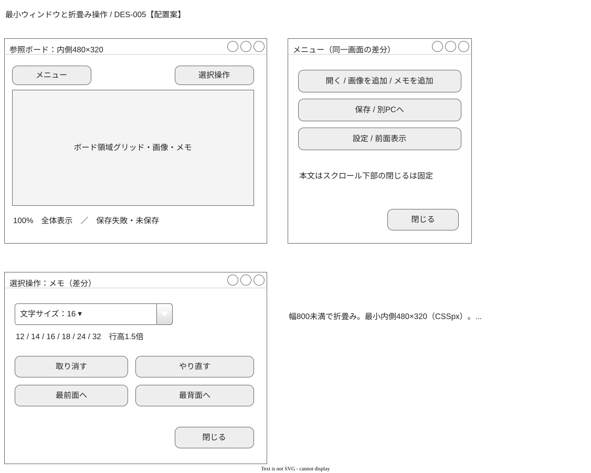

# DES-005：全体画面設計

- 設計状態：ドラフト。決定済みの振る舞いと設計上の配置・文言案を区別し、要件反映・実証待ちを維持する。
- 目的・範囲：主要操作を単一ボード、固定UI、ダイアログ、同一画面内の状態に具体化する。
- 入力確認日：2026-09-28。REQ-001～026の本文・受入条件・合意状態を確認。REQ-004・006・010・020～026は条件付き合意、011～017・019は更新でドラフト、その他は合意済み。条件付き合意の限界値・評価条件は確定しない。
- 参照要件：[REQ-001](../../product-requirements/collection/REQ-001-add-image-path.md#req-001画像の追加経路)、[REQ-002](../../product-requirements/collection/REQ-002-static-image-formats.md#req-002静止画形式と複数フレームの扱い)、[REQ-003](../../product-requirements/collection/REQ-003-batch-import-errors.md#req-003複数取込と失敗通知)、[REQ-004](../../product-requirements/comparison/REQ-004-board-overview-and-detail.md#req-004全体と細部の表示)、[REQ-005](../../product-requirements/comparison/REQ-005-keep-references-visible.md#req-005制作中の参照維持)、[REQ-006](../../product-requirements/organization/REQ-006-image-transform.md#req-006画像の移動回転拡縮)、[REQ-007](../../product-requirements/organization/REQ-007-image-deletion.md#req-007画像の削除)、[REQ-008](../../product-requirements/organization/REQ-008-group-membership.md#req-008グループへの所属と解除)、[REQ-009](../../product-requirements/organization/REQ-009-group-movement.md#req-009グループの一括移動)、[REQ-010](../../product-requirements/organization/REQ-010-independent-notes.md#req-010独立メモの編集と配置)、[REQ-011](../../product-requirements/cross-cutting/REQ-011-restore-saved-content.md#req-011保存内容の復元)、[REQ-012](../../product-requirements/cross-cutting/REQ-012-periodic-autosave.md#req-01230秒ごとの自動保存)、[REQ-013](../../product-requirements/cross-cutting/REQ-013-autosave-settings.md#req-013自動保存設定)、[REQ-014](../../product-requirements/cross-cutting/REQ-014-manual-save.md#req-014手動保存)、[REQ-015](../../product-requirements/cross-cutting/REQ-015-save-status.md#req-015保存状態の識別)、[REQ-016](../../product-requirements/cross-cutting/REQ-016-save-failure-recovery.md#req-016保存失敗時の内容保護と再試行)、[REQ-017](../../product-requirements/cross-cutting/REQ-017-exit-with-unsaved-changes.md#req-017未保存での終了)、[REQ-018](../../product-requirements/cross-cutting/REQ-018-source-independent-resumption.md#req-018原本に依存しない継続)、[REQ-019](../../product-requirements/cross-cutting/REQ-019-cross-pc-transfer.md#req-019利用者の別pcへの引継ぎ)、[REQ-020](../../product-requirements/cross-cutting/REQ-020-portable-windows-app.md#req-020windows-11でのインストール不要利用)、[REQ-021](../../product-requirements/cross-cutting/REQ-021-normal-operation-latency.md#req-021通常時の操作反応)、[REQ-022](../../product-requirements/cross-cutting/REQ-022-normal-detail-display.md#req-022通常時の細部表示)、[REQ-023](../../product-requirements/cross-cutting/REQ-023-saving-operation-latency.md#req-023保存中の操作反応)、[REQ-024](../../product-requirements/cross-cutting/REQ-024-saving-detail-display.md#req-024保存中の細部表示)、[REQ-025](../../product-requirements/cross-cutting/REQ-025-saved-project-open-performance.md#req-025保存済み500枚の再開性能)、[REQ-026](../../product-requirements/cross-cutting/REQ-026-batch-import-performance.md#req-026ローカル500枚の初回取込性能)。
- 依存設計：[DES-001](../architecture/DES-001-system-architecture.md#画面操作の全体図)、[DES-002](../functional-design/DES-002-board-editing-state.md#des-002ボードの編集状態とグループ構造)、[DES-003](../data-design/DES-003-data-overview.md#des-003全体データ設計)。
- 分割元・先：DES-001の概要図から独立した共通画面方針。ボード詳細はDES-006、保存関連詳細はDES-007を正本とする。

更新内容：画像資源制限と編集方針の反映後、REQ-001～004・006～017・019はドラフト。REQ-005・018は合意済み、REQ-020～026は条件付き合意。以下に残る過去の参照状態は入力時点の記録で、現在状態の正本は要件本文とする。

## 表示責務

PixiJSでボードと固定UIを描画し、パン・ズームで固定UIを動かさない。メモのtextarea併用は[ADR-003](../architecture-decisions/2026-09-25-ADR-003-text-editing.md)の提案を維持する。システム・内部・画面操作の全体図はDES-001、属性・所属の定義はデータ設計、処理と更新単位はDES-002を参照する。

添付の画面図は白・黒・グレーの低忠実度表現とし、画面・ダイアログ枠、ボタン、入力・選択部品には用途に合うMockupプリセットを優先する。該当する表現がないボード固有の要素・選択枠・ハンドル、および状態ノード・接続線・図外注記はGeneralで補う。プリセットの窓枠装飾は追加操作を定義せず、操作の提供範囲・名称は本文を正本とする。配置・文言・キー割当ての提案と未決は維持する。

| 種別・名称 | 入口と責務 | 詳細 |
| --- | --- | --- |
| 画面：ボード | 起動・正常な保存内容の読込後。収集・比較・整理を一つの表示領域で行う | [DES-006](DES-006-board-screen.md#ボードと要素の表示) |
| OSダイアログ：画像選択 | 上部「画像を追加」。単一・複数選択、取消 | [取込](DES-006-board-screen.md#画像の取込) |
| 状態：選択・ドラッグ・メモ編集・取込通知 | 画面を切り替えず対象と処理状況を示す | [操作](DES-006-board-screen.md#操作中の表示) |
| ダイアログ：プロジェクト設定 | 上部「設定」。有効・無効の即時適用と設定独立保存 | [DES-007](DES-007-persistence-screen.md#自動保存設定) |
| ダイアログ：終了確認 | ウィンドウを閉じる際、未保存がある場合 | [終了](DES-007-persistence-screen.md#終了確認) |
| OSダイアログ：保存内容を開く／ダイアログ：切替確認 | 上部「開く」。候補選択と未保存保護 | [再開](DES-007-persistence-screen.md#再開と保存内容の切替) |
| ダイアログ：別PCへの引継ぎ | 上部「別PCへ」。最新保存の確認と移送手順 | [引継ぎ](DES-007-persistence-screen.md#別pcへの引継ぎ) |
| 状態：保存中・完了・失敗・未保存／読込中・失敗 | 固定ステータス帯と通知領域。通常保存ではボード操作を継続 | [保存状態](DES-007-persistence-screen.md#保存状態と手動保存) |

## 共通の操作とフォーカス

上部に開く・画像追加・メモ追加・保存・別PCへ・設定・前面表示、下部に倍率・全体表示・保存状態を置く案とする。選択操作は右側のコンテキスト欄にまとめ、無効な操作は理由付きで示す。狭いウィンドウでは上部操作をメニューへ収め、ボード領域を残す。最小クライアント領域480×320論理単位（CSSpx）とし、具体配置は下節。メモ文字サイズはDES-006、操作性の実証は評価待ち。

Tabで固定UIを表示順に移り、フォーカス枠を表示する。ボード、メモ入力、ダイアログで入力先を区別し、入力欄のDelete・Ctrl+Vを画像操作へ流さない。ダイアログではフォーカスを内部に保ち、閉じたら起動ボタンへ戻す。確認ダイアログの初期フォーカスは「戻る／キャンセル」、破棄を既定にしない。IME変換中のEnter・Escapeを確定・取消へ流さない。実装上のキーボード・支援技術対応は[ADR-002](../architecture-decisions/2026-09-25-ADR-002-pixijs-ui-rendering.md)の未確認事項である。

## 通知方針

処理中・成功・失敗・未保存を文字と記号で示し、色だけに依存しない。通常の保存・取込結果は右側通知領域に表示し、フォーカスを奪わない。失敗は対象・理由・次の操作を併記し、閉じても保存状態帯の失敗・未保存を消さない。取込失敗の一覧は次の取込結果に置き換わるまで再表示できる案。通知を閉じることと失敗の解消を区別する。

## 品質制約と未決事項

REQ-020の対応Windows 11範囲は未決。REQ-021～026の目標・評価条件は[要件本文](../../product-requirements/cross-cutting/REQ-033-performance-evaluation-conditions.md#性能の共通評価条件)を正本とし、図の枚数や配置を登録上限にしない。保存中もパン・ズームと編集を妨げる全面マスクを出さない。取込・読込完了は表示と操作可能状態で判定し、保存完了とは分ける。

操作配置・フォーカス・通知文言は設計レビューで確認する。今回決定した倍率・サイズ・文字計数はDES-004・006に従う。対応OS・性能条件の既存残件は担当・時期・解消条件を維持して引き継ぐ。提案の評価と必要な上流反映が終わるまでは実装引継ぎ可能としない。

## 詳細設計

- [DES-006：ボード画面設計](DES-006-board-screen.md#des-006ボード画面設計) — 操作別遷移図とボードのワイヤーフレーム、取込・整理・参照維持。
- [DES-007：保存・再開・引継ぎの画面設計](DES-007-persistence-screen.md#des-007保存再開引継ぎの画面設計) — 操作別遷移図と設定・終了・引継ぎのワイヤーフレーム。

## 文書・図の検査とレビュー状態

添付6図をdraw.io Desktopで出力し、SVG/XML構文、単一ページ、埋込編集データ、要素IDの重複、親・接続先の存在を確認した。正式SVGから編集データを抽出して6図とも再出力でき、改図前の要素IDをすべて維持した。出力PNGを全体と拡大で確認し、日本語・操作部品・状態差分・矢印・条件ラベルを読めること、遷移線の交差・共有区間・無関係ノード通過がないことを確認した。OKF厳格リンク検査は47文書、エラー0・警告0。

当時のMarkdown閲覧環境での埋込表示は未確認だった。図の確認は製品の動作・性能、要件の受入合格を保証しない。設定独立保存・メモ保存・確認ゲート・復元候補の画面記述を更新した。ドラッグ中の手動確定操作と移送中の書込競合など残件があるドラフトである。

既存6図をMockup優先の表現へ更新した。Desktop版draw.ioを起動せず、インストール済みの描画資源とローカルのヘッドレスブラウザーを使用し、図データの編集・描画はメモリ上で行った。正式SVGを置き換える前に出力画像の全体と拡大を確認し、日本語・部品の状態・条件ラベルが読めること、文字の重なりや遷移線の交差・共有区間・無関係ノード通過がないことを確認した。構造・再読込・再編集の確認結果は今回の図を対象とし、上記のDesktop書出し記録とは区別する。設計状態はドラフトを維持し、新規画面の追加、未決事項の確定、製品の受入試験は行っていない。

途中終了後の記録を照合し、6図が検証時の内容と一致することを確認した。Markdownをmarkdown-it-pyでHTML化したローカルのヘッドレスEdge環境では、6図すべての読込成功と本文内の埋込表示を確認した。他のMarkdown閲覧環境での表示互換性までは確認していない。OKFの文書形式・厳格リンク検査は52文書、エラー0・警告0。今回のWindows警告の有無は利用者からの回答がなく未確認であり、過去の警告の根本解消を認定しない。

## 狭い画面の配置契約

計画反映。クライアント幅800 CSSpx未満では上部操作を「メニュー」へまとめ、右コンテキスト欄を「選択操作」の折畳みパネルへ移す。800以上では従来の横並び操作と右欄。800は配置の設計初期値であり、操作感の実証値ではない。

480×320でも上部40・下部40 CSSpxを固定し、残りボード領域を確保する。メニュー・選択操作・設定ダイアログは利用可能領域内で本文をスクロールし、完了／戻る／閉じるのフッターを固定する。最前面・Undo／Redo・文字サイズ・グリッド／スナップ設定をすべて到達可能にする。狭い画面では通知一覧を下部状態から開く折畳みとし、保存失敗・未保存は固定帯へ残す。OSダイアログはOSに任せる。

要件担当へ：REQ-004・005・010・020の制約として最小内側480×320、狭い幅で全操作到達可能を反映。正常受入案は最小寸法で操作・設定・確認フッターを使用できること。異常受入案は縮小・リサイズ中に未確定編集を消さず、隠れた破棄操作を既定にしないこと。Windows高DPI・フォーカス・支援技術の成立は検証担当へ引き継ぐ。

## セッション決定反映後の文書確認

今回の計画反映後は添付9図（既存6図更新・新規3図）を対象に、SVGと埋込編集データの構造検査、正式SVGからの編集データ再読込、描画・出力時の編集データ一致を確認した。既存図の要素IDを保持した。ローカルのヘッドレスEdgeで全体と原寸の拡大表示を点検し、グリッド・スナップ補助線・文字サイズ操作・最小画面・設定失敗・保存再試行の表示、文字の重なり、配線の交差・共有区間・無関係ノード通過を確認した。

DES-005・006・007のMarkdownをmarkdown-it-pyでHTML化し、本文内の9図すべてが読込成功した。他のMarkdown閲覧環境での互換性とWindows警告の有無は未確認を維持する。OKF形式・厳格リンク検査は53文書、エラー0・警告0。今回の完了はセッション決定の設計反映と文書整合レビューであり、要件合意・ADR一括採用・製品試験合格ではない。上流反映・実機成立確認・操作性と性能の実証は各DESの引継ぎ節を正本とする。

## 共通要件の対応と引継ぎ

独立採番した[REQ-033](../../product-requirements/cross-cutting/REQ-033-performance-evaluation-conditions.md)は、既存の共通条件を管理する本文として参照する。既存設計との対応は一部対応とし、本文・受入条件との個別照合と既存の技術・実機検証の残件を引き継ぐ。文書の再配置によって設計完了・要件合意・ADR採用・試験合格へ状態を変更しない。
