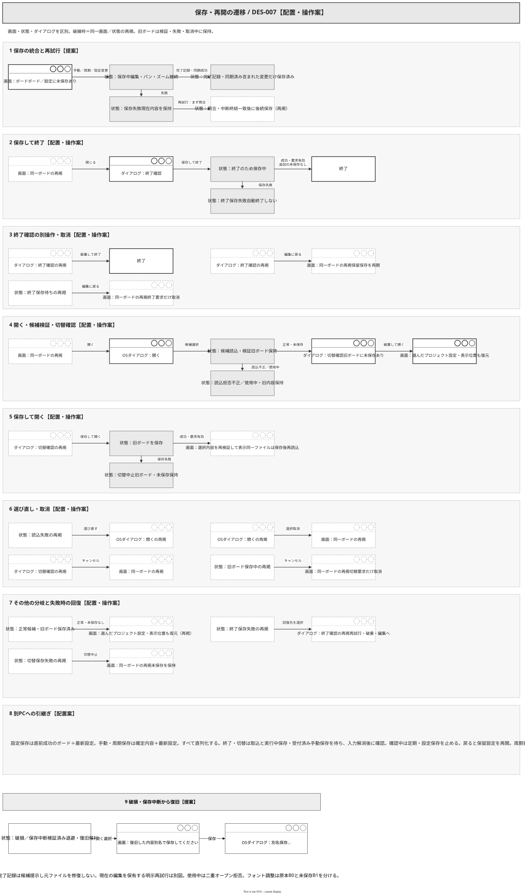
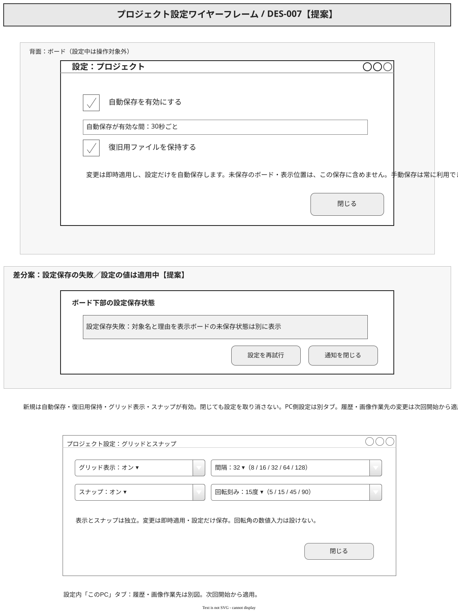
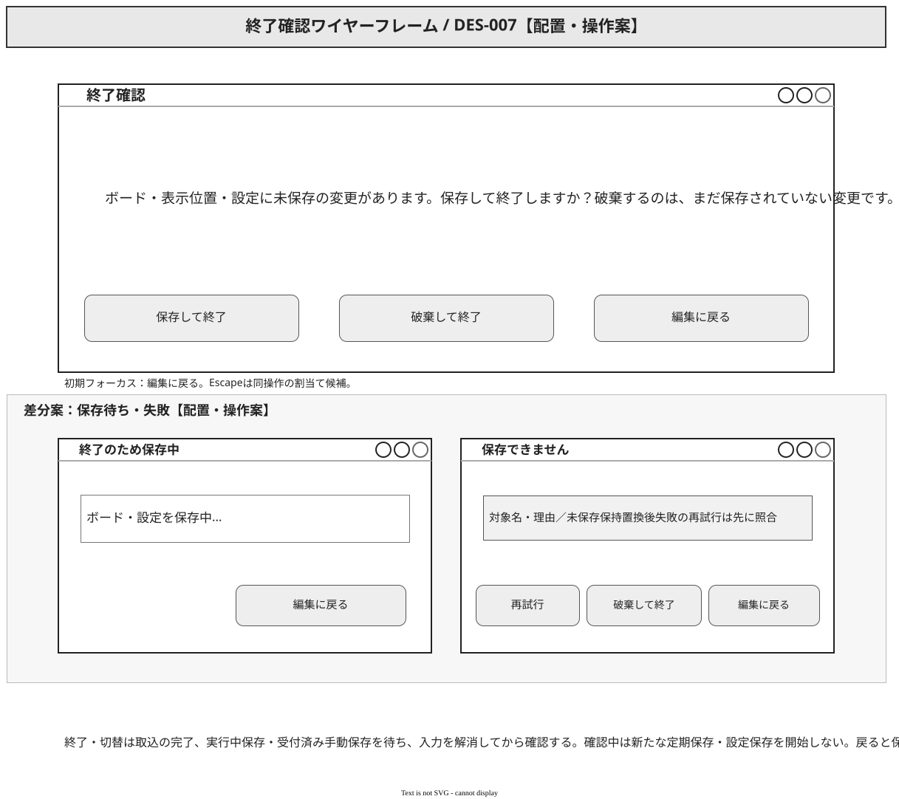
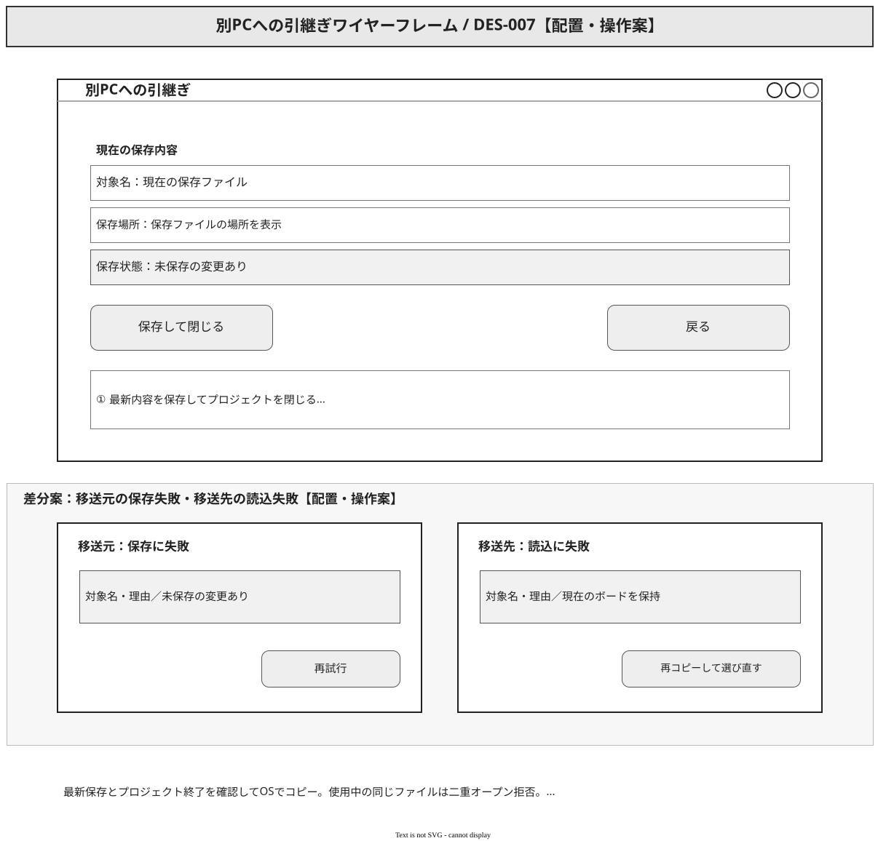
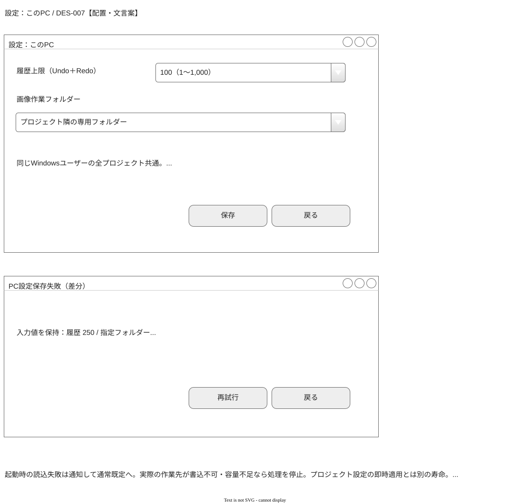
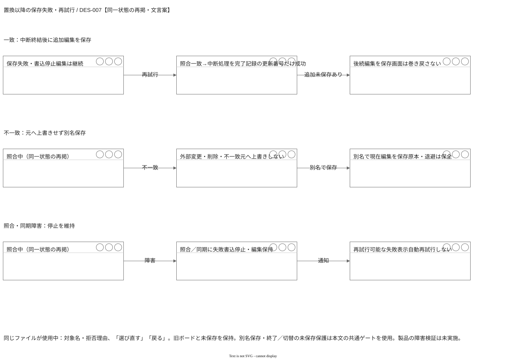

# DES-007：保存・再開・引継ぎの画面設計

- 設計状態：ドラフト。配置・文言は提案。ユーザーの回答・実行指示で保存の振る舞いを更新。製品動作は未検証。
- 目的・範囲：保存と継続利用の操作・通知・遷移を具体化する。
- 入力確認日：2026-09-30（保存統合・中断復元の計画を反映。従前画面案を更新）。参照要件：[REQ-011](../../product-requirements/cross-cutting/REQ-011-restore-saved-content.md#req-011保存内容の復元)、[REQ-012](../../product-requirements/cross-cutting/REQ-012-periodic-autosave.md#req-01230秒ごとの自動保存)、[REQ-013](../../product-requirements/cross-cutting/REQ-013-autosave-settings.md#req-013自動保存設定)、[REQ-014](../../product-requirements/cross-cutting/REQ-014-manual-save.md#req-014手動保存)、[REQ-015](../../product-requirements/cross-cutting/REQ-015-save-status.md#req-015保存状態の識別)、[REQ-016](../../product-requirements/cross-cutting/REQ-016-save-failure-recovery.md#req-016保存失敗時の内容保護と再試行)、[REQ-017](../../product-requirements/cross-cutting/REQ-017-exit-with-unsaved-changes.md#req-017未保存での終了)、[REQ-018](../../product-requirements/cross-cutting/REQ-018-source-independent-resumption.md#req-018原本に依存しない継続)、[REQ-019](../../product-requirements/cross-cutting/REQ-019-cross-pc-transfer.md#req-019利用者の別pcへの引継ぎ)、[REQ-020](../../product-requirements/cross-cutting/REQ-020-portable-windows-app.md#req-020windows-11でのインストール不要利用)、[REQ-023](../../product-requirements/cross-cutting/REQ-023-saving-operation-latency.md#req-023保存中の操作反応)、[REQ-024](../../product-requirements/cross-cutting/REQ-024-saving-detail-display.md#req-024保存中の細部表示)、[REQ-025](../../product-requirements/cross-cutting/REQ-025-saved-project-open-performance.md#req-025保存済み500枚の再開性能)。REQ-020・023～025は条件付き合意、011～017・019は更新でドラフト、018は合意済み。
- 依存設計：[DES-001](../architecture/DES-001-system-architecture.md#保存と復旧の設計方針)、[DES-002](../functional-design/DES-002-board-editing-state.md#保存復元と異常時の扱い)、[DES-003](../data-design/DES-003-data-overview.md#des-003全体データ設計)、[DES-005](DES-005-screen-overview.md#des-005全体画面設計)。
- 分割元：DES-006の保存状態・異常通知を分離し、REQ-011～019の画面操作を追加具体化した。保存形式は採用済み[ADR-004](../architecture-decisions/2026-09-26-ADR-004-zip-board-storage.md)、直列化・復旧用保持は提案中[ADR-005](../architecture-decisions/2026-09-26-ADR-005-save-recovery-policy.md)を参照する。

## 保存と再開の遷移

図の破線枠は同一画面または状態の再掲であり、「保存中」「候補読込・検証」は同一ボード内の状態である。操作別の部分図で成功、失敗・再試行、取消の到達先を示す。通常保存中は編集・パン・ズームを続ける。終了・切替の確認は明示した遷移目的にだけ適用する。

既存4図の画面・ダイアログ枠、ボタン、チェックをMockupプリセット中心の表現へ更新した。状態ノード・部分表示・遷移線・図外注記はGeneralで補い、別画面と誤認させない。「設定を再試行」「手動保存は常に利用できます」、保存して終了する際の「追加の未保存なし」の条件を本文と揃えた。入力済み設定とボードの保存状態を分ける方針、失敗・取消の到達先と未決事項を維持する。

## 保存状態と手動保存

上部「保存」（Ctrl+Sは未決の候補）を自動保存の有効・無効にかかわらず受け付ける。保存中も受付を無効にしない。先行保存に含まれない要求は「手動保存を受付」と表示し、少なくとも操作時点までの確定済み変更（IME変換中部分を除く）を保存できてから「手動保存完了」と通知する。内部の直列化・対象固定はDES-009を参照し、古い完了で新しい編集を置き換えない。

| 表示位置 | 状態と文言案 | 回復・次の操作 |
| --- | --- | --- |
| 下部固定帯 | 「未保存の変更あり」 | 保存操作または自動周期を待つ |
| 下部固定帯 | 「保存中」＋後続変更があれば「追加の未保存変更あり」 | 編集継続・手動保存受付可 |
| 通知／固定帯 | 「手動保存完了」／「保存済み」 | 保存対象後の変更があれば固定帯は「未保存の変更あり」のまま |
| 通知／固定帯 | 「保存に失敗：対象名・理由」／「保存失敗・未保存」 | 「再試行」で最新の変更を保存。原因不明なら推測せず読取・書込失敗と示す |

設定の保存中・成功・失敗をボード・表示位置の保存状態と別に表示する。「設定保存完了」でもボード未保存を消さず、「設定保存失敗」には設定だけを再試行する操作を示す。IME変換中は確定部分の保存完了と入力中の未保存を併記する。通知を閉じても未保存表示を残す。保存失敗時は現在の編集と直前成功内容を保ち、編集継続できる。異常終了では最後の成功内容までが復元対象で、未保存変更の回復を表示上保証しない。

## 自動保存設定

上部「設定」からプロジェクト設定を開く。自動保存と復旧用保持は独立したチェック項目で、初期値は共に有効。「30秒ごと」「手動保存は常に利用できます」を示す。変更は即時適用して設定だけを自動保存し、「閉じる」は変更を取り消さない。

「設定は自動で保存されます」「ボードの未保存編集は含みません」を示す。無効化後の追加手動保存は不要。設定保存中・成功・失敗を示し、失敗でも適用値を戻さず「設定を再試行」を利用できる。手動保存でも最新設定を保存できる。別プロジェクトを開くと、そのファイルの設定へ切り替える。

無効化では定期保存の新規・保留要求だけを止め、設定保存・実行中保存・受付済み手動保存を止めない。有効化を起点に30秒周期を開始し、同じ値では起算点を変えない。保持無効化で既存復旧用を削除しない。有効時は設定・表示位置だけの保存でも毎回直前1世代を更新する。処理境界は[DES-009](../functional-design/DES-009-project-persistence-recovery.md#設定と表示状態の保存)に従う。

### 新規作成と保存先未確立

新規作成で保存場所・名前を指定し、空プロジェクトの初回保存成功後にボード編集を開始する。取消は作成しない。失敗は「再試行」「別の保存先」「取消」を示し、編集開始しない。既存ボードからの新規作成は旧状態を保護してから切り替える。

復旧から開いた場合は例外として「復旧した内容：別名で保存してください」を示し、保存先確立まで定期保存・設定独立保存を始めない。設定変更は適用中・未保存と分かるようにし、別名保存に含める。

## 終了確認

取込中は「画像の取込完了を待っています」と「待機を取消」を示す。取消は取込を中止せず現在のボードへ戻る。取込完了後、新たな定期保存・設定保存の開始を止め、実行中保存と受付済み手動保存の結果を待つ。

未確定のドラッグ・IME等は先に「編集を完了／編集を取消／戻る」で解消する。IME変換中のEnter・Escapeをアプリの確定・取消へ流さない。その後、ボード・表示位置・設定の残る未保存を示し「保存して終了」「破棄して終了」「編集に戻る」を選べる。初期フォーカスは戻る。Escapeも戻る操作の割当て候補とし、[DES-006のキー表記方針](DES-006-board-screen.md#ボードと要素の表示)に従う。確認中は新たな編集を抑止する。

保存は全対象を含み、成功かつ追加の未保存がない場合だけ終了する。失敗時は終了せず再試行・破棄・戻るを選べる。破棄は未保存分と保留要求だけに適用し、既に独立保存した設定は戻さない。保存待ち中の戻るは終了要求だけを取り消し、進行中保存は継続する。後着の成功で終了しない。

戻るで設定保存を再開する。確認中に周期を迎えていれば、有効かつ未保存の場合に1回だけ定期保存し、次の予定時刻は元の周期を維持する。無効または変更なしなら追加の定期保存はしない。[保存ゲート](../functional-design/DES-009-project-persistence-recovery.md#終了切替の保存ゲート)を正本とする。

## 再開と保存内容の切替

上部「開く」で保存内容を選ぶ。対象名を表示して読込・整合確認を行い、画像・配置・グループ・メモ、プロジェクト設定、表示中心と倍率の復元と操作可能状態をもって完了を示す。読込中は旧ボードを保持し、切替対象が変わらないようボード編集を一時抑止する案。候補を検証するだけでは現行保存先へ書き込まない。

1. ファイル選択の取消では何も変えない。候補を読込・検証し、失敗なら対象・理由・「選び直す」「戻る」を表示する。破損ファイルも旧ボードも変更しない。
2. 正常な候補が確認できたら、旧ボードに未保存変更がある場合だけ切替確認を表示する。「保存して開く」「破棄して開く」「キャンセル」を選べる。
3. 保存を選んだ場合は旧ボード・表示位置・設定の保存成功後に切り替える。同じファイルなら保存後の候補を再読込・検証し、保存前候補を採用しない。保存失敗では切替を中止し、旧ボードと未保存を保持する。破棄は候補の検証成功後、切替時点でのみ適用する。切替自体の失敗でも旧状態を保持する案。
4. キャンセルでは旧状態へ戻る。誤った正常内容を開いた場合も「開く」から選び直せる。開くだけではどちらの既存保存内容も上書きしない。

取込待ち・未確定入力の解消・定期／設定保存の停止と再開も終了確認と共通にする。保存先が同じかはパス文字列だけでなくファイル識別で確認する。切替確認の配置・フォーカスは終了確認に合わせ、対象名と「開く」に文言を置き換える。保存の待機・失敗中に「キャンセル」した場合は切替要求だけを取り消し、遅延した成功で切り替えない。異常終了後も同じ「開く」で最後の成功内容を読める。破損時は正常と検証できた復旧用を開く選択肢を示す設計案。復旧用を開いた後は次の保存で別名を指定し、破損元・開いた復旧用への保存を拒否する。指定前は自動保存で上書きしない。画面に「復旧した内容：別名で保存してください」を示す。自動修復は行わず、要件へ反映した操作として扱い、変更後要件のレビューと障害検証は残す。

中断記録が残る保存先では、DES-009に従い「保存処理が中断されました」と検証済み候補を示す。本ファイルがなくても、開く画面から保存先フォルダー内の中断候補を選べる。完了記録前の新ZIPを自動採用せず、直前成功の退避を提示する。初回未完了候補にはその旨を表示する。候補を開いても元データは変更しない。

## 別PCへの引継ぎ

上部「別PCへ」で保存対象名・場所と「保存してプロジェクトを閉じてから、OSでコピーしてください」を示す案。主操作の文言案を「保存して閉じる」とし、終了・切替と同じ保存ゲートで最新内容の保存成功とプロジェクト終了を確認し、その後OSでコピーする。保存失敗・戻るではボードを保持し、コピー可能とは表示しない。破棄して閉じた場合は未保存変更を含む最新内容の移送完了とはしない。プロジェクトが開いている間のコピーは手順に含めない。

利用者が保存ファイルをOSでコピーして別PCへ運び、別PCの「開く」で選ぶ。採用済み独自ZIPファイル一つに画像も含まれ、原本を別途用意しない。利用者が片方ずつ使う前提を記載し、自動同期や共有送信の操作は設けない。アプリ外のコピー成功は自動判定せず、別PCで正常に読めたことをもって引継ぎを確認する。コピー失敗・読込失敗時は移送元を保ち、正常なファイルを再コピーして選び直す。別PCに現在の未保存内容があれば上記の切替保護を適用する。

## アプリ設定と画像作業領域

計画反映。プロジェクトごとの自動保存・復旧用保持とは別のアプリ設定として「画像作業フォルダー」を扱う。既定はプロジェクトファイルの隣の専用フォルダー。代替先を指定でき、変更は次にプロジェクトを開くときから適用することを表示する。履歴上限も同じWindowsユーザーの全プロジェクトに共通するアプリ設定とし、既定100、変更は次回の新規作成・オープン・再オープンから適用する。現在の履歴は変更しない。Undo・Redo合計1～1,000、次節のPC設定契約で保存・失敗を扱う。キャッシュ容量・並列数は初版では設定項目にしない。

書込不可・容量不足は対象場所と理由をモーダルで通知し、保存成功を示さず、自動で別の場所へ切り替えない。通知を閉じても現在の編集内容を保持する。正常終了時は不要キャッシュを削除し、復元候補の扱いは[DES-009](../functional-design/DES-009-project-persistence-recovery.md#作業ファイルと容量不足)に従う。既存図はプロジェクト設定を示すもので、アプリ設定画面の具体配置は下節と添付図を参照する。

## 未決事項・引継ぎ

| 対象 | 担当・時期・解消条件・影響と進行範囲 |
| --- | --- |
| 要件反映 | 要件担当がDES-002・006・009と本書の具体差分を本文・正常異常受入条件へ反映、実装引継ぎ前にレビュー。全体合意は推定しない |
| 保存・排他成立 | DES-009の方式は具体化済み。実装／検証担当が置換・中断・ロック寿命・別名・ACL・異常終了を実証。画面表示だけで保証しない |
| 操作性・入力 | 狭い画面・IME・フォーカス・入力値保持の実機評価を別担当へ。具体的試験計画は未作成 |
| 品質・技術選定 | Windows範囲・固定WebView2はDES-012、画像はDES-010・ADR-013、SQLite／ZIPはADR-014へ選定案を反映。具体的依存版・配布物・性能と障害成立はDES-013へ引き継ぐ |

## 検証観点とレビュー状態

保存中の手動受付、後続変更と完了の併記、失敗後の編集・再試行、終了保存失敗・終了取消、破損読込と旧ボード保持、切替保存失敗・破棄・キャンセル、誤選択から選び直し、原本なしの別PC再開をレビュー対象とする。図の構造・出力画像は確認済みだが、製品動作の受入試験を代替しない。今回の入力・設定・保存再試行の技術契約は具体化済みである。要件担当への反映とレビュー、実装・検証担当による製品検証が残るためドラフトを維持する。

## PC側アプリ設定の契約

設定入口は「設定」内の「このPC」タブ。履歴上限（整数1～1,000、既定100）と画像作業フォルダー（空指定はプロジェクト隣の専用フォルダー）を入力し「保存」で一括確定する。「閉じる／戻る」は未適用入力を破棄する。次回の新規作成・オープン・再オープンから適用する説明を常時示す。プロジェクト設定の即時適用と区別する。

Rustが同一Windowsユーザーの `%LOCALAPPDATA%/reference-app/settings.json`（形式版1、historyLimitとimageWorkspaceOverride）を所有する。未存在は既定開始、不正型・版・範囲・読込I/O失敗は通知して両項目とも通常既定で開始する。壊れた原本は設定保存の明示操作まで上書きしない。画像フォルダーが実際に書込不可・容量不足なら当該処理を停止し通知し、自動代替へ切り替えない。

書込は最新成功ファイルのハッシュ確認・同一フォルダー一時出力・同期・置換・現物照合の順。同じアプリ設定先はDES-009のパスmutex方式で処理ごとに直列化し、他プロセスによる基準不一致は失敗として旧設定を使う。設定保存失敗では現在の入力値をパネルに残し、エラー・「再試行」「戻る」を表示し、全プロジェクトの次回適用値は旧成功値のまま。失敗後閉じる場合は入力破棄の確認を出す案。設定読込失敗で既定開始していても成功保存以前は既定が適用値。

要件担当へ：REQ-007・010・019の共通設定として履歴計数と失敗動作を反映。正常受入案は新規／再開で保存済み設定が適用され現在履歴に影響なし。異常受入案は書込失敗で旧適用値＋入力保持＋再試行、読込失敗で通知＋履歴100／プロジェクト隣へ戻ること。

## 保存失敗と使用中の表示

置換以降の失敗は下部「保存失敗・未保存・再試行が必要」を維持する。「再試行」はまず記録と現物の照合を行い、通常の新規保存に直行しない。照合中は書込と追加再試行を無効にするが、編集・パン・ズームは継続する。中断成功の後に追加編集がある場合は「中断処理は完了／追加編集を保存中」とし、すべて保存済みと表示しない。再照合失敗なら対象・理由と再試行を残す。不一致・外部変更・削除は「元の保存先へ保存できません」「別名で保存」「編集へ戻る」を出し、既存ファイルを上書きしない。

「開く」で別プロセスが所有する候補は「このファイルは別のプロセスで使用中です」と対象名を表示し、「選び直す」「戻る」を提供する。旧ボードと未保存内容は保持する。権限等で排他確認不能なら使用中と断定せず、その理由を通知する。別ファイル切替と同一セッション再オープンの保護は[DES-009](../functional-design/DES-009-project-persistence-recovery.md#同一ファイルの排他契約)に従う。

グリッド・間隔・スナップ・回転刻みは「プロジェクト」タブに置き、即時適用・設定独立保存する。閉じても戻さず、失敗しても適用値維持。アプリ設定と違う寿命をラベルで示す。画面の異常受入条件案はDES-009の要件担当向け差分を参照する。

## 共通要件の対応と引継ぎ

独立採番した[REQ-027](../../product-requirements/organization/REQ-027-edit-history-and-stacking.md)、[REQ-030](../../product-requirements/cross-cutting/REQ-030-shared-settings.md)、[REQ-031](../../product-requirements/cross-cutting/REQ-031-font-resumption-adjustments.md)、[REQ-032](../../product-requirements/cross-cutting/REQ-032-file-lock-and-save-retry.md)は、既存の共通条件を管理する本文として参照する。既存設計との対応は一部対応とし、本文・受入条件との個別照合と既存の技術・実機検証の残件を引き継ぐ。文書の再配置によって設計完了・要件合意・ADR採用・試験合格へ状態を変更しない。
