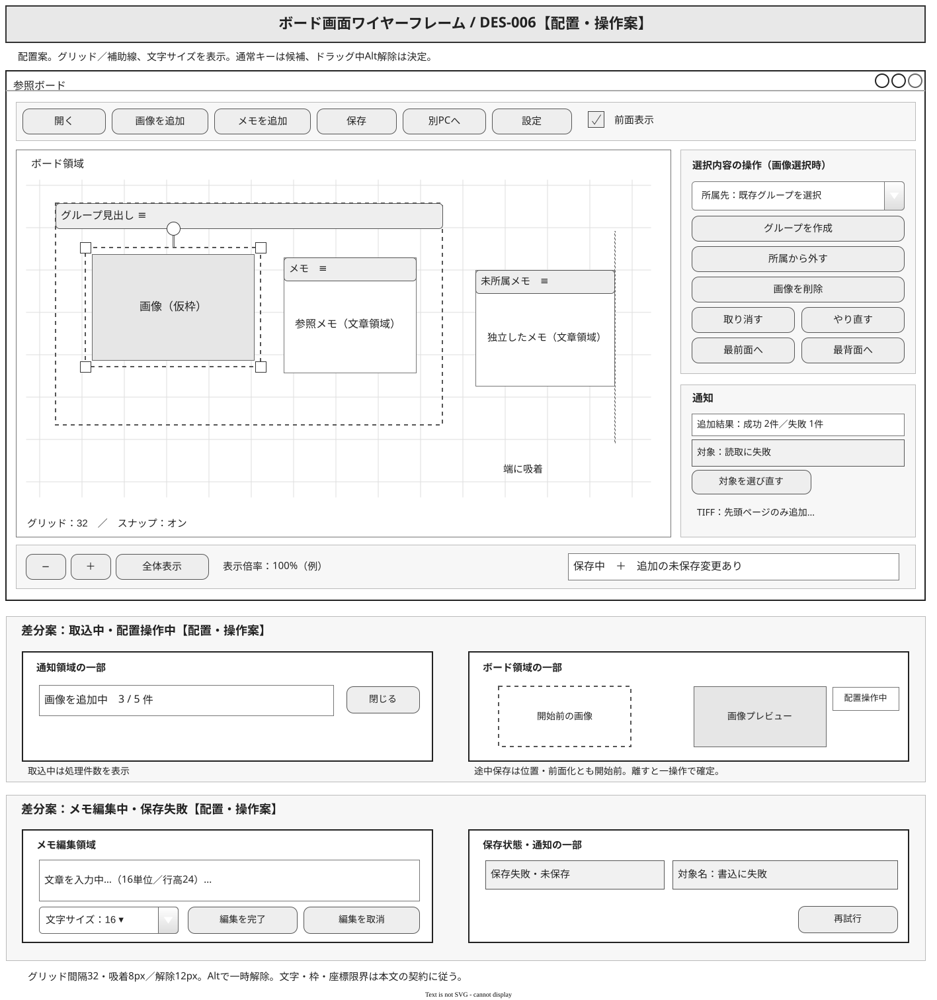
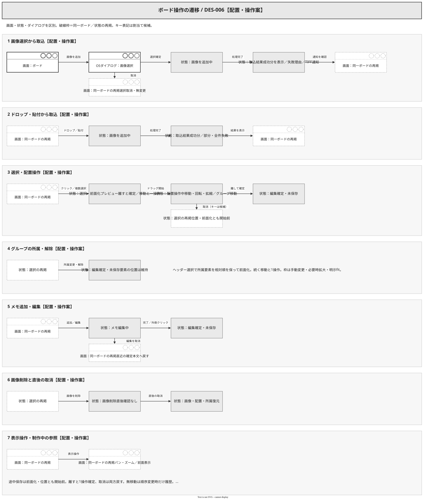

# DES-006：ボード画面設計

- 設計状態：ドラフト。セッション決定の振る舞いを反映済み。配置・文言と残るキー割当ては設計案で、要件反映・操作性実証待ち。
- 目的・範囲：収集・比較・整理の主要操作を具体化する。
- 入力確認日：2026-09-28。参照要件：[REQ-001](../../product-requirements/collection.md#req-001画像の追加経路)、[REQ-002](../../product-requirements/collection.md#req-002静止画形式と複数フレームの扱い)、[REQ-003](../../product-requirements/collection.md#req-003複数取込と失敗通知)、[REQ-004](../../product-requirements/comparison.md#req-004全体と細部の表示)、[REQ-005](../../product-requirements/comparison.md#req-005制作中の参照維持)、[REQ-006](../../product-requirements/organization.md#req-006画像の移動回転拡縮)、[REQ-007](../../product-requirements/organization.md#req-007画像の削除)、[REQ-008](../../product-requirements/organization.md#req-008グループへの所属と解除)、[REQ-009](../../product-requirements/organization.md#req-009グループの一括移動)、[REQ-010](../../product-requirements/organization.md#req-010独立メモの編集と配置)、[REQ-015](../../product-requirements/cross-cutting.md#req-015保存状態の識別)、[REQ-016](../../product-requirements/cross-cutting.md#req-016保存失敗時の内容保護と再試行)、[REQ-021](../../product-requirements/cross-cutting.md#req-021通常時の操作反応)、[REQ-022](../../product-requirements/cross-cutting.md#req-022通常時の細部表示)、[REQ-023](../../product-requirements/cross-cutting.md#req-023保存中の操作反応)、[REQ-024](../../product-requirements/cross-cutting.md#req-024保存中の細部表示)、[REQ-026](../../product-requirements/cross-cutting.md#req-026ローカル500枚の初回取込性能)。REQ-004・006・010・021～024・026は条件付き合意、015・016は2026-09-30更新でドラフト、その他は合意済み。
- 依存設計：[DES-005](overview.md#des-005全体画面設計)、[DES-002](../board-state.md#des-002ボードの編集状態とグループ構造)、[DES-004](../data-design/board-state.md#des-004ボードのデータ設計)。
- 分割元・先：DES-001・002の表示操作から独立。従来の保存・失敗通知の詳細を[DES-007](persistence.md#des-007保存再開引継ぎの画面設計)へ分割した。

2026-10-03更新：画像資源制限と編集方針の反映後、REQ-001～004・006～017・019はドラフト。REQ-005・018は合意済み、REQ-020～026は条件付き合意。以下に残る過去の参照状態は入力時点の記録で、現在状態の正本は要件本文とする。

## ボードと要素の表示

図の上段は画像選択時の配置案、下段は取込中・配置操作中・メモ編集中・保存失敗時に変わる部分のワイヤーフレーム案である。中央のボードに画像とメモを置く。画像の選択枠には四隅の拡縮ハンドルと回転ハンドル、メモには移動用ヘッダーと文章領域を示す。右側のコンテキスト欄は画像・メモ・グループ・複数選択に応じて変わる。画像選択時の図には「取り消す」「やり直す」「最前面へ」「最背面へ」の配置案を示す。グループのヘッダーを選択・移動の入口とする案であり、全グループの枠保持・必要時拡大・明示fitと選択時前面化は[ADR-007](../architecture-decisions/2026-09-26-ADR-007-board-coordinates-and-groups.md)に方針を反映済み。要件への反映と画面配置案の確定は区別する。

2026-10-04、既存2図の画面枠・ボタン・所属先の選択・前面表示のチェック・メモ入力をMockupプリセット中心の表現へ更新した。画像・メモ・グループの固有表現、選択枠・ハンドル、遷移の状態・接続線はGeneralで補う。TIFF通知は「先頭ページのみ追加、残りは未取込」を示す。既存の操作と遷移先、案・未決の区分を維持し、新しい画面・操作は追加しない。

ボードのパン・ズームは表示変換であり、画像・メモの配置を変えない。座標・所属・重なり順の定義は[DES-004](../data-design/board-state.md#座標所属グループ枠)を参照する。枠内へ置くだけで所属させず、所属先をコンテキスト欄で明示する案とする。

選択・前面化と続く移動は一つのUndo操作とする。グループヘッダー選択は所属要素全体を相対順を保って前面化する。グループ枠は内容があっても手動変更でき、枠操作は内容を移動・拡縮しない。内容と余白を含む最小寸法を下回れず、通常は維持・必要時拡大、「中身に合わせる」で縮小する。余白各辺24、最小64×64単位。空の「中身に合わせる」は無効。

本文・図のキー表記（Ctrl+V、Ctrl+Z、Shift、Space、Escape等）は候補であり、割当ては別途決める。確定した操作の提供と候補キーを区別する。

## 画像の取込

上部「画像を追加」でOSファイルダイアログを開き、単一・複数選択を受け付ける。取消は無変更。ローカルファイルまたは対象ブラウザ画像をボードへドロップし、画像コピー後はボードにフォーカスがあるときCtrl+Vで貼り付ける。ブラウザの対応範囲はREQ-001に従い、URL入力欄は設けない。

取込中は「画像を追加中」と処理件数を通知欄に表示する。ドロップはその位置、ファイル選択・貼付は表示中央を基準に、複数画像は重なりを避けて並べる案。成功分は表示して操作可能とし、全件表示と操作可能になって取込完了とする。失敗分は「対象名／対応していない形式・読み取れない内容・アクセスできない等の理由」を一覧に残す。原因を特定できない場合は推測せず「読取に失敗」とする。全件失敗は追加せず、部分成功では成功分を取り消さない。対象を選び直して追加する操作で回復する。

JPEG・PNG・WebP・GIF・TIFF・BMPを対象に、GIF・WebPは先頭コマ、TIFFは先頭ページを表示する。複数ページTIFFは対象名と「先頭ページのみ追加、残りは未取込」を通知する。保存と取込は別の状態表示とし、REQ-026の完了に自動保存完了を含めない。

## 操作中の表示

図の破線枠は同一ボードまたは同一状態の再掲であり、新しい画面ではない。画像選択の取消、配置操作・メモ編集の取消、削除直後の取消と取込の部分・全件失敗は、各部分図で到達先を示す。

| 操作・入口 | 操作中と確定 | 取消・失敗・注意 |
| --- | --- | --- |
| 選択 | クリックで一つ、Shift+クリックで画像・メモを追加選択。空白クリックで解除 | 選択で画像・メモを永続的に前面化し、重なり順が変われば未保存・Undo対象にする。複数対象は相対順を維持する。メモ入力中はキーを文章編集へ渡す |
| 画像移動・回転・拡縮 | 本体をドラッグして移動、回転ハンドルで角度、四隅で縦横比を維持して拡縮。指を離して確定 | Escapeで開始前へ戻す案。ボード倍率は変えない。画像倍率は1～1600%、縦横比を維持 |
| 画像削除と直後取消 | 選択画像の「画像を削除」またはDeleteで確認なしに削除。「取り消す」「やり直す」を利用。Ctrl+Zは割当て候補 | 配置・所属を含め復元。原本は削除しない。空グループは残す。基本編集のUndo／Redoも対象。組合せ境界はDES-002の契約 |
| グループ作成・所属 | 画像・メモ選択後「グループを作成」。「所属先」から既存グループを選ぶ | 旧所属から移し、位置維持。空グループも選択肢に残す。選択メニューを閉じれば無変更 |
| 除外・グループ解除 | 対象要素の「所属から外す」、グループ選択時の「グループを解除」 | 要素や文章・位置を消さない。「画像を削除」と別の名称・配置にする |
| グループ移動 | ヘッダーをドラッグ。所属画像・メモだけを一括プレビューし確定 | Escapeで全対象を戻す案。近くの未所属・別所属メモを動かさない。回転・拡縮は設けない |
| メモ追加・編集・削除 | 「メモを追加」後ボード位置を指定、既存メモはダブルクリックで文章入力。「編集を完了」で確定、ヘッダーで移動、コンテキスト欄で削除 | 「編集を取消」で直近の確定文章へ、新規で未確定なら作成しない。IME変換中は取消しない。上限10,000文字、折返しと明示改行を扱う。幅を変更でき、高さは全文に追従する。拡張書記素クラスタで計数（DES-002） |
| パン・ズーム | Space+ドラッグでパン、ホイールでカーソル位置中心ズーム、下部の±と「全体表示」でも操作 | 画像拡縮と別操作。保存中も利用可能。最大1600%、最小はグループ枠を含む全体を収める倍率。空ボードは手動100～1600%、非空の下限・再開時例外と技術下限はDES-004。全体表示は24 CSSpx余白・最大100%。固定の用紙境界を設けない |
| 制作中の参照維持 | 上部「前面表示」を有効にし、ウィンドウサイズと表示位置を調整して制作アプリへ戻る | フォーカスを奪い返さず画像を維持。有効／無効を表示。対象制作アプリでの成立は未検証 |

ドラッグ中は一時表示と「配置操作中」を示し、保存済み表示と混同させない。確定・中止・無変更終了と自動保存の境界は[DES-002](../board-state.md#ドラッグ中の自動保存)を正本とする。メモの未確定入力は「メモ編集中」と表示する。メモ入力中の手動・定期保存はIME変換中部分を除く入力済み文章を確定して保存し、入力を継続できる。編集取消は直近の保存対象確定文章まで戻す。未確定部分は未保存と表示する。ドラッグ中の手動保存は確定済み内容を対象として受け付け、途中配置を除いて保存し、ドラッグを継続する。前面化と移動は解放時に1操作で確定し、保存途中は両方とも開始前とする（DES-002）。取込中の終了・切替は取込完了を待ち、待機取消は取込を中止せずボードへ戻る。保存の状態と確認は[DES-007](persistence.md)へ接続する。

## 保存状態と異常通知

下部の保存状態と右側通知の表示契約・再試行は[DES-007](persistence.md#保存状態と手動保存)を正本とする。保存完了後に追加変更があれば未保存表示を維持する。読込失敗時もボードを保持する。取込失敗・TIFFの未取込通知は本書を正本とする。

## 未決事項と検証観点

文字・枠・座標・倍率・スナップの設計値と優先順位は具体化済み。要件担当は前節およびDES-002の差分を本文・受入条件へ反映し、実装引継ぎ前にレビューする。ADR-003の入力方式・IME／フォーカス成立、狭い画面・スナップの操作感と性能は設計／実装／検証担当が入力実装・受入前に確認する。値を実測済みとはしない。

レビュー観点は前面化→保存→取消／確定→Undo、文章内保存境界、IME超過・貼付け拒否、回転画像の対角固定拡縮、複数相対配置、同距離・候補消失・Alt復帰・座標限界とする。製品の試作・具体的試験計画・実行は別担当。今回の変更図と文書の構造・リンク・表示確認を製品の受入試験に代えない。

## グリッドとスナップの操作契約

2026-10-05、自由回転のみ／スナップなしという以前の案を、利用者のスナップ追加指定で変更する。回転角の数値入力は設けない。

- プロジェクト設定にグリッド表示（初期オン）、間隔8・16・32・64・128（初期32）、スナップ有効（初期オン）、回転刻み5・15・45・90度（初期15）を配置する。表示とスナップは独立切替。原点基準の縦横線とし、縮小時は画面上の間隔が8 CSSpx以上になるまで2の累乗で線を間引く。吸着は元の間隔を維持する。
- 移動・幅変更・枠変更・画像拡縮の候補は、グリッドと他要素の水平／垂直外接矩形の端・中心。回転画像は回転後AABB。グループ移動は保持枠、複数選択移動は選択全体AABB。回転の他要素／グリッド位置への吸着は行わず、角度だけ刻みに合わせる。
- 表示領域に一部でも入る他画像・メモ・グループ枠（遮蔽されても含む）を候補にする。操作対象・同時移動対象・付随拡大対象・対象の所属先枠を除外する。同じグループの動かしていない画像・メモは含める。候補はポインター更新ごとに再評価し、画面外・削除・除外条件へ変わった吸着先は即解除する。
- 距離はボード距離×表示zoomのCSSpxで判定し、devicePixelRatioを掛けない。移動は軸ごとに候補を選ぶ。8px以内で取得、取得中は自由操作値から同じ候補への距離が12pxを超えるまで維持。近い候補優先、同距離は他要素→グリッド。残る同距離はUUIDの辞書順、端／中心は左・上→中心→右・下、グリッド線は小さい座標を優先する。
- Altを押している間は位置・角度とも吸着を解除し、自由操作プレビューへ戻す。離すと自由操作値から再判定する。Altはこのボードドラッグに限って処理し、本文・ダイアログ・OSの操作へ割当てを波及させない。解放時のプレビューを確定し、スナップのON/OFF自体で要素を動かさない。
- 回転は連続角度を `刻み×floor(角度/刻み+0.5)` へ常時量子化する。同点は正方向へ丸め、角度の8／12距離条件は使用しない。Alt中は自由角度。保存だけ0以上360度未満へ正規化し、何周でも回せる。
- 吸着時は対象の軸を示す補助線と端／中心の印を描く。候補が複数重なるときは選ばれた線だけを表示する。吸着・補助線は操作中の一時状態で保存・Undoへ追加しない。寸法・画像倍率・グループ包含・座標の制約違反候補は除外し、元の自由操作も無効なら最後の有効状態で止める。

### 拡縮候補の解法

画像はドラッグ開始時の対角頂点・角度・縦横比を固定する。自由操作の角の位置を対角から元の対角方向へ射影して倍率を得る。各AABBの端・中心と候補線が一致する倍率を解き、正かつ0.01～16で全制約を満たすものだけ比較する。射影係数0の組合せは候補なし。操作角の自由値→候補値のユークリッドCSSpx距離が8以内を取得、12超で解除し、最小補正の1倍率だけ採用する。水平垂直同時一致なら両補助線を出せる。両方に一致できないときは小さい補正だけを採用し、縦横比を壊さない。同距離最終順位はX軸→Y軸、その後上記候補順位。

メモは左辺固定・右辺幅変更（120～4,096）、高さは再計算する。幅変更の吸着は右辺Xだけ。グループ枠はハンドルの移動辺で軸ごとに吸着し、反対辺を固定する。固定辺を動かして吸着を成立させない。吸着後にメモ高と所属枠の必要拡大を算出し、全制約をもう一度検査する。

## メモ文字と編集表示

メモごとの文字サイズをコンテキスト欄で12・14・16・18・24・32から選択（初期16）、行高は1.5倍固定。文字サイズ・幅の変更中も全文高さと所属枠拡大をプレビューし、一操作で保存・Undo対象にする。編集開始時の100%への拡大・最小パンを編集終了後も維持する。

「編集を完了」「編集を取消」を入力欄の下に置き、長文では入力欄内だけをスクロールしてカーソル位置を表示する。本文の全文高はボードで保持し、編集用スクロールを保存しない。完了／取消の専用キーを設けない。ボード側文章外クリック、別アプリ切替、IME・貼付け・上限時の本文／選択保持は[DES-002](../board-state.md#メモ編集の入力契約)に従う。文字数を現在数／10,000として表示する案。別PCフォント差の枠拡大・通知なし座標補正は[DES-009](../project-persistence.md#フォント差読込と保存原本)に従う。

## 要件担当への変更案

| 対象 | 本文差分案 | 正常の受入条件案 | 異常の受入条件案 |
| --- | --- | --- | --- |
| REQ-004 | 全体表示は枠を含め24 CSSpx余白、100%超に拡大なし。空は原点100%。再開は中心／倍率無補正 | 異なる画面でも保存倍率へ戻せる。全体表示を実行すると現在画面へfit。編集開始100%未満は100%へ上げ終了後維持 | 不正倍率のファイルは読込拒否し旧状態保持 |
| REQ-006・008～010 | 画像／メモ／グループ／複数移動と対応拡縮にグリッド・他要素近接吸着、回転は刻みを設定。Altで一時解除 | 8px取得／12px超解除がzoomによらず成立。同距離は他要素優先、遮蔽候補の補助線、相対配置・画像比率維持 | 制約違反候補・自分／追従要素／所属枠へ吸着なし。画面外候補消失で解除。限界で最終有効状態を保持し通知 |
| REQ-008・010・011 | 枠24余白／64最小、メモ幅320・120～4,096、文字16・選択値、行高1.5倍、幅／サイズ保存 | 空枠のfit無効、削除で縮まない。文字変更と必要枠拡大をUndo1回。本文上限・編集取消はDES-002 | 上限違反の操作は部分適用なし。フォント差補正はDES-009の異常／正常案と同期 |
